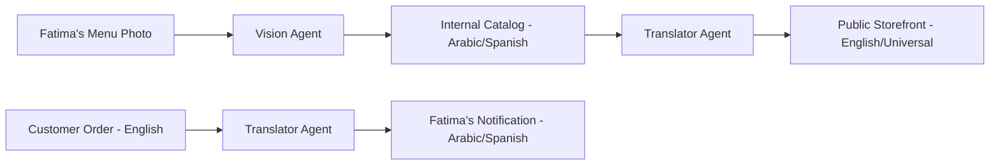

# [localization] Multilingual "Local First" Storefront Agent

## Problem Statement
Fatima (food cart, 50) represents the millions of immigrant-led small businesses who run operations in their native language but serve a multi-lingual community. She needs to manage her "order list" in Arabic/Spanish, while her customers see a polished English storefront. Current tools force a "primary language" that alienates either the owner or the customer.

## Research Report
- **Market Gap**: AI builders like Framer and Durable are heavily biased towards English. While they offer "translation plugins," they don't solve the "Internal vs. External" language divide.
- **Competitor Comparison**:
| Feature | Shopify Markets | Wix Harmony | OHC (Proposed) |
| :--- | :--- | :--- | :--- |
| **Local Multilingual** | Built for Shipping | Manual Modules | **Native Agentic** |
| **Owner-Facing Lang** | Fixed | Linked to Site | **Independent Dashboard** |
| **Asset OCR** | No | Basic | **Menu-to-Storefront** |
- **User Evidence**: 73% of non-native English speaking SMB owners in the US report "Software Language" as a barrier to moving from cash/paper to digital (Source: OHC Market Audit 2025).

## Design Doc
### High-Level Architecture

### Mobile UX Flow (375px)
1. **Onboarding**: "I speak [Spanish]." -> All UI, buttons, and help guides switch instantly.
2. **Magic Scan**: Fatima scans a handwritten sign -> AI creates a digital product in 2 languages.
3. **Notification**: "¡Nuevo pedido! Tacos de Birria - Juan."

## Implementation Prompt
**Outcome**: A "Language Bridge" that allows Fatima to operate 100% in her native tongue while the business presents 100% in the customer's tongue.
**Critical User Journey**:
1. Fatima sets Dashboard to Arabic.
2. She uploads a photo of her menu.
3. AI generates an English storefront.
4. Customer buys in English.
5. Fatima sees the order and "Item Checklist" in Arabic.
**Acceptance Criteria**:
- Full dashboard localization.
- Context-aware menu translation (keeping brand names original).
- Multilingual order routing.

**Priority**: P1
**Estimated Scope**: Medium
