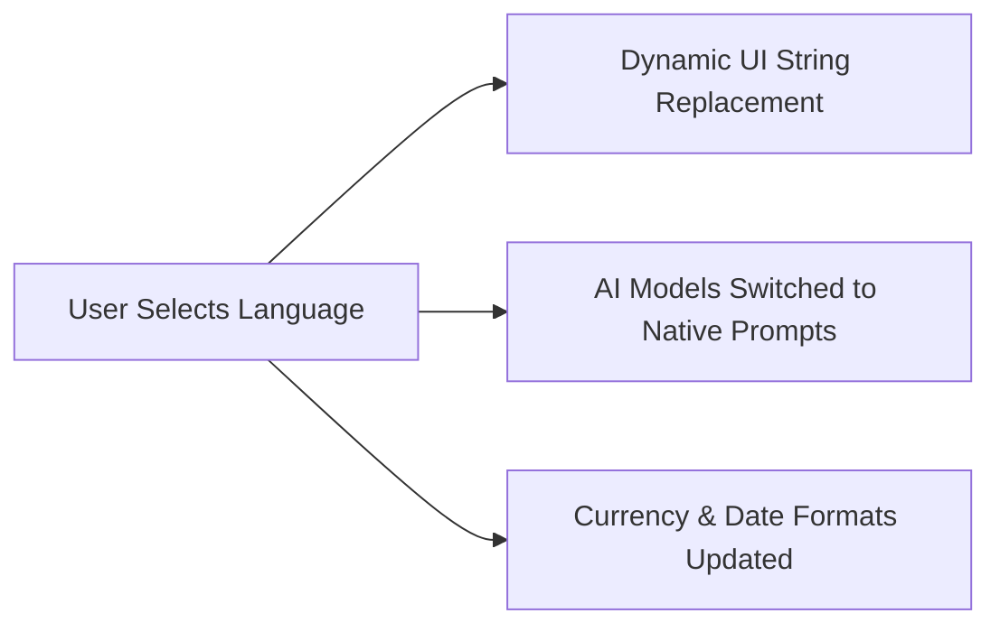

# Title: Zero-Touch Native Localization Engine

## Problem Statement
Non-English speaking founders (like Fatima the food cart owner) are locked out of modern e-commerce platforms because dashboards and setups are overwhelmingly English-first.

## Research Report
- 5% of international complaints focus on language barriers and poor translation quality.
- Geographic expansion requires native-feeling localization, not just raw machine translation.

## Design Doc
- **High-level architecture**: Centralized localization dictionary, dynamic formatting utilities, and localized system prompts for AI agents.
- **UI wireframes or screen flow description (375px first)**:
    - **Onboarding**: Language selection is the very first screen.
    - **Dashboard**: Fully localized UI.
- **Mobile UX flow**: Seamless transition. UI layouts must accommodate longer string lengths (e.g., German, Spanish) at 375px width.
- **AI Integration**: Ensuring the AI agent understands and responds in the selected language accurately.

## Implementation Prompt
Implement the Zero-Touch Native Localization Engine framework. The Critical User Journey involves changing the system language and verifying that the dashboard UI, date formats, and AI agent responses reflect the chosen language without layout breakage at 375px width. Acceptance criteria: Supports at least English and Spanish initially, UI does not break with long text.

## Priority
P3

## Estimated Scope
Small
