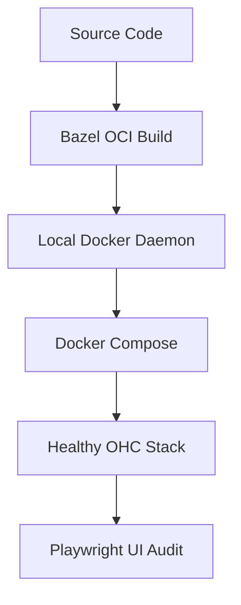

# [maintenance] Resolve Docker Hub Rate Limits & Missing Base Images

## Title
Resolve Docker Hub Rate Limits & Missing Base Images for UI Dogfooding

## Problem Statement
The OHC development environment is currently blocked from performing "Phase -1: Real Product Dogfooding" due to Docker Hub unauthenticated pull rate limits and missing remote images for the `onehumancorp/server:latest`. This prevents the "Live Service UI Gap Audit" mandatory protocol, forcing developers to rely on code assumptions rather than observed product behavior. We need a robust fallback to local OCI builds for critical services and a mechanism to bypass rate limits using authenticated registries or local image caching.

## Research Report
*   **Discovery**: Running `docker compose up` fails with `error from registry: You have reached your unauthenticated pull rate limit.`
*   **Missing Artifacts**: The `onehumancorp/server:latest` image referenced in `deploy/docker-compose.yml` does not exist in the public registry.
*   **Bazel Path**: The repository contains OCI image targets in `//deploy:server_image` and `//deploy:agent_image`. These are the intended source-of-truth for local development images.

## Design Doc

### Architecture Diagram

### Key Design Decisions
1.  **Local-First Images**: Update the local developer workflow to default to `npx @bazel/bazelisk run //deploy:load_all_images` instead of pulling from Docker Hub.
2.  **Compose Overrides**: Utilize `docker-compose.override.yml` to point to local image tags, preventing changes to the canonical production compose file.
3.  **CI/CD Alignment**: Ensure the Bazel build pipeline pushes to a private authenticated registry (e.g., GCR/AR) to mitigate rate limits in CI.

## Implementation Prompt
**To the Infrastructure Swarm:**
Implement the fix for the Docker environment blockade.
1.  Provide a script or Bazel target that builds all required OHC services (`server`, `agent`) locally and loads them into the local Docker daemon.
2.  Update `deploy/docker-compose.yml` or provide an override that utilizes these local images.
3.  Document the "Local Build & Launch" flow in `README.md` as the primary path when Docker Hub rate limits are encountered.
4.  Verify the fix by ensuring `docker compose up server postgres valkey` reaches a `Healthy` state without pulling from external registries.

## Priority
P0 (Environment Blocker)

## Estimated Scope
Small
