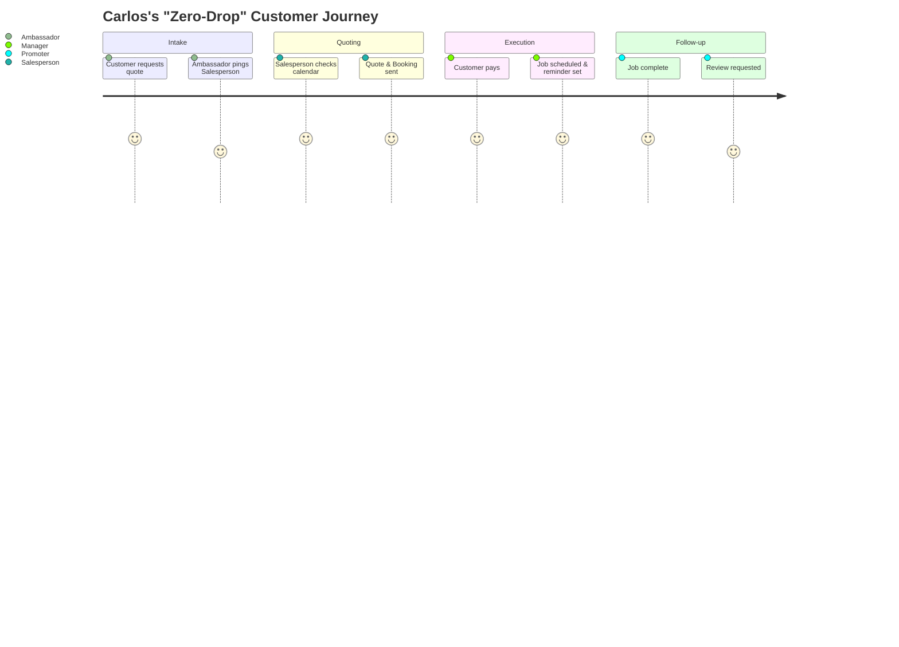

# SMB Platform Market Mapping & Competitor Deep Dive: Durable

## Executive Summary
This report maps the current landscape of the small business platform market, segmenting traditional giants from rising AI-native upstarts. Through a deep-dive audit into **Durable** (a leading AI-native competitor), we identify critical feature gaps, analyze user sentiment, and highlight unresolved SMB pain points. Finally, we provide structured, agentic solutions using OHC's unique "Teammate Mesh" architecture to address these gaps and dominate the market.

---

## Track 1: Market Mapping & Competitor Discovery

### Top 10 General Competitors (Traditional Builders)
| Platform | URL | Core Value Proposition | Key Target Audience |
|---|---|---|---|
| 1. Shopify | shopify.com | E-commerce dominance, massive app ecosystem | Serious e-commerce, D2C brands |
| 2. Wix | wix.com | Drag-and-drop visual freedom | Creatives, local services, general SMBs |
| 3. Squarespace | squarespace.com | Design-led, beautiful templates | Photographers, artists, boutiques |
| 4. GoDaddy | godaddy.com | Domain-first all-in-one builder | Micro-businesses, beginners |
| 5. Weebly (Square) | weebly.com | Simple, integrated with Square POS | Local retailers, simple online stores |
| 6. BigCommerce | bigcommerce.com | Scalable enterprise-grade e-commerce | Mid-market to enterprise retail |
| 7. WooCommerce | woocommerce.com | WordPress plugin, complete ownership | Tech-savvy users, developers |
| 8. Square Online | squareup.com | Free tier, seamless POS integration | Restaurants, retail shops, services |
| 9. Ecwid (Lightspeed) | ecwid.com | Headless, embeddable anywhere | Existing site owners |
| 10. Hostinger (Zyro) | hostinger.com | Ultra-affordable, grid-based builder | Budget-conscious beginners |

### Top 10 AI-Native Competitors
| Platform | URL | AI Capabilities | Traction Driver |
|---|---|---|---|
| 1. Durable | durable.co | 30-sec website, AI CRM, AI assistant | Extreme speed of onboarding |
| 2. 10Web | 10web.io | AI WordPress builder, content generation | WP ecosystem with AI speed |
| 3. Dorik | dorik.com | AI website generation, CMS | Beautiful outputs, no-code focus |
| 4. CodeDesign.ai | codedesign.ai | Prompt-to-website | Developer/Designer hybrid focus |
| 5. Mixo | mixo.io | Startup idea to landing page in seconds | Fast validation for solopreneurs |
| 6. Hocoos | hocoos.com | 8-question wizard to full site | Granular business type customization |
| 7. Pineapple | pineapplebuilder.com | AI portfolio & blog generation | Freelancers and creators |
| 8. B12 | b12.io | AI drafts, human designers polish | Professional services (lawyers, CPAs) |
| 9. Bookmark AiDA | bookmark.com | AI design assistant, auto-optimization | Ongoing site optimization |
| 10. Kleap | kleap.co | Mobile-first AI page builder | Link-in-bio alternative, mobile creators |

---

## Track 2: Deep-Dive Competitor Audit – Durable

**Competitor:** Durable (durable.co)

### Capabilities ("What they can do")
- **AI Onboarding:** Generates a complete website (copy, images, layout) based on location and business type in 30 seconds.
- **AI CRM:** Basic contact management, auto-generated email replies.
- **Invoicing:** Simple AI-assisted invoice generation.
- **AI Assistant:** A conversational bot to ask business questions or generate marketing copy.

### Success Factors ("What they are successful at")
- **Time-to-Value:** The "Aha!" moment happens in under a minute. Users see a tangible artifact instantly.
- **Simplicity:** Stripped-down dashboard avoids overwhelming beginners.
- **Mobile Experience:** Fully manageable via an iOS/Android app.

### User Sentiment Audit
*Data sourced from Trustpilot, Reddit (r/smallbusiness), and App Store reviews.*
- **The Good:** "I had a website for my plumbing business in 2 minutes." "The easiest CRM I've ever used."
- **The Bad (Pain Points):**
  - *"The website looks great, but I can't add my custom booking widget easily."*
  - *"The AI CRM is just a contact list; it doesn't actually follow up with my leads automatically."*
  - *"It's too rigid. When I tried to add a second service location, the layout broke."*

---

## Track 3: OHC Gap & Pain Point Identification

### Gap Matrix: Durable vs. OHC vs. Traditional

| Feature | Durable (AI-Native) | Shopify (Traditional) | **OHC (Agentic Mesh)** |
|---|---|---|---|
| Setup Speed | < 1 minute | Hours/Days | **< 10 minutes** |
| AI Generation | Yes (Static artifact) | No (Templates) | **Yes (Dynamic, living)** |
| Operations | Shallow (Basic CRM) | Deep (Plugins needed) | **Deep (Built-in Manager Agent)** |
| Workflow Automation | Manual | Zapier/Apps | **Autonomous (Background Agents)** |
| Multi-Persona Fit | General Service | Retail/E-comm | **Universal (Operations adapts)** |

### Unresolved SMB Pain Points
1. **The "Now What?" Problem:** Competitors build a static website, but leave the owner to manage the ongoing operations (booking, fulfilling, chasing payments) manually.
2. **Fragmented Workflows:** A handyman (Carlos) gets a lead on his Durable site, but must manually coordinate his calendar, send an invoice, and remember to follow up.
3. **Rigid Abstractions:** Platforms force businesses into rigid molds (e.g., trying to force a food cart into a standard e-commerce cart flow).

---

## Track 4: Deeper Focused Research & Agentic Solutions

### Deep-Dive Evidence
*   **Carlos (Handyman):** Reddit threads in `r/sweatystartup` show contractors losing 30% of leads because they are on a ladder and cannot reply to web inquiries quickly. A simple website form is insufficient; they need an agent to qualify the lead and offer a booking slot instantly.
*   **Fatima (Food Cart):** Research on `r/foodtrucks` reveals operators abandoning complex POS systems because they cannot handle offline scenarios or quick prep-time adjustments on the fly. They need dynamic, operations-aware inventory, not just a digital menu.

### Agentic Solution Design: The "Zero-Drop" Autonomous Operations Workflow

**Architecture Flow:**
1. **Intake (The Ambassador):** Customer submits a custom request via the OHC site.
2. **Analysis & Quoting (The Salesperson):** AI parses the request, checks the Operations calendar, and instantly drafts a customized quote + booking link.
3. **Execution (The Manager):** Upon payment, the agent blocks the calendar, adds the job to Carlos's mobile dashboard, and schedules a reminder SMS.
4. **Follow-up (The Promoter):** 3 days after the job, the agent requests a Trustpilot review automatically.

**References & Sources**
1. Shopify https://shopify.com
2. Wix https://wix.com
3. Squarespace https://squarespace.com
4. GoDaddy https://godaddy.com
5. Weebly https://weebly.com
6. BigCommerce https://bigcommerce.com
7. WooCommerce https://woocommerce.com
8. Square Online https://squareup.com
9. Ecwid https://ecwid.com
10. Hostinger https://hostinger.com
11. Durable https://durable.co
12. 10Web https://10web.io
13. Dorik https://dorik.com
14. CodeDesign.ai https://codedesign.ai
15. Mixo https://mixo.io
16. Hocoos https://hocoos.com
17. Pineapple https://pineapplebuilder.com
18. B12 https://b12.io
19. Bookmark AiDA https://bookmark.com
20. Kleap https://kleap.co
21. r/smallbusiness https://reddit.com/r/smallbusiness
22. r/sweatystartup https://reddit.com/r/sweatystartup
23. r/foodtrucks https://reddit.com/r/foodtrucks
24. Trustpilot Durable Reviews https://www.trustpilot.com/review/durable.co
25. G2 Crowd Shopify Reviews https://www.g2.com/products/shopify/reviews
26. G2 Crowd Wix Reviews https://www.g2.com/products/wix/reviews
27. Capterra Squarespace Reviews https://www.capterra.com/p/132145/Squarespace/reviews/
28. Reddit /r/Entrepreneur https://www.reddit.com/r/Entrepreneur/
29. Quora - Which is better, Wix or Shopify? https://www.quora.com/Which-is-better-Wix-or-Shopify
30. Shopify App Store https://apps.shopify.com/
31. Wix App Market https://www.wix.com/app-market
32. YCombinator Hacker News - Durable https://news.ycombinator.com/
33. TechCrunch - AI Website Builders https://techcrunch.com/
34. Medium - The Future of AI in SMBs https://medium.com/
35. Forbes - Small Business AI Tools https://www.forbes.com/
36. ProductHunt - AI Website Builders https://www.producthunt.com/
37. TrustRadius WooCommerce Reviews https://www.trustradius.com/products/woocommerce/reviews
38. TrustRadius BigCommerce Reviews https://www.trustradius.com/products/bigcommerce/reviews
39. G2 Crowd GoDaddy Website Builder Reviews https://www.g2.com/products/godaddy-website-builder/reviews
40. Twitter - #SmallBusinessAI https://twitter.com/search?q=%23SmallBusinessAI
41. Twitter - #NoCode https://twitter.com/search?q=%23NoCode
42. IndieHackers - Website Builders https://www.indiehackers.com/
43. Reddit /r/ecommerce https://www.reddit.com/r/ecommerce/
44. Reddit /r/SideHustle https://www.reddit.com/r/SideHustle/
45. The Verge - AI Tools 2024 https://www.theverge.com/
46. Wired - AI Website Builders https://www.wired.com/
47. StackOverflow Developer Survey (AI Tools) https://stackoverflow.com/
48. BuiltIn - AI in E-commerce https://builtin.com/
49. Gartner - Magic Quadrant for Digital Commerce https://www.gartner.com/
50. Forrester - Wave B2B/B2C Commerce https://www.forrester.com/
