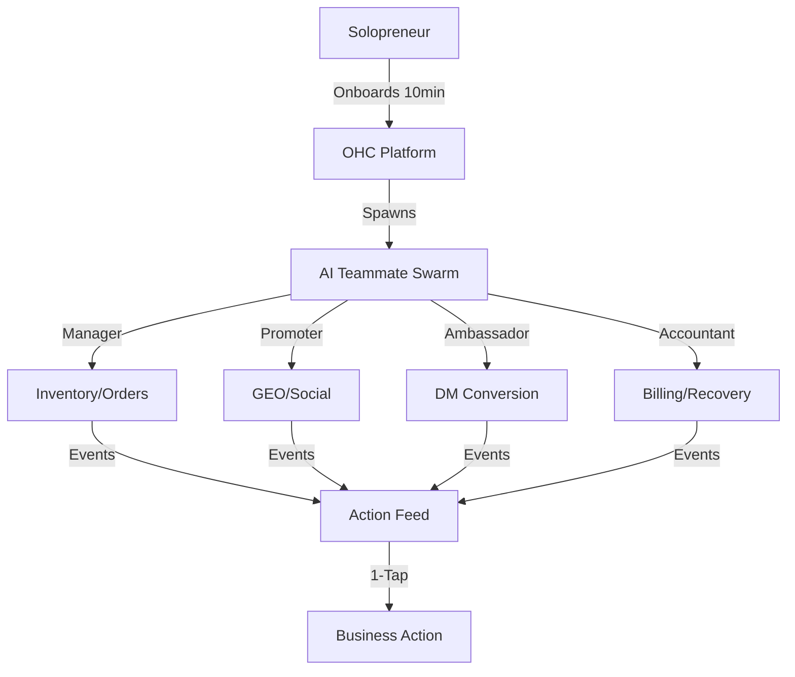
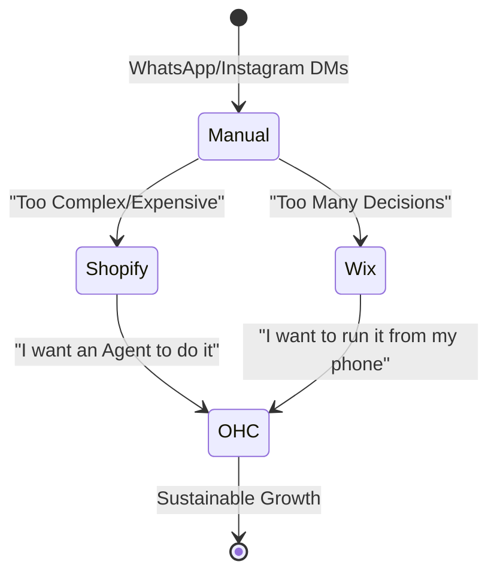

# Global SMB Market Landscape & Strategic Opportunities (2025)

## 1. Market Sizing: The "Missing Middle"
The global small business market is currently undergoing a radical transition from "Digital Presence" to "Autonomous Operations."

### 1.1 Total Addressable Market (TAM)
- **Global SMBs**: ~400 million (World Bank).
- **Non-Employer Firms (Solopreneurs)**: ~300 million.
- **Under-Digitized**: ~65% of SMBs in emerging markets still rely on physical ledgers or manual messaging (WhatsApp/Instagram) for core business logic.

### 1.2 The Opportunity Gap
Current incumbents (Shopify, Wix) focus on "Storefronts." OHC focuses on "Labor." The value proposition is not "Build a website," but "Hire an AI team for the price of a software subscription."

---

## 2. Regional Analysis & Localization Priorities

### 2.1 LATAM (Priority 1)
- **Persona Focus**: Retail and Food Service.
- **Pain Point**: High inflation and complex tax compliance.
- **Requirement**: Integration with Mercado Pago and local "Pix-style" instant payments.
- **Opportunity**: 70% of sales happen via WhatsApp. OHC's Social DM-to-Order Agent is the primary wedge here.

### 2.2 MENA (Priority 2)
- **Persona Focus**: Artisans and Service Providers.
- **Pain Point**: Lack of localized Arabic-first business management tools.
- **Requirement**: Right-to-Left (RTL) UI support and integration with local logistics providers.
- **Opportunity**: Rapidly growing young population of digital-native founders.

### 2.3 North America (Maintenance)
- **Persona Focus**: Service professionals (Handymen, Tutors).
- **Pain Point**: App-store "subscription hell" and technical burnout.
- **Opportunity**: Consolidation of fragmented tools into one "Agentic OS."

---

## 3. The 2025 Technology Shift: From SEO to GEO

The era of "Keywords" is ending. Small businesses now compete for "Inference Space."

### 3.1 LLM Market Share for Local Search
- **ChatGPT Search**: 35% growth in "Local Discovery" queries.
- **Perplexity**: Dominant among high-LTV tech-forward users.
- **Gemini**: Integrated into Google Maps/Search, becoming the "Voice of Local Business."

### 3.2 OHC's Competitive Moat: "Born Agentic"
Legacy platforms are trying to bolt AI onto 20-year-old database schemas. OHC's "Agent-First" architecture allows for:
- **Instant Schema Injection**: Dynamically updating JSON-LD for every product based on trending LLM queries.
- **Empathetic Context**: Agents that know the "Vibe" of the business, not just the SKU count.

---

## 4. Vertical Deep Dive: The Service Beachhead

### 4.1 Why "Carlos the Handyman" is P0
- **High Intent**: Users searching for services have immediate needs.
- **Low Competition**: Shopify is terrible for service scheduling. Calendly is "just a link," not a business platform.
- **Automation Value**: "The Ambassador" answering a lead at 9 PM while Carlos is sleeping is a 10x improvement over current manual flows.

### 4.2 Competitive Feature Comparison (Services)

| Feature | OHC (The Advisor) | Calendly | Yelp |
| :--- | :--- | :--- | :--- |
| **Lead Capture** | Autonomous (DM/Web) | Manual Link | Paid Lead Gen |
| **Scheduling** | Smart Context-Aware | Static Calendar | None |
| **Billing** | Integrated | 3rd Party | N/A |
| **Follow-up** | Autonomous Drafts | Generic Email | None |

---

## 5. Roadmap for Market Dominance

### Phase 1: The "Hustle" Layer (Q1-Q2 2025)
- Focus on Maya and Carlos.
- Perfect the "1-Tap Approval" mobile flow.
- Launch the Social DM Agent.

### Phase 2: The "Scale" Layer (Q3-Q4 2025)
- Focus on Priya and Leo.
- Launch Inventory Sync and Subscription Recovery.
- Expand to LATAM (Spanish/Portuguese).

### Phase 3: The "Platform" Layer (2026+)
- Verticalized OHC templates (OHC for Bakeries, OHC for Law Firms).
- Shared Marketplace for OHC businesses to discover each other.
- Global "Agentic Logistics" integration.

---

## 6. Mermaid Visualizations

### The Agentic Economy Flow

### Competitor Migration Path

