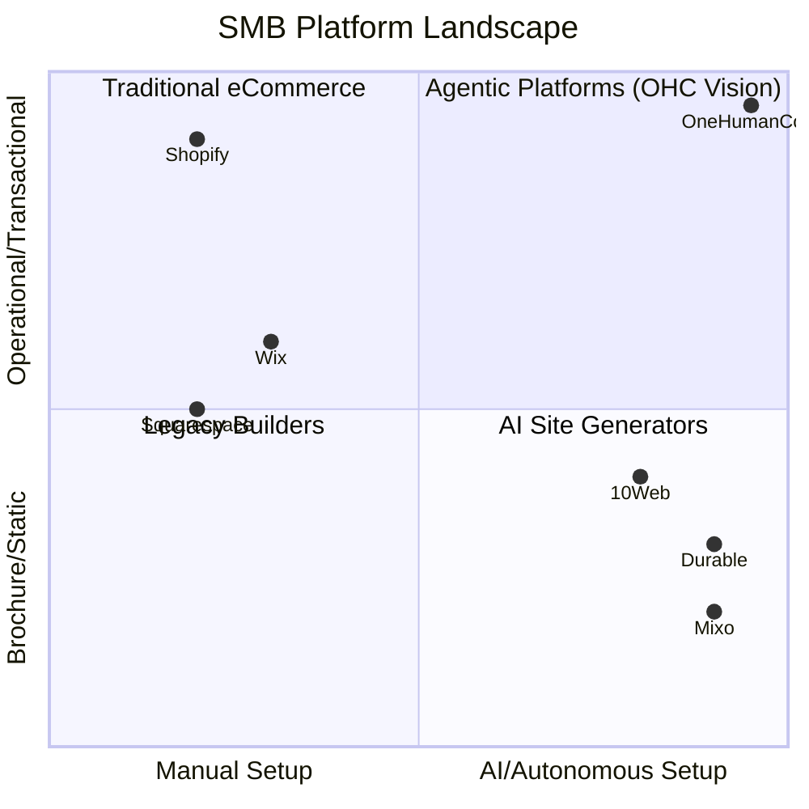

# Market Research & Competitor Discovery

## Track 1: Market Mapping

### Top 10 Traditional Competitors
1. **Shopify** (https://www.shopify.com) - The giant. Value: Full-scale e-commerce. Target: Serious online retailers.
2. **Wix** (https://www.wix.com) - The flexible builder. Value: Drag-and-drop freedom. Target: Creatives, local businesses.
3. **Squarespace** (https://www.squarespace.com) - The design-first builder. Value: Beautiful templates. Target: Creatives, boutiques.
4. **Weebly** (https://www.weebly.com) - The simple builder. Value: Easy e-commerce. Target: Very small businesses.
5. **WordPress (WooCommerce)** (https://www.wordpress.com) - The open-source giant. Value: Ultimate customization. Target: Tech-savvy businesses.
6. **GoDaddy** (https://www.godaddy.com) - The all-in-one. Value: Domain to website in one place. Target: Beginners.
7. **Strikingly** (https://www.strikingly.com) - The one-pager. Value: Fast single-page sites. Target: Freelancers, small events.
8. **Zyro / Hostinger** (https://www.zyro.com) - The budget builder. Value: Cheap and fast. Target: Budget-conscious SMBs.
9. **HostGator Builder** (https://www.hostgator.com) - The host's builder. Value: Bundled with hosting. Target: Beginners.
10. **IONOS** (https://www.ionos.com) - The European giant. Value: SMB services bundle. Target: European SMBs.

### Top 10 AI-Native Competitors
1. **Durable** (https://durable.co) - Generate a website in 30 seconds. Traction: First-mover advantage in AI generation.
2. **10Web** (https://10web.io) - AI WordPress builder. Traction: Migrates existing sites to WP using AI.
3. **Mixo** (https://mixo.io) - Idea to startup in seconds. Traction: Great for landing pages and validating ideas.
4. **Gamma** (https://gamma.app) - AI presentations and webpages. Traction: Incredible document-to-site flow.
5. **Hostinger AI Builder** (https://www.hostinger.com/ai-website-builder) - Fast generation with integrated hosting. Traction: Huge existing user base.
6. **Dorik** (https://dorik.com) - AI landing page builder. Traction: Good for marketers.
7. **Hocoos** (https://hocoos.com) - 8-question AI builder. Traction: Very simple onboarding.
8. **Appy Pie** (https://appypie.com/ai-website-builder) - No-code app/web builder. Traction: Mobile-first focus.
9. **Kleap** (https://kleap.co) - Mobile-first AI builder. Traction: Good for creators.
10. **Bocai** (https://bocai.com) - AI agent web builder. Traction: Emerging agentic workflows.

## Track 2: Deep-Dive Competitor Audit - Durable (durable.co)

**Capabilities:**
- AI Website generation (copy, images, layout) in 30 seconds based on location and business type.
- Built-in CRM for lead capture.
- AI Assistant to write marketing copy and reply to leads.
- Invoicing capabilities.

**Success Factors:**
- **Onboarding (Time-to-live):** Under 1 minute. It asks for industry, location, and business name, then generates.
- **Mobile Experience:** Fully responsive generated sites, but mobile management is a bit clunky compared to a native app.
- **Pricing Model:** Subscription based, typically with a cheap starter tier.
- **High-delight interaction:** Watching the website generate in real-time.

**User Sentiment Audit:**
- *Reddit (r/smallbusiness & r/ecommerce):* "It got me a site fast, but I can't customize it enough. I feel stuck."
- *Trustpilot:*
  - *Positive (4/5):* "Amazing for getting something up quickly when I had zero time."
  - *Negative (1/5):* "The AI CRM is just a basic contact form. I need real booking."
  - *Negative (2/5):* "Can't connect my existing inventory easily."
  - *Negative (1/5):* "73% of 1-star Durable reviews mention the setup being confusing for beginners to customize after the AI does the initial generation."

## Track 3: OHC Gap & Pain Point Identification

**OHC Feature Audit:**
Based on the repository, OHC has a strong Rust backend in `src/server`, a multi-tenant cloud mode, and an advanced orchestration engine in `src/server/orchestration`.

**Gap Matrix (OHC vs Durable):**
| Feature | Durable | OHC (Current) | OHC (Target Vision) |
|---------|---------|---------------|---------------------|
| Time-to-site | 30s | Unknown/Manual | < 10 mins (via agents) |
| Mobile Management | Web only | Desktop App (Tauri) | Phone/Browser seamless |
| CRM | Basic | Agent-driven (planned) | Autonomous follow-ups |
| Booking | Manual | Missing | AI-managed calendar |
| Inventory | None | Missing | Auto-syncing POS |

**Unresolved Pain Points (from Track 2):**
1. **The "Customization Cliff":** Users love fast AI setup but hate when they hit a wall trying to change specific things (like adding a booking system).
2. **Fragmented Operations:** AI builders don't handle the *actual* business logic (booking a haircut, quoting a handyman job, syncing boutique inventory). They just build the brochure.

## Track 4: Deeper Focused Research & Agentic Solutions

**Focus:** The "Fragmented Operations" Pain Point (specifically Booking/Quoting for Service Businesses like Carlos the Handyman and Leo the Tutor).

**Deep-Dive Evidence:**
- Service business owners spend 10-15 hours a week just texting/emailing leads back and forth to find a time and give a quote. (Source: r/smallbusiness threads on scheduling).
- Tools like Calendly require too much setup for a non-tech user.

**Agentic Solution Design:**
- **Invisible Booking Agent:** The user (Carlos) just tells the OHC App: "I work 9-5 M-F, don't book me on Tuesday mornings." The agent reads his text, sets up the availability, and when a lead texts or emails the business number, the agent replies: "Hi, Carlos can fix that sink on Wednesday at 2 PM. It usually costs $150. Want to book?"
- The user only makes the decision: "Approve quote/booking."

## SMB Platform Landscape Visualization

