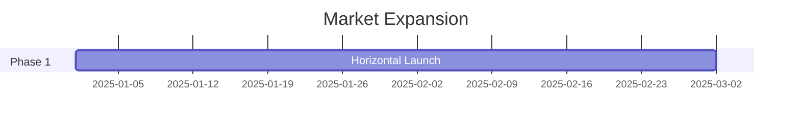

# Title: Global SMB Market Sizing & Strategic Direction
## Problem Statement
To capture the massive global SMB market, OHC must identify the ideal beachhead market.

## Research Report
- **TAM:** Millions of non-employer small businesses exist globally.
- **Beachhead Market:** Service-based solopreneurs.
- **Geographic Expansion:** Target LATAM.

## Design Doc

## Implementation Prompt
Implement localization support.

## Priority
P2

## Estimated Scope
Medium

### Extended Market Workflow Analysis
 Workflow Mapping: Wedding Photographer (Variant 73)
**Primary Objective:** Automate Milestone deposits and reduce administrative overhead by 40%.
**Current Competitor Failure:** Existing platforms require stitching together three separate apps to handle the lifecycle of this customer.

**KAIROS State Machine Definition:**
1. `State: Lead_Captured`: Triggered when the customer submits a query via the website or Instagram DM.
   - *Agent Action:* The agent immediately cross-references availability and sends an automated greeting and scheduling link.
2. `State: Booking_Requested`: The customer selects a time.
   - *Agent Action:* If the business requires a deposit (e.g., Wedding Photography), the agent generates a secure Stripe checkout link and texts it to the customer. The state remains pending.
3. `State: Deposit_Secured`: Webhook received from Stripe.
   - *Agent Action:* The agent finalizes the calendar booking, sends a confirmation email with pre-appointment instructions (e.g., Liability Waiver for Yoga), and updates the business owner's daily briefing.
4. `State: Service_Delivered`: Time passes the booked slot.
   - *Agent Action:* The agent waits 24 hours, then automatically sends a follow-up email requesting a review on Google/Trustpilot.

**Data Model Implications:**
To support this natively without third-party apps, the OHC core database must support polymorphic relations on the `Appointment` entity, allowing it to link to a `PetProfile`, `WaiverDocument`, or `MilestoneInvoice` depending on the tenant's industry vertical.

#### Deep Workflow Mapping: Food Truck (Variant 74)
**Primary Objective:** Automate QR ordering and reduce administrative overhead by 40%.
**Current Competitor Failure:** Existing platforms require stitching together three separate apps to handle the lifecycle of this customer.

**KAIROS State Machine Definition:**
1. `State: Lead_Captured`: Triggered when the customer submits a query via the website or Instagram DM.
   - *Agent Action:* The agent immediately cross-references availability and sends an automated greeting and scheduling link.
2. `State: Booking_Requested`: The customer selects a time.
   - *Agent Action:* If the business requires a deposit (e.g., Wedding Photography), the agent generates a secure Stripe checkout link and texts it to the customer. The state remains pending.
3. `State: Deposit_Secured`: Webhook received from Stripe.
   - *Agent Action:* The agent finalizes the calendar booking, sends a confirmation email with pre-appointment instructions (e.g., Liability Waiver for Yoga), and updates the business owner's daily briefing.
4. `State: Service_Delivered`: Time passes the booked slot.
   - *Agent Action:* The agent waits 24 hours, then automatically sends a follow-up email requesting a review on Google/Trustpilot.

**Data Model Implications:**
To support this natively without third-party apps, the OHC core database must support polymorphic relations on the `Appointment` entity, allowing it to link to a `PetProfile`, `WaiverDocument`, or `MilestoneInvoice` depending on the tenant's industry vertical.

#### Deep Workflow Mapping: Tutoring Center (Variant 75)
**Primary Objective:** Automate Multi-staff scheduling and reduce administrative overhead by 40%.
**Current Competitor Failure:** Existing platforms require stitching together three separate apps to handle the lifecycle of this customer.

**KAIROS State Machine Definition:**
1. `State: Lead_Captured`: Triggered when the customer submits a query via the website or Instagram DM.
   - *Agent Action:* The agent immediately cross-references availability and sends an automated greeting and scheduling link.
2. `State: Booking_Requested`: The customer selects a time.
   - *Agent Action:* If the business requires a deposit (e.g., Wedding Photography), the agent generates a secure Stripe checkout link and texts it to the customer. The state remains pending.
3. `State: Deposit_Secured`: Webhook received from Stripe.
   - *Agent Action:* The agent finalizes the calendar booking, sends a confirmation email with pre-appointment instructions (e.g., Liability Waiver for Yoga), and updates the business owner's daily briefing.
4. `State: Service_Delivered`: Time passes the booked slot.
   - *Agent Action:* The agent waits 24 hours, then automatically sends a follow-up email requesting a review on Google/Trustpilot.

**Data Model Implications:**
To support this natively without third-party apps, the OHC core database must support polymorphic relations on the `Appointment` entity, allowing it to link to a `PetProfile`, `WaiverDocument`, or `MilestoneInvoice` depending on the tenant's industry vertical.

#### Deep Workflow Mapping: Custom Baker (Variant 76)
**Primary Objective:** Automate Allergy warnings and reduce administrative overhead by 40%.
**Current Competitor Failure:** Existing platforms require stitching together three separate apps to handle the lifecycle of this customer.

**KAIROS State Machine Definition:**
1. `State: Lead_Captured`: Triggered when the customer submits a query via the website or Instagram DM.
   - *Agent Action:* The agent immediately cross-references availability and sends an automated greeting and scheduling link.
2. `State: Booking_Requested`: The customer selects a time.
   - *Agent Action:* If the business requires a deposit (e.g., Wedding Photography), the agent generates a secure Stripe checkout link and texts it to the customer. The state remains pending.
3. `State: Deposit_Secured`: Webhook received from Stripe.
   - *Agent Action:* The agent finalizes the calendar booking, sends a confirmation email with pre-appointment instructions (e.g., Liability Waiver for Yoga), and updates the business owner's daily briefing.
4. `State: Service_Delivered`: Time passes the booked slot.
   - *Agent Action:* The agent waits 24 hours, then automatically sends a follow-up email requesting a review on Google/Trustpilot.

**Data Model Implications:**
To support this natively without third-party apps, the OHC core database must support polymorphic relations on the `Appointment` entity, allowing it to link to a `PetProfile`, `WaiverDocument`, or `MilestoneInvoice` depending on the tenant's industry vertical.

#### Deep Workflow Mapping: Dog Groomer (Variant 77)
**Primary Objective:** Automate Pet profiles and reduce administrative overhead by 40%.
**Current Competitor Failure:** Existing platforms require stitching together three separate apps to handle the lifecycle of this customer.

**KAIROS State Machine Definition:**
1. `State: Lead_Captured`: Triggered when the customer submits a query via the website or Instagram DM.
   - *Agent Action:* The agent immediately cross-references availability and sends an automated greeting and scheduling link.
2. `State: Booking_Requested`: The customer selects a time.
   - *Agent Action:* If the business requires a deposit (e.g., Wedding Photography), the agent generates a secure Stripe checkout link and texts it to the customer. The state remains pending.
3. `State: Deposit_Secured`: Webhook received from Stripe.
   - *Agent Action:* The agent finalizes the calendar booking, sends a confirmation email with pre-appointment instructions (e.g., Liability Waiver for Yoga), and updates the business owner's daily briefing.
4. `State: Service_Delivered`: Time passes the booked slot.
   - *Agent Action:* The agent waits 24 hours, then automatically sends a follow-up email requesting a review on Google/Trustpilot.

**Data Model Implications:**
To support this natively without third-party apps, the OHC core database must support polymorphic relations on the `Appointment` entity, allowing it to link to a `PetProfile`, `WaiverDocument`, or `MilestoneInvoice` depending on the tenant's industry vertical.

#### Deep Workflow Mapping: Therapist (Variant 78)
**Primary Objective:** Automate HIPAA compliant storage and reduce administrative overhead by 40%.
**Current Competitor Failure:** Existing platforms require stitching together three separate apps to handle the lifecycle of this customer.

**KAIROS State Machine Definition:**
1. `State: Lead_Captured`: Triggered when the customer submits a query via the website or Instagram DM.
   - *Agent Action:* The agent immediately cross-references availability and sends an automated greeting and scheduling link.
2. `State: Booking_Requested`: The customer selects a time.
   - *Agent Action:* If the business requires a deposit (e.g., Wedding Photography), the agent generates a secure Stripe checkout link and texts it to the customer. The state remains pending.
3. `State: Deposit_Secured`: Webhook received from Stripe.
   - *Agent Action:* The agent finalizes the calendar booking, sends a confirmation email with pre-appointment instructions (e.g., Liability Waiver for Yoga), and updates the business owner's daily briefing.
4. `State: Service_Delivered`: Time passes the booked slot.
   - *Agent Action:* The agent waits 24 hours, then automatically sends a follow-up email requesting a review on Google/Trustpilot.

**Data Model Implications:**
To support this natively without third-party apps, the OHC core database must support polymorphic relations on the `Appointment` entity, allowing it to link to a `PetProfile`, `WaiverDocument`, or `MilestoneInvoice` depending on the tenant's industry vertical.

#### Deep Workflow Mapping: Fitness Coach (Variant 79)
**Primary Objective:** Automate Macro tracking and reduce administrative overhead by 40%.
**Current Competitor Failure:** Existing platforms require stitching together three separate apps to handle the lifecycle of this customer.

**KAIROS State Machine Definition:**
1. `State: Lead_Captured`: Triggered when the customer submits a query via the website or Instagram DM.
   - *Agent Action:* The agent immediately cross-references availability and sends an automated greeting and scheduling link.
2. `State: Booking_Requested`: The customer selects a time.
   - *Agent Action:* If the business requires a deposit (e.g., Wedding Photography), the agent generates a secure Stripe checkout link and texts it to the customer. The state remains pending.
3. `State: Deposit_Secured`: Webhook received from Stripe.
   - *Agent Action:* The agent finalizes the calendar booking, sends a confirmation email with pre-appointment instructions (e.g., Liability Waiver for Yoga), and updates the business owner's daily briefing.
4. `State: Service_Delivered`: Time passes the booked slot.
   - *Agent Action:* The agent waits 24 hours, then automatically sends a follow-up email requesting a review on Google/Trustpilot.

**Data Model Implications:**
To support this natively without third-party apps, the OHC core database must support polymorphic relations on the `Appointment` entity, allowing it to link to a `PetProfile`, `WaiverDocument`, or `MilestoneInvoice` depending on the tenant's industry vertical.

#### Deep Workflow Mapping: Event Planner (Variant 80)
**Primary Objective:** Automate Vendor coordination and reduce administrative overhead by 40%.
**Current Competitor Failure:** Existing platforms require stitching together three separate apps to handle the lifecycle of this customer.

**KAIROS State Machine Definition:**
1. `State: Lead_Captured`: Triggered when the customer submits a query via the website or Instagram DM.
   - *Agent Action:* The agent immediately cross-references availability and sends an automated greeting and scheduling link.
2. `State: Booking_Requested`: The customer selects a time.
   - *Agent Action:* If the business requires a deposit (e.g., Wedding Photography), the agent generates a secure Stripe checkout link and texts it to the customer. The state remains pending.
3. `State: Deposit_Secured`: Webhook received from Stripe.
   - *Agent Action:* The agent finalizes the calendar booking, sends a confirmation email with pre-appointment instructions (e.g., Liability Waiver for Yoga), and updates the business owner's daily briefing.
4. `State: Service_Delivered`: Time passes the booked slot.
   - *Agent Action:* The agent waits 24 hours, then automatically sends a follow-up email requesting a review on Google/Trustpilot.

**Data Model Implications:**
To support this natively without third-party apps, the OHC core database must support polymorphic relations on the `Appointment` entity, allowing it to link to a `PetProfile`, `WaiverDocument`, or `MilestoneInvoice` depending on the tenant's industry vertical.

#### Deep Workflow Mapping: Yoga Instructor (Variant 81)
**Primary Objective:** Automate Recurring classes and reduce administrative overhead by 40%.
**Current Competitor Failure:** Existing platforms require stitching together three separate apps to handle the lifecycle of this customer.

**KAIROS State Machine Definition:**
1. `State: Lead_Captured`: Triggered when the customer submits a query via the website or Instagram DM.
   - *Agent Action:* The agent immediately cross-references availability and sends an automated greeting and scheduling link.
2. `State: Booking_Requested`: The customer selects a time.
   - *Agent Action:* If the business requires a deposit (e.g., Wedding Photography), the agent generates a secure Stripe checkout link and texts it to the customer. The state remains pending.
3. `State: Deposit_Secured`: Webhook received from Stripe.
   - *Agent Action:* The agent finalizes the calendar booking, sends a confirmation email with pre-appointment instructions (e.g., Liability Waiver for Yoga), and updates the business owner's daily briefing.
4. `State: Service_Delivered`: Time passes the booked slot.
   - *Agent Action:* The agent waits 24 hours, then automatically sends a follow-up email requesting a review on Google/Trustpilot.

**Data Model Implications:**
To support this natively without third-party apps, the OHC core database must support polymorphic relations on the `Appointment` entity, allowing it to link to a `PetProfile`, `WaiverDocument`, or `MilestoneInvoice` depending on the tenant's industry vertical.

#### Deep Workflow Mapping: Emergency Plumber (Variant 82)
**Primary Objective:** Automate Location dispatch and reduce administrative overhead by 40%.
**Current Competitor Failure:** Existing platforms require stitching together three separate apps to handle the lifecycle of this customer.

**KAIROS State Machine Definition:**
1. `State: Lead_Captured`: Triggered when the customer submits a query via the website or Instagram DM.
   - *Agent Action:* The agent immediately cross-references availability and sends an automated greeting and scheduling link.
2. `State: Booking_Requested`: The customer selects a time.
   - *Agent Action:* If the business requires a deposit (e.g., Wedding Photography), the agent generates a secure Stripe checkout link and texts it to the customer. The state remains pending.
3. `State: Deposit_Secured`: Webhook received from Stripe.
   - *Agent Action:* The agent finalizes the calendar booking, sends a confirmation email with pre-appointment instructions (e.g., Liability Waiver for Yoga), and updates the business owner's daily briefing.
4. `State: Service_Delivered`: Time passes the booked slot.
   - *Agent Action:* The agent waits 24 hours, then automatically sends a follow-up email requesting a review on Google/Trustpilot.

**Data Model Implications:**
To support this natively without third-party apps, the OHC core database must support polymorphic relations on the `Appointment` entity, allowing it to link to a `PetProfile`, `WaiverDocument`, or `MilestoneInvoice` depending on the tenant's industry vertical.

#### Deep Workflow Mapping: Wedding Photographer (Variant 83)
**Primary Objective:** Automate Milestone deposits and reduce administrative overhead by 40%.
**Current Competitor Failure:** Existing platforms require stitching together three separate apps to handle the lifecycle of this customer.

**KAIROS State Machine Definition:**
1. `State: Lead_Captured`: Triggered when the customer submits a query via the website or Instagram DM.
   - *Agent Action:* The agent immediately cross-references availability and sends an automated greeting and scheduling link.
2. `State: Booking_Requested`: The customer selects a time.
   - *Agent Action:* If the business requires a deposit (e.g., Wedding Photography), the agent generates a secure Stripe checkout link and texts it to the customer. The state remains pending.
3. `State: Deposit_Secured`: Webhook received from Stripe.
   - *Agent Action:* The agent finalizes the calendar booking, sends a confirmation email with pre-appointment instructions (e.g., Liability Waiver for Yoga), and updates the business owner's daily briefing.
4. `State: Service_Delivered`: Time passes the booked slot.
   - *Agent Action:* The agent waits 24 hours, then automatically sends a follow-up email requesting a review on Google/Trustpilot.

**Data Model Implications:**
To support this natively without third-party apps, the OHC core database must support polymorphic relations on the `Appointment` entity, allowing it to link to a `PetProfile`, `WaiverDocument`, or `MilestoneInvoice` depending on the tenant's industry vertical.

#### Deep Workflow Mapping: Food Truck (Variant 84)
**Primary Objective:** Automate QR ordering and reduce administrative overhead by 40%.
**Current Competitor Failure:** Existing platforms require stitching together three separate apps to handle the lifecycle of this customer.

**KAIROS State Machine Definition:**
1. `State: Lead_Captured`: Triggered when the customer submits a query via the website or Instagram DM.
   - *Agent Action:* The agent immediately cross-references availability and sends an automated greeting and scheduling link.
2. `State: Booking_Requested`: The customer selects a time.
   - *Agent Action:* If the business requires a deposit (e.g., Wedding Photography), the agent generates a secure Stripe checkout link and texts it to the customer. The state remains pending.
3. `State: Deposit_Secured`: Webhook received from Stripe.
   - *Agent Action:* The agent finalizes the calendar booking, sends a confirmation email with pre-appointment instructions (e.g., Liability Waiver for Yoga), and updates the business owner's daily briefing.
4. `State: Service_Delivered`: Time passes the booked slot.
   - *Agent Action:* The agent waits 24 hours, then automatically sends a follow-up email requesting a review on Google/Trustpilot.

**Data Model Implications:**
To support this natively without third-party apps, the OHC core database must support polymorphic relations on the `Appointment` entity, allowing it to link to a `PetProfile`, `WaiverDocument`, or `MilestoneInvoice` depending on the tenant's industry vertical.

#### Deep Workflow Mapping: Tutoring Center (Variant 85)
**Primary Objective:** Automate Multi-staff scheduling and reduce administrative overhead by 40%.
**Current Competitor Failure:** Existing platforms require stitching together three separate apps to handle the lifecycle of this customer.

**KAIROS State Machine Definition:**
1. `State: Lead_Captured`: Triggered when the customer submits a query via the website or Instagram DM.
   - *Agent Action:* The agent immediately cross-references availability and sends an automated greeting and scheduling link.
2. `State: Booking_Requested`: The customer selects a time.
   - *Agent Action:* If the business requires a deposit (e.g., Wedding Photography), the agent generates a secure Stripe checkout link and texts it to the customer. The state remains pending.
3. `State: Deposit_Secured`: Webhook received from Stripe.
   - *Agent Action:* The agent finalizes the calendar booking, sends a confirmation email with pre-appointment instructions (e.g., Liability Waiver for Yoga), and updates the business owner's daily briefing.
4. `State: Service_Delivered`: Time passes the booked slot.
   - *Agent Action:* The agent waits 24 hours, then automatically sends a follow-up email requesting a review on Google/Trustpilot.

**Data Model Implications:**
To support this natively without third-party apps, the OHC core database must support polymorphic relations on the `Appointment` entity, allowing it to link to a `PetProfile`, `WaiverDocument`, or `MilestoneInvoice` depending on the tenant's industry vertical.

#### Deep Workflow Mapping: Custom Baker (Variant 86)
**Primary Objective:** Automate Allergy warnings and reduce administrative overhead by 40%.
**Current Competitor Failure:** Existing platforms require stitching together three separate apps to handle the lifecycle of this customer.

**KAIROS State Machine Definition:**
1. `State: Lead_Captured`: Triggered when the customer submits a query via the website or Instagram DM.
   - *Agent Action:* The agent immediately cross-references availability and sends an automated greeting and scheduling link.
2. `State: Booking_Requested`: The customer selects a time.
   - *Agent Action:* If the business requires a deposit (e.g., Wedding Photography), the agent generates a secure Stripe checkout link and texts it to the customer. The state remains pending.
3. `State: Deposit_Secured`: Webhook received from Stripe.
   - *Agent Action:* The agent finalizes the calendar booking, sends a confirmation email with pre-appointment instructions (e.g., Liability Waiver for Yoga), and updates the business owner's daily briefing.
4. `State: Service_Delivered`: Time passes the booked slot.
   - *Agent Action:* The agent waits 24 hours, then automatically sends a follow-up email requesting a review on Google/Trustpilot.

**Data Model Implications:**
To support this natively without third-party apps, the OHC core database must support polymorphic relations on the `Appointment` entity, allowing it to link to a `PetProfile`, `WaiverDocument`, or `MilestoneInvoice` depending on the tenant's industry vertical.

#### Deep Workflow Mapping: Dog Groomer (Variant 87)
**Primary Objective:** Automate Pet profiles and reduce administrative overhead by 40%.
**Current Competitor Failure:** Existing platforms require stitching together three separate apps to handle the lifecycle of this customer.

**KAIROS State Machine Definition:**
1. `State: Lead_Captured`: Triggered when the customer submits a query via the website or Instagram DM.
   - *Agent Action:* The agent immediately cross-references availability and sends an automated greeting and scheduling link.
2. `State: Booking_Requested`: The customer selects a time.
   - *Agent Action:* If the business requires a deposit (e.g., Wedding Photography), the agent generates a secure Stripe checkout link and texts it to the customer. The state remains pending.
3. `State: Deposit_Secured`: Webhook received from Stripe.
   - *Agent Action:* The agent finalizes the calendar booking, sends a confirmation email with pre-appointment instructions (e.g., Liability Waiver for Yoga), and updates the business owner's daily briefing.
4. `State: Service_Delivered`: Time passes the booked slot.
   - *Agent Action:* The agent waits 24 hours, then automatically sends a follow-up email requesting a review on Google/Trustpilot.

**Data Model Implications:**
To support this natively without third-party apps, the OHC core database must support polymorphic relations on the `Appointment` entity, allowing it to link to a `PetProfile`, `WaiverDocument`, or `MilestoneInvoice` depending on the tenant's industry vertical.

#### Deep Workflow Mapping: Therapist (Variant 88)
**Primary Objective:** Automate HIPAA compliant storage and reduce administrative overhead by 40%.
**Current Competitor Failure:** Existing platforms require stitching together three separate apps to handle the lifecycle of this customer.

**KAIROS State Machine Definition:**
1. `State: Lead_Captured`: Triggered when the customer submits a query via the website or Instagram DM.
   - *Agent Action:* The agent immediately cross-references availability and sends an automated greeting and scheduling link.
2. `State: Booking_Requested`: The customer selects a time.
   - *Agent Action:* If the business requires a deposit (e.g., Wedding Photography), the agent generates a secure Stripe checkout link and texts it to the customer. The state remains pending.
3. `State: Deposit_Secured`: Webhook received from Stripe.
   - *Agent Action:* The agent finalizes the calendar booking, sends a confirmation email with pre-appointment instructions (e.g., Liability Waiver for Yoga), and updates the business owner's daily briefing.
4. `State: Service_Delivered`: Time passes the booked slot.
   - *Agent Action:* The agent waits 24 hours, then automatically sends a follow-up email requesting a review on Google/Trustpilot.

**Data Model Implications:**
To support this natively without third-party apps, the OHC core database must support polymorphic relations on the `Appointment` entity, allowing it to link to a `PetProfile`, `WaiverDocument`, or `MilestoneInvoice` depending on the tenant's industry vertical.

#### Deep Workflow Mapping: Fitness Coach (Variant 89)
**Primary Objective:** Automate Macro tracking and reduce administrative overhead by 40%.
**Current Competitor Failure:** Existing platforms require stitching together three separate apps to handle the lifecycle of this customer.

**KAIROS State Machine Definition:**
1. `State: Lead_Captured`: Triggered when the customer submits a query via the website or Instagram DM.
   - *Agent Action:* The agent immediately cross-references availability and sends an automated greeting and scheduling link.
2. `State: Booking_Requested`: The customer selects a time.
   - *Agent Action:* If the business requires a deposit (e.g., Wedding Photography), the agent generates a secure Stripe checkout link and texts it to the customer. The state remains pending.
3. `State: Deposit_Secured`: Webhook received from Stripe.
   - *Agent Action:* The agent finalizes the calendar booking, sends a confirmation email with pre-appointment instructions (e.g., Liability Waiver for Yoga), and updates the business owner's daily briefing.
4. `State: Service_Delivered`: Time passes the booked slot.
   - *Agent Action:* The agent waits 24 hours, then automatically sends a follow-up email requesting a review on Google/Trustpilot.

**Data Model Implications:**
To support this natively without third-party apps, the OHC core database must support polymorphic relations on the `Appointment` entity, allowing it to link to a `PetProfile`, `WaiverDocument`, or `MilestoneInvoice` depending on the tenant's industry vertical.

#### Deep Workflow Mapping: Event Planner (Variant 90)
**Primary Objective:** Automate Vendor coordination and reduce administrative overhead by 40%.
**Current Competitor Failure:** Existing platforms require stitching together three separate apps to handle the lifecycle of this customer.

**KAIROS State Machine Definition:**
1. `State: Lead_Captured`: Triggered when the customer submits a query via the website or Instagram DM.
   - *Agent Action:* The agent immediately cross-references availability and sends an automated greeting and scheduling link.
2. `State: Booking_Requested`: The customer selects a time.
   - *Agent Action:* If the business requires a deposit (e.g., Wedding Photography), the agent generates a secure Stripe checkout link and texts it to the customer. The state remains pending.
3. `State: Deposit_Secured`: Webhook received from Stripe.
   - *Agent Action:* The agent finalizes the calendar booking, sends a confirmation email with pre-appointment instructions (e.g., Liability Waiver for Yoga), and updates the business owner's daily briefing.
4. `State: Service_Delivered`: Time passes the booked slot.
   - *Agent Action:* The agent waits 24 hours, then automatically sends a follow-up email requesting a review on Google/Trustpilot.

**Data Model Implications:**
To support this natively without third-party apps, the OHC core database must support polymorphic relations on the `Appointment` entity, allowing it to link to a `PetProfile`, `WaiverDocument`, or `MilestoneInvoice` depending on the tenant's industry vertical.

#### Deep Workflow Mapping: Yoga Instructor (Variant 91)
**Primary Objective:** Automate Recurring classes and reduce administrative overhead by 40%.
**Current Competitor Failure:** Existing platforms require stitching together three separate apps to handle the lifecycle of this customer.

**KAIROS State Machine Definition:**
1. `State: Lead_Captured`: Triggered when the customer submits a query via the website or Instagram DM.
   - *Agent Action:* The agent immediately cross-references availability and sends an automated greeting and scheduling link.
2. `State: Booking_Requested`: The customer selects a time.
   - *Agent Action:* If the business requires a deposit (e.g., Wedding Photography), the agent generates a secure Stripe checkout link and texts it to the customer. The state remains pending.
3. `State: Deposit_Secured`: Webhook received from Stripe.
   - *Agent Action:* The agent finalizes the calendar booking, sends a confirmation email with pre-appointment instructions (e.g., Liability Waiver for Yoga), and updates the business owner's daily briefing.
4. `State: Service_Delivered`: Time passes the booked slot.
   - *Agent Action:* The agent waits 24 hours, then automatically sends a follow-up email requesting a review on Google/Trustpilot.

**Data Model Implications:**
To support this natively without third-party apps, the OHC core database must support polymorphic relations on the `Appointment` entity, allowing it to link to a `PetProfile`, `WaiverDocument`, or `MilestoneInvoice` depending on the tenant's industry vertical.

#### Deep Workflow Mapping: Emergency Plumber (Variant 92)
**Primary Objective:** Automate Location dispatch and reduce administrative overhead by 40%.
**Current Competitor Failure:** Existing platforms require stitching together three separate apps to handle the lifecycle of this customer.

**KAIROS State Machine Definition:**
1. `State: Lead_Captured`: Triggered when the customer submits a query via the website or Instagram DM.
   - *Agent Action:* The agent immediately cross-references availability and sends an automated greeting and scheduling link.
2. `State: Booking_Requested`: The customer selects a time.
   - *Agent Action:* If the business requires a deposit (e.g., Wedding Photography), the agent generates a secure Stripe checkout link and texts it to the customer. The state remains pending.
3. `State: Deposit_Secured`: Webhook received from Stripe.
   - *Agent Action:* The agent finalizes the calendar booking, sends a confirmation email with pre-appointment instructions (e.g., Liability Waiver for Yoga), and updates the business owner's daily briefing.
4. `State: Service_Delivered`: Time passes the booked slot.
   - *Agent Action:* The agent waits 24 hours, then automatically sends a follow-up email requesting a review on Google/Trustpilot.

**Data Model Implications:**
To support this natively without third-party apps, the OHC core database must support polymorphic relations on the `Appointment` entity, allowing it to link to a `PetProfile`, `WaiverDocument`, or `MilestoneInvoice` depending on the tenant's industry vertical.

#### Deep Workflow Mapping: Wedding Photographer (Variant 93)
**Primary Objective:** Automate Milestone deposits and reduce administrative overhead by 40%.
**Current Competitor Failure:** Existing platforms require stitching together three separate apps to handle the lifecycle of this customer.

**KAIROS State Machine Definition:**
1. `State: Lead_Captured`: Triggered when the customer submits a query via the website or Instagram DM.
   - *Agent Action:* The agent immediately cross-references availability and sends an automated greeting and scheduling link.
2. `State: Booking_Requested`: The customer selects a time.
   - *Agent Action:* If the business requires a deposit (e.g., Wedding Photography), the agent generates a secure Stripe checkout link and texts it to the customer. The state remains pending.
3. `State: Deposit_Secured`: Webhook received from Stripe.
   - *Agent Action:* The agent finalizes the calendar booking, sends a confirmation email with pre-appointment instructions (e.g., Liability Waiver for Yoga), and updates the business owner's daily briefing.
4. `State: Service_Delivered`: Time passes the booked slot.
   - *Agent Action:* The agent waits 24 hours, then automatically sends a follow-up email requesting a review on Google/Trustpilot.

**Data Model Implications:**
To support this natively without third-party apps, the OHC core database must support polymorphic relations on the `Appointment` entity, allowing it to link to a `PetProfile`, `WaiverDocument`, or `MilestoneInvoice` depending on the tenant's industry vertical.

#### Deep Workflow Mapping: Food Truck (Variant 94)
**Primary Objective:** Automate QR ordering and reduce administrative overhead by 40%.
**Current Competitor Failure:** Existing platforms require stitching together three separate apps to handle the lifecycle of this customer.

**KAIROS State Machine Definition:**
1. `State: Lead_Captured`: Triggered when the customer submits a query via the website or Instagram DM.
   - *Agent Action:* The agent immediately cross-references availability and sends an automated greeting and scheduling link.
2. `State: Booking_Requested`: The customer selects a time.
   - *Agent Action:* If the business requires a deposit (e.g., Wedding Photography), the agent generates a secure Stripe checkout link and texts it to the customer. The state remains pending.
3. `State: Deposit_Secured`: Webhook received from Stripe.
   - *Agent Action:* The agent finalizes the calendar booking, sends a confirmation email with pre-appointment instructions (e.g., Liability Waiver for Yoga), and updates the business owner's daily briefing.
4. `State: Service_Delivered`: Time passes the booked slot.
   - *Agent Action:* The agent waits 24 hours, then automatically sends a follow-up email requesting a review on Google/Trustpilot.

**Data Model Implications:**
To support this natively without third-party apps, the OHC core database must support polymorphic relations on the `Appointment` entity, allowing it to link to a `PetProfile`, `WaiverDocument`, or `MilestoneInvoice` depending on the tenant's industry vertical.

#### Deep Workflow Mapping: Tutoring Center (Variant 95)
**Primary Objective:** Automate Multi-staff scheduling and reduce administrative overhead by 40%.
**Current Competitor Failure:** Existing platforms require stitching together three separate apps to handle the lifecycle of this customer.

**KAIROS State Machine Definition:**
1. `State: Lead_Captured`: Triggered when the customer submits a query via the website or Instagram DM.
   - *Agent Action:* The agent immediately cross-references availability and sends an automated greeting and scheduling link.
2. `State: Booking_Requested`: The customer selects a time.
   - *Agent Action:* If the business requires a deposit (e.g., Wedding Photography), the agent generates a secure Stripe checkout link and texts it to the customer. The state remains pending.
3. `State: Deposit_Secured`: Webhook received from Stripe.
   - *Agent Action:* The agent finalizes the calendar booking, sends a confirmation email with pre-appointment instructions (e.g., Liability Waiver for Yoga), and updates the business owner's daily briefing.
4. `State: Service_Delivered`: Time passes the booked slot.
   - *Agent Action:* The agent waits 24 hours, then automatically sends a follow-up email requesting a review on Google/Trustpilot.

**Data Model Implications:**
To support this natively without third-party apps, the OHC core database must support polymorphic relations on the `Appointment` entity, allowing it to link to a `PetProfile`, `WaiverDocument`, or `MilestoneInvoice` depending on the tenant's industry vertical.

#### Deep Workflow Mapping: Custom Baker (Variant 96)
**Primary Objective:** Automate Allergy warnings and reduce administrative overhead by 40%.
**Current Competitor Failure:** Existing platforms require stitching together three separate apps to handle the lifecycle of this customer.

**KAIROS State Machine Definition:**
1. `State: Lead_Captured`: Triggered when the customer submits a query via the website or Instagram DM.
   - *Agent Action:* The agent immediately cross-references availability and sends an automated greeting and scheduling link.
2. `State: Booking_Requested`: The customer selects a time.
   - *Agent Action:* If the business requires a deposit (e.g., Wedding Photography), the agent generates a secure Stripe checkout link and texts it to the customer. The state remains pending.
3. `State: Deposit_Secured`: Webhook received from Stripe.
   - *Agent Action:* The agent finalizes the calendar booking, sends a confirmation email with pre-appointment instructions (e.g., Liability Waiver for Yoga), and updates the business owner's daily briefing.
4. `State: Service_Delivered`: Time passes the booked slot.
   - *Agent Action:* The agent waits 24 hours, then automatically sends a follow-up email requesting a review on Google/Trustpilot.

**Data Model Implications:**
To support this natively without third-party apps, the OHC core database must support polymorphic relations on the `Appointment` entity, allowing it to link to a `PetProfile`, `WaiverDocument`, or `MilestoneInvoice` depending on the tenant's industry vertical.

#### Deep

## Research: Market segmentation

In marketing, market segmentation or customer segmentation is the process of dividing a consumer or business market into meaningful sub-groups of current or potential customers, known as segments. The objective is to identify profitable and growing segments that a company can target with tailored marketing strategies.

When segmenting markets, researchers typically examine common characteristics such as shared needs, interests, lifestyles, or demographic profiles. The goal is to identify high-yield segments—those likely to be the most profitable or exhibiting growth potential—so they can be prioritized as target markets.

Different approaches to segmentation exist depending on the market context. Business-to-business (B2B) marketers may segment markets based on company type, industry, or geographic location, while business-to-consumer (B2C) marketers often segment customers by demographic, behavioral, lifestyle, or socioeconomic criteria.

Market segmentation assumes that different market segments require different marketing programs – that is, different offers, prices, promotions, distribution, or some combination of marketing variables. Market segmentation is not only designed to identify the most profitable segments but also to develop profiles of key segments to better understand their needs and purchase motivations. Insights from segmentation analysis are subsequently used to support marketing strategy development and planning.

In practice, marketers implement market segmentation using the S-T-P framework, which stands for Segmentation → Targeting → Positioning. That is, partitioning a market into one or more consumer categories, of which some are further selected for targeting, and products or services are positioned in a way that resonates with the selected target market or markets.

Market segmentation is the process of dividing mass markets into groups with similar needs and wants. The rationale for market segmentation is that in order to achieve competitive advantage and superior performance, firms should: "(1) identify segments of industry demand, (2) target specific segments of demand, and (3) develop specific 'marketing mixes' for each targeted market segment. " From an economic perspective, segmentation is built on the assumption that heterogeneity in demand allows for demand to be disaggregated into segments with distinct demand functions.

The business historian Richard S. Tedlow identifies four stages in the evolution of market segmentation:

 Fragmentation (pre-1880s): The economy was characterized by small regional suppliers who sold goods on a local or regional basis.

Unification or mass marketing (1880s–1920s): As transportation systems improved, the economy became unified. Standardized, branded goods were distributed at a national level. Manufacturers tended to insist on strict standardization to achieve scale economies to penetrate markets in the early stages of a product's lifecycle. e.g. the Model T Ford.

 Segmentation (the 1920s–1980s): As market size increased, manufacturers were able to produce different models pitched at different quality points to meet the needs of various demographic and psychographic market segments. This is the era of market differentiation based on demographic, socio-economic, and lifestyle factors.

Hyper-segmentation (post-1980s): a shift towards the definition of ever more narrow market segments. Technological advancements, especially in the area of digital communications, allow marketers to communicate with individual consumers or very small groups. This is sometimes known as one-to-one marketing.

The practice of market segmentation emerged well before marketers thought about it at a theoretical level. Archaeological evidence suggests that Bronze Age traders segmented trade routes according to geographical circuits. Other evidence suggests that the practice of modern market segmentation was developed incrementally from the 16th century onwards. Retailers, operating outside the major metropolitan cities, could not afford to serve one type of clientele exclusively, yet retailers needed to find ways to separate the wealthier clientele from the "riff-raff". One simple technique was to have a window opening out onto the street from which customers could be served. This allowed the sale of goods to the common people, without encouraging them to come inside. Another solution, that came into vogue starting in the late sixteenth century, was to invite favored customers into a back room of the store, where goods were permanently on display. Yet another technique that emerged around the same time was to hold a showcase of goods in the shopkeeper's private home for the benefit of wealthier clients. Samuel Pepys, for example, writing in 1660, describes being invited to the home of a retailer to view a wooden jack. The eighteenth-century English entrepreneurs, Josiah Wedgewood and Matthew Boulton, both staged expansive showcases of their wares in their private residences or in rented halls to which only the upper classes were invited while Wedgewood used a team of itinerant salesmen to sell wares to the masses.

Evidence of early marketing segmentation has also been noted elsewhere in Europe. A study of the German book trade found examples of both product differentiation and market segmentation in the 1820s. From the 1880s, German toy manufacturers were producing models of tin toys for specific geographic markets; London omnibuses and ambulances destined for the British market; French postal delivery vans for Continental Europe and American locomotives intended for sale in America. Such activities suggest that basic forms of market segmentation have been practiced since the 17th century and possibly earlier.

Contemporary market segmentation emerged in the first decades of the twentieth century as marketers responded to two pressing issues. Demographic and purchasing data were available for groups but rarely for individuals and secondly, advertising and distribution channels were available for groups, but rarely for single consumers. Between 1902 and 1910, George B Waldron, working at Mahin's Advertising Agency in the United States used tax registers, city directories, and census data to show advertisers the proportion of educated vs illiterate consumers and the earning capacity of different occupations, etc. in a very early example of simple market segmentation. In 1924 Paul Cherington developed the 'ABCD' household typology; the first socio-demographic segmentation tool. By the 1930s, market researchers such as Ernest Dichter recognized that demographics alone were insufficient to explain different marketing behaviors and began exploring the use of lifestyles, attitudes, values, beliefs and culture to segment markets. With access to group-level data only, brand marketers approached the task from a tactical viewpoint. Thus, segmentation was essentially a brand-driven process.

Wendell R. Smith is generally credited with being the first to introduce the concept of market segmentation into the marketing literature in 1956 with the publication of his article, "Product Differentiation and Market Segmentation as Alternative Marketing Strategies." Smith's article makes it clear that he had observed "many examples of segmentation" emerging and to a certain extent saw this as a "natural force" in the market that would "not be denied." As Schwarzkopf points out, Smith was codifying implicit knowledge that had been used in advertising and brand management since at least the 1920s.

Until relatively recently, most segmentation approaches have retained a tactical perspective in that they address immediate short-term decisions; such as describing the current "market served" and are concerned with informing marketing mix decisions. However, with the advent of digital communications and mass data storage, it has been possible for marketers to conceive of segmenting at the level of the individual consumer. Extensive data is now available to support segmentation in very narrow groups or even for a single customer, allowing marketers to devise a customized offer with an individual price that can be disseminated via real-time communications. Some scholars have argued that the fragmentation of markets has rendered traditional approaches to market segmentation less useful.

The limitations of conventional segmentation have been well documented in the literature.

That it is no better than mass marketing at building brands

In competitive markets, segments rarely exhibit major differences in the way they use brands

Geographic/demographic segmentation is overly descriptive and lacks sufficient insights into the motivations necessary to drive communications strategy

Difficulties with market dynamics, notably the instability of segments over time and structural change which leads to segment creep and membership migration as individuals move from one segment to another

Segments are categories that marketers create for consumers, but consumers do not self-identify with them.

Market segmentation has many critics. Despite its limitations, market segmentation remains one of the enduring concepts in marketing and continues to be widely used in practice. One American study, for example, suggested that almost 60 percent of senior executives had used market segmentation in the past two years.

A key consideration for marketers is whether they should segment. Depending on company philosophy, resources, product type, or market characteristics, a business may develop an undifferentiated approach or differentiated approach. In an undifferentiated approach, the marketer ignores segmentation and develops a product that meets the needs of the largest number of buyers. In a differentiated approach, the firm targets one or more market segments and develops separate offers for each segment.

In consumer marketing, it is difficult to find examples of undifferentiated approaches. Even goods such as salt and sugar, which were once treated as commodities, are now highly differentiated. Consumers can purchase a variety of salt products; cooking salt, table salt, sea salt, rock salt, kosher salt, mineral salt, herbal or vegetable salts, iodized salt, salt substitutes, and many more. Sugar also comes in many different types - cane sugar, beet sugar, raw sugar, white refined sugar, brown sugar, caster sugar, sugar lumps, icing sugar (also known as milled sugar), sugar syrup, invert sugar, and a plethora of sugar substitutes including smart sugar which is essentially a blend of pure sugar and a sugar substitute. Each of these product types is designed to meet the needs of specific market segments. Invert sugar and sugar syrups, for example, are marketed to food manufacturers where they are used in the production of conserves, chocolate, and baked goods. Sugars marketed to consumers appeal to different usage segments – refined sugar is primarily for use on the table, while caster sugar and icing sugar are primarily designed for use in home-baked goods.

Company resources: When resources are restricted, a concentrated strategy may be more effective.

Product variability: For highly uniform products (such as sugar or steel) undifferentiated marketing may be more appropriate. For products that can be differentiated, (such as cars) then either a differentiated or concentrated approach is indicated.

Product life cycle: For new products, one version may be used at the launch stage, but this may be expanded to a more segmented approach over time. As more competitors enter the market, it may be necessary to differentiate.

Market characteristics: When all buyers have similar tastes or are unwilling to pay a premium for different quality, then undifferentiated marketing is indicated.

Competitive activity: When competitors apply differentiated or concentrated market segmentation, using undifferentiated marketing may prove to be fatal. A company should consider whether it can use a different market segmentation approach

The process of segmenting the market is deceptively simple. Marketers tend to use the so-called S-T-P process, that is Segmentation→ Targeting → Positioning, as a broad framework for simplifying the process. Segmentation comprises identifying the market to be segmented; identification, selection, and application of bases to be used in that segmentation; and development of profiles. Targeting comprises an evaluation of each segment's attractiveness and selection of the segments to be targeted. Positioning comprises the identification of optimal positions and the development of the marketing program.

Perhaps the most important marketing decision a firm makes is the selection of one or more market segments on which to focus. A market segment is a portion of a larger market whose needs differ somewhat from the larger market. Since a market segment has unique needs, a firm that develops a total product focused solely on the needs of that segment will be able to meet the segment's desires better than a firm whose product or service attempts to meet the needs of multiple segments.

Current research shows that, in practice, firms apply three variations of the S-T-P framework: ad-hoc segmentation, syndicated segmentation, and feral segmentation.

Ad-Hoc segmentation closely resembles the original S-T-P framework in that firms initiate and conduct independently a market segmentation project. Firms focus on a category of offerings as the starting point for identifying a base of consumers and performing analysis to validate distinct consumption profiles. The resulting market segmentation profiles are often treated as trade secrets.

Syndicated segmentation means that firms purchase segmentation frameworks that are commercially available from specialized firms that apply data science to generate consumer profiles. The resulting segments are available for commercial distribution, and clients can consult the segments for a fee.

Feral segmentation: is a process in which cultural intermediaries coin, circulate, and validate the consumer categories that some marketers use as market segments - consumer categories emerge, unsolicited, in popular culture. Segments are "feral" because consumer categories emerge in the public domain, unsolicited, without the direct involvement of professional marketers, outside managerial control, and without mobilizing the prescribed market research techniques.

The market for any given product or service is known as the market potential or the total addressable market (TAM). Given that this is the market to be segmented, the market analyst should begin by identifying the size of the potential market. For existing products and services, estimating the size and value of the market potential is relatively straightforward. However, estimating the market potential can be very challenging when a product or service is new to the market and no historical data on which to base forecasts exists.

A basic approach is to first assess the size of the broad population, then estimate the percentage likely to use the product or service, and finally estimate the revenue potential.

Another approach is to use a historical analogy. For example, the manufacturer of HDTV might assume that the number of consumers willing to adopt high-definition TV will be similar to the adoption rate for color TV. To support this type of analysis, data for household penetration of TV, Radio, PCs, and other communications technologies are readily available from government statistics departments. Finding useful analogies can be challenging because every market is unique. However, analogous product adoption and growth rates can provide the analyst with benchmark estimates and can be used to cross-validate other methods that might be used to forecast sales or market size.

A more robust technique for estimating the market potential is known as the Bass diffusion model, the equation for which follows:

N(t) – N(t−1) = [p + qN(t−1)/m] × [m – N(t−1)]

N(t)= the number of adopters in the current time period, (t)

N(t−1)= the number of adopters in the previous time period, (t-1)

The major challenge with the Bass model is estimating the parameters for p and q. However, the Bass model has been so widely used in empirical studies that the values of p and q for more than 50 consumer and industrial categories have been determined and are widely published in tables. The average value for p is 0.037 and for q is 0.327.

A major step in the segmentation process is the selection of a suitable base. In this step, marketers are looking for a means of achieving internal homogeneity (similarity within the segments), and external heterogeneity (differences between segments). In other words, they are searching for a process that minimizes differences between members of a segment and maximizes differences between each segment. In addition, the segmentation approach must yield segments that are meaningful for the specific marketing problem or situation. For example, a person's hair color may be a relevant base for a shampoo manufacturer, but it would not be relevant for a seller of financial services. Selecting the right base requires a good deal of thought and a basic understanding of the market to be segmented.

In reality, marketers can segment the market using any base or variable provided that it is identifiable, substantial, responsive, actionable, and stable.

Identifiability refers to the extent to which managers can identify or recognize distinct groups within the marketplace.

Substantiality refers to the extent to which a segment or group of customers represents a sufficient size to be profitable. This could mean being sufficiently large in number of people or purchasing power.

Accessibility refers to the extent to which marketers can reach the targeted segments with promotional or distribution efforts.

Responsiveness refers to the extent to which consumers in a defined segment will respond to marketing offers targeted at them.

Actionable – segments are said to be actionable when they guide marketing decisions.

For example, although dress size is not a standard base for segmenting a market, some fashion houses have successfully segmented the market using women's dress size as a variable. However, the most common bases for segmenting consumer markets include: geographics, demographics, psychographics, and behavior. Marketers normally select a single base for the segmentation analysis, although, some bases can be combined into a single segmentation with care. Combining bases is the foundation of an emerging form of segmentation known as 'Hybrid Segmentation' (see § Hybrid segmentation). This approach seeks to deliver a single segmentation that is equally useful across multiple marketing functions such as brand positioning, product and service innovation as well as eCRM.

The following sections provide a description of the most common forms of consumer market segmentation.

Segmentation according to demography is based on consumer demographic variables such as age, income, family size, socio-economic status, etc. Demographic segmentation assumes that consumers with similar demographic profiles will exhibit similar purchasing patterns, motivations, interests, and lifestyles and that these characteristics will translate into similar product/brand preferences. In practice, demographic segmentation can potentially employ any variable that is used by the nation's census collectors. Examples of demographic variables and their descriptors include:

Age: Under 5, 5–8 years, 9–12 years, 13–17 years, 18–24, 25–29, 30–39, 40–49, 50–59, 60+

Occupation: Professional, self-employed, semi-professional, clerical/ admin, sales, trades, mining, primary producer, student, home duties, unemployed, retired

Socio-economic: A, B, C, D, E, or I, II, III, IV, or V (normally divided into quintiles)

Family Life-stage: Young single; Young married with no children; Young family with children under 5 years; Older married with children; Older married with no children living at home, Older living alone

Educational attainment: Primary school; Some secondary, Completed secondary, Some university, Degree; Postgraduate or higher degree

Home ownership: Renting, Own home with a mortgage, Home owned outright

Ethnicity: Asian, African, Aboriginal, Polynesian, Melanesian, Latin-American, African-American, American Indian, etc.

In practice, most demographic segmentation utilizes a combination of demographic variables.

The use of multiple segmentation variables normally requires the analysis of databases using sophisticated statistical techniques such as cluster analysis or principal components analysis. These types of analysis require very large sample sizes. However, data collection is expensive for individual firms. For this reason, many companies purchase data from commercial market research firms, many of whom develop proprietary software to interrogate the data.

The labels applied to some of the more popular demographic segments began to enter the popular lexicon in the 1980s. These include the following:

DINK: Double (or dual) Income, No Kids, describes one member of a couple with above-average household income and no dependent children, tend to exhibit discretionary expenditure on luxury goods and entertainment and dining out.

GLAM: Greying, Leisured and Moneyed. Retired older persons, asset rich, and high income. Tend to exhibit higher spending on recreation, travel, and entertainment.

GUPPY: (aka GUPPIE) Gay, Upwardly Mobile, Prosperous, Professional; a blend of gay and YUPPY (can also refer to the London-based equivalent of YUPPY).

Preppy: (American) Well-educated, well-off, upper-class young persons; a graduate of an expensive school. Often distinguished by a style of dress.

SITKOM: Single Income, Two Kids, Oppressive Mortgage. Tend to have very little discretionary income, and struggle to make ends meet.

Tween: Young person who is approaching puberty, aged approximately 9–12 years; too old to be considered a child, but too young to be a teenager; they are 'in-between'.

WASP: (American) White, Anglo-Saxon Protestant. Tend to be high-status and influential white Americans of English Protestant ancestry.

YUPPY: (aka yuppie) Young, Urban/ Upwardly-mobile, Prosperous, Professional. Tend to be well-educated, career-minded, ambitious, affluent, and free spenders.

Geographic segmentation divides markets according to geographic criteria. In practice, markets can be segmented as broadly as continents and as narrowly as neighborhoods or postal codes. Typical geographic variables include:

Country Brazil, Canada, China, France, Germany, India, Italy, Japan, UK, US

Region Geographic area of a nation, North, North-west, Mid-west, South, Central

City or town size: population under 1,000; 1,000–5,000; 5,000–10,000 ... 1,000,000–3,000,000, and over 3,000,000

The geo-cluster approach (also called geodemographic segmentation) combines demographic data with geographic data to create richer, more detailed profiles. Geo-cluster approaches are a consumer classification system designed for market segmentation and consumer profiling purposes. They classify residential regions or postcodes based on census and lifestyle characteristics obtained from a wide range of sources. This allows the segmentation of a population into smaller groups defined by individual characteristics such as demographic, socio-economic, or other shared socio-demographic characteristics.

Geographic segmentation may be considered the first step in international marketing, where marketers must decide whether to adapt their existing products and marketing programs to the unique needs of distinct geographic markets. Tourism Marketing Boards often segment international visitors based on their country of origin.

Several proprietary geo-demographic packages are available for commercial use. Geographic segmentation is widely used in direct marketing campaigns to identify areas that are potential candidates for personal selling, letter-box distribution, or direct mail. Geo-cluster segmentation is widely used by Governments and public sector departments such as urban planning, health authorities, police, criminal justice departments, telecommunications, and public utility organizations such as water boards.

Geo-demographic or geoclusters is a combination of geographic & demographic variables.

Psychographic segmentation, which is sometimes called psychometric or lifestyle segmentation, is measured by studying the activities, interests, and opinions (AIOs) of customers. It considers how people spend their leisure, and which external influences they are most responsive to and influenced by. Psychographics is a very widely used basis for segmentation because it enables marketers to identify tightly defined market segments and better understand consumer motivations for product or brand choice.

While many of these proprietary psychographic segmentation analyses are well-known, the majority of studies based on psychographics are custom-designed. That is, the segments are developed for individual products at a specific time. One common thread among psychographic segmentation studies is that they use quirky names to describe the segments.

Behavioural segmentation divides consumers into groups according to their observed behaviours. Many marketers believe that behavioural variables are superior to demographics and geographics for building market segments, and some analysts have suggested that behavioural segmentation is killing off demographics. Typical behavioural variables and their descriptors include:

Attitude to Product or Service: Enthusiast, Indifferent, Hostile; Price Conscious, Quality Conscious

Note that these descriptors are merely commonly used examples. Marketers customize the variables and descriptors for both local conditions and for specific applications. For example, in the health industry, planners often segment broad markets according to 'health consciousness' and identify low, moderate, and highly health-conscious segments. This is an applied example of behavioural segmentation, using attitude to a product or service as a key descriptor or variable which has been customized for the specific application.

Purchase or usage occasion segmentation focuses on analyzing occasions when consumers might purchase or consume a product. This approach customer-level and occasion-level segmentation models and provides an understanding of the individual customers' needs, behaviour, and value under different occasions of usage and time. Unlike traditional segmentation models, this approach assigns more than one segment to each unique customer, depending on the current circumstances they are under.

Benefit segmentation (sometimes called needs-based segmentation) was developed by Grey Advertising in the late 1960s. The benefits-sought by purchasers enables the market to be divided into segments with distinct needs, perceived value, benefits sought, or advantage that accrues from the purchase of a product or service. Marketers using benefit segmentation might develop products with different quality levels, performance, customer service, special features, or any other meaningful benefit and pitch different products at each of the segments identified. Benefit segmentation is one of the more commonly used approaches to segmentation and is widely used in many consumer markets including motor vehicles, fashion and clothing, furniture, consumer electronics, and holiday-makers.

Loker and Purdue, for example, used benefit segmentation to segment the pleasure holiday travel market. The segments identified in this study were the naturalists, pure excitement seekers, and escapists.

Attitudinal segmentation provides insight into the mindset of customers, especially the attitudes and beliefs that drive consumer decision-making and behaviour. An example of attitudinal segmentation comes from the UK's Department of Environment which segmented the British population into six segments, based on attitudes that drive behaviour relating to environmental protection:

Greens: Driven by the belief that protecting the environment is critical; try to conserve whenever they can

Conscious with a conscience: Aspire to be green; primarily concerned with wastage; lack awareness of other behaviours associated with broader environmental issues such as climate change

Currently constrained: Aspire to be green but feel they cannot afford to purchase organic products; pragmatic realists

 Basic contributors: Skeptical about the need for behaviour change; aspire to conform to social norms; lack awareness of social and environmental issues

Long-term resistance: Have serious life priorities that take precedence before a behavioural change is a consideration; their everyday behaviours often have a low impact on the environment, but for other reasons than conservation

Disinterested: View greenies as an eccentric minority; exhibit no interest in changing their behaviour; may be aware of climate change but have not internalized it to the extent that it enters their decision-making process.

One of the difficulties organisations face when implementing segmentation into their business processes is that segmentations developed using a single variable base, e.g. attitudes, are useful only for specific business functions. As an example, segmentations driven by functional needs (e.g. "I want home appliances that are very quiet") can provide clear direction for product development, but tell little about how to position brands, or who to target on the customer database and with what tonality of messaging.

Hybrid segmentation is a family of approaches that specifically addresses this issue by combining two or more variable bases into a single segmentation. This emergence has been driven by three factors. First, the development of more powerful AI and machine learning algorithms to help attribute segmentations to customer databases; second, the rapid increase in the breadth and depth of data that is available to commercial organisations; third, the increasing prevalence of customer databases amongst companies (which generates the commercial demand for segmentation to be used for different purposes).

A successful example of hybrid segmentation came from the travel company TUI, which in 2018 developed a hybrid segmentation using a combination of geo-demographics, high-level category attitudes, and more specific holiday-related needs. Before the onset of Covid-19 travel restrictions, they credited this segmentation with having generated an incremental £50 million of revenue in the UK market alone in just over two years.

In addition to geographics, demographics, psychographics, and behavioural bases, marketers occasionally turn to other means of segmenting the market or developing segment profiles.

A generation is defined as "a cohort of people born within a similar period (15 years at the upper end) who share a comparable age and life stage and who were shaped by a particular period (events, trends, and developments)." Generational segmentation refers to the process of dividing and analyzing a population into cohorts based on their birth date. Generational segmentation assumes that people's values and attitudes are shaped by the key events that occurred during their lives and that these attitudes translate into product and brand preferences.

Demographers, studying population change, disagree about precise dates for each generation. Dating is normally achieved by identifying population peaks or troughs, which can occur at different times in each country. For example, in Australia the post-war population boom peaked in 1960, while the peak occurred somewhat later in the US and Europe, with most estimates converging on 1964. Accordingly, Australian Boomers are normally defined as those born between 1945 and 1960; while American and European Boomers are normally defined as those born between 1946 and 1964. Thus, the generational segments and their dates discussed here must be taken as approximations only.

Cultural segmentation is used to classify markets according to their cultural origin. Culture is a major dimension of consumer behaviour and can be used to enhance customer insight and as a component of predictive models. Cultural segmentation enables appropriate communications to be crafted for particular cultural communities. Cultural segmentation can be applied to existing customer data to measure market penetration in key cultural segments by product, brand, and channel as well as traditional measures of recency, frequency, and monetary value. These benchmarks form an important evidence base to guide strategic direction and tactical campaign activity, allowing engagement trends to be monitored over time.

Cultural segmentation can be combined with other bases, especially geographics so that segments are mapped according to state, region, suburb, and neighborhood. This provides a geographical market view of population proportions and may be of benefit in selecting appropriately located premises, determining territory boundaries, and local marketing activities.

Census data is a valuable source of cultural data but cannot meaningfully be applied to individuals. Name analysis (onomastics) is the most reliable and efficient means of describing the cultural origin of individuals. The accuracy of using name analysis as a surrogate for cultural background in Australia is between 80 and 85%, after allowing for female name changes due to marriage, social or political reasons, or colonial influence. The extent of name data coverage means a user will code a minimum of 99% of individuals with their most likely ancestral origin.

Online market segmentation is similar to the traditional approaches in that the segments should be identifiable, substantial, accessible, stable, differentiable, and actionable. Customer data stored in online data management systems such as a CRM or DMP enables the analysis and segmentation of consumers across a diverse set of attributes. Forsyth et al., in an article 'Internet research' grouped current active online consumers into six groups: Simplifiers, Surfers, Bargainers, Connectors, Routiners, and Sportsters. The segments differ regarding four customers' behaviours, namely:

For example, Simplifiers make up over 50% of all online transactions. Their main characteristic is that they need easy (one-click) access to information and products as well as easy and quickly available service regarding products. Amazon is an example of a company that created an online environment for Simplifiers. They also 'dislike unsolicited e-mail, uninviting chat rooms, pop-up windows intended to encourage impulse buys, and other features that complicate their on- and off-line experience'. Surfers like to spend a lot of time online, thus companies must have a variety of products to offer and constant updates, Bargainers are looking for the best price, Connectors like to relate to others, Routiners want content, and Sportsters like sport and entertainment sites.

Another major decision in developing the segmentation strategy is the selection of market segments that will become the focus of special attention (known as target markets). The marketer faces important decisions:

When a marketer enters more than one market, the segments are often labeled the primary target market and secondary target market. The primary market is the target market selected as the main focus of marketing activities. The secondary target market is likely to be a segment that is not as large as the primary market, but has growth potential. Alternatively, the secondary target group might consist of a small number of purchasers that account for a relatively high proportion of sales volume perhaps due to purchase value or purchase frequency.

There are no formulas for evaluating the attractiveness of market segments and a good deal of judgment must be exercised. There are approaches to assist in evaluating market segments for overall attractiveness. The following lists a series of questions to evaluate target segments.

Is the market segment substantial enough to be profitable? (Segment size can be measured in the number of customers, but superior measures are likely to include sales value or volume)

What are the indications that growth will be sustained in the long term? Is any observed growth sustainable?

Is the segment stable over time? (Segment must have sufficient time to reach desired performance level)

Can we carve out a viable position to differentiate from any competitors?

How responsive are members of the market segment to the marketing program?

Is this market segment reachable and accessible? (i.e., concerning distribution and promotion)

Do we have the resources necessary to enter this market segment?

Do we have prior experience with this market segment or similar market segments?

Do we have the skills and/or know-how to enter this market segment successfully?

When the segments have been determined and separate offers developed for each of the core segments, the marketer's next task is to design a marketing program (also known as the marketing mix) that will resonate with the target market or markets. Developing the marketing program requires a deep knowledge of key market segments' purchasing habits, their preferred retail outlet, their media habits, and their price sensitivity. The marketing program for each brand or product should be based on the understanding of the target market (or target markets) revealed in the market profile.

Positioning is the final step in the S-T-P planning approach; Segmentation → Targeting → Positioning. It is a core framework for developing marketing plans and setting objectives. Positioning refers to decisions about how to present the offer in a way that resonates with the target market. During the research and analysis that forms the central part of segmentation and targeting, the marketer will gain insights into what motivates consumers to purchase a product or brand. These insights will form part of the positioning strategy.

According to advertising guru, David Ogilvy, "Positioning is the act of designing the company's offering and image to occupy a distinctive place in the minds of the target market. The goal is to locate the brand in the minds of consumers to maximize the potential benefit to the firm. A good brand positioning helps guide marketing strategy by clarifying the brand's essence, what goals it helps the consumer achieve, and how it does so in a unique way."

The technique known as perceptual mapping is often used to understand consumers' mental representations of brands within a given category. Traditionally two variables (often, but not necessarily, price and quality) are used to construct the map. A sample of people in the target market are asked to explain where they would place various brands in terms of the selected variables. Results are averaged across all respondents, and results are plotted on a graph, as illustrated in the figure. The final map indicates how the average member of the population views the brand that makes up a category and how each of the brands relates to other brands within the same category. While perceptual maps with two dimensions are common, multi-dimensional maps are also used.

Cultural symbols e.g. Australia's Easter Bilby (as a culturally appropriate alternative to the Easter Bunny).

Segmenting business markets is more straightforward than segmenting consumer markets. Businesses may be segmented according to industry, business size, business location, turnover, number of employees, company technology, purchasing approach, or any other relevant variables. The most widely used segmentation bases used in business to business markets are geographics and firmographics.

Geographic segmentation occurs when a firm seeks to identify the most promising geographic markets to enter. Businesses can tap into business census-type products published by Government departments to identify geographic regions that meet certain predefined criteria.

Firmographics (also known as emporographics or feature-based segmentation) is the business community's answer to demographic segmentation. It is commonly used in business-to-business markets (an estimated 81% of B2B marketers use this technique). Under this approach the target market is segmented based on features such as company size, industry sector or location usage rate, purchase frequency, number of years in business, ownership factors, and buying situation.

Key firmographic variables: standard industry classification (SIC); company size (either in terms of revenue or number of employees), industry sector or location (country and/or region), usage rate, purchase frequency, number of years in business, ownership factors and buying situation

The basic approach to retention-based segmentation is that a company tags each of its active customers on four axes:

One of the most common indicators of high-risk customers is a drop off in usage of the company's service. For example, in the credit card industry, this could be signaled through a customer's decline in spending on his or her card.

Many times customers move purchase preferences to a competitor brand. This may happen for many reasons those of which can be more difficult to measure. It is many times beneficial for the former company to gain meaningful insights, through data analysis, as to why this change of preference has occurred. Such insights can lead to effective strategies for winning back the customer or on how not to lose the target customer in the first place.

This determination boils down to whether the post-retention profit generated from the customer is predicted to be greater than the cost incurred to retain the customer and includes evaluation of customer lifecycles.

This analysis of customer lifecycles is usually included in the growth plan of a business to determine which tactics to implement to retain or let go of customers. Tactics commonly used range from providing special customer discounts to sending customers communications that reinforce the value proposition of the given service.

The choice of an appropriate statistical method for the segmentation depends on numerous factors that may include, the broad approach (a-priori or post-hoc), the availability of data, time constraints, the marketer's skill level, and resources.

A priori research occurs when "a theoretical framework is developed before the research is conducted". In other words, the marketer has an idea about whether to segment the market geographically, demographically, psychographically or behaviourally before undertaking any research. For example, a marketer might want to learn more about the motivations and demographics of light and moderate users to understand what tactics could be used to increase usage rates. In this case, the target variable is known – the marketer has already segmented using a behavioural variable – user status. The next step would be to collect and analyze attitudinal data for light and moderate users. The typical analysis includes simple cross-tabulations, frequency distributions, and occasionally logistic regression or one of several proprietary methods.

The main disadvantage of a-priori segmentation is that it does not explore other opportunities to identify market segments that could be more meaningful.

In contrast, post-hoc segmentation makes no assumptions about the optimal theoretical framework. Instead, the analyst's role is to determine the segments that are the most meaningful for a given marketing problem or situation. In this approach, the empirical data drives the segmentation selection. Analysts typically employ some type of clustering analysis or structural equation modeling to identify segments within the data. Post-hoc segmentation relies on access to rich datasets, usually with a very large number of cases, and uses sophisticated algorithms to identify segments.

The figure alongside illustrates how segments might be formed using clustering; however, note that this diagram only uses two variables, while in practice clustering employs a large number of variables.

Marketers often engage commercial research firms or consultancies to carry out segmentation analysis, especially if they lack the statistical skills to undertake the analysis. Some segmentation, especially post-hoc analysis, relies on sophisticated statistical analysis.

Clustering algorithms – overlapping, non-overlapping and fuzzy methods; e.g. K-means or other Cluster analysis

Latent Class Analysis – a generic term for a class of methods that attempt to detect underlying clusters based on observed patterns of association

Marketers use a variety of data sources for segmentation studies and market profiling. Typical sources of information include:

Patron membership records e.g. active members, lapsed members, length of membership

Commissioned research (where the business commissions a research study and maintains exclusive rights to the data; typically the most expensive means of data collection)

Government statistics and surveys (e.g. studies by departments of trade, industry, technology, etc.)

Omnibus surveys (a standard, regular survey with a basic set of questions about demographics and lifestyles where an individual can add specific sets of questions about product preference or usage; generally lower cost than commissioned survey methods)

Proprietary surveys or tracking studies (also known as syndicated research; studies carried out by market research companies where businesses can purchase the right to access part of the data set)

Customer Segmentation Archived 2023-06-26 at the Wayback Machine A Step-by-Step Guide

## Research: Total addressable market

Total addressable market (TAM), also called total available market, is a term that is typically used to reference the revenue opportunity for a product or service.  TAM helps prioritize business opportunities by serving as a size metric of a given opportunity's underlying potential.

TAM can be defined as a global total (even if a particular company could not reach some of it) or, more commonly, a sub-market that one specific product or service could serve (within realistic expansion scenarios). The inclusion of constraints such as distribution and competition challenges then modifies the concept, reducing the market down to the serviceable available market (SAM), the percentage of the market that can be served (either by that company or all providers) out of the TAM. This is occasionally referred to as PAU (Potential Active Use). Competitive dynamics reduce the SAM to SOM.

Total addressable market (TAM), or total available market, is the total market demand for a product or service, calculated in annual revenue or unit sales if 100% of the available market is achieved.

Serviceable available market (SAM) is the portion of TAM that is reachable by a company's distribution footprint. The SAM may be the same as the Target Market, but a Target Market can also be a subset of the SAM. For example, a beverage company may be able to reach a broad range of customers with its products and distribution footprint, but choose only to serve high end bars.

Serviceable obtainable market (SOM) is the share of SAM which is realistically achieved by a company. It is an estimate of future market share. It should be understood as a subset of a Target Market.

For example, the total UK consumer expenditure on food in 2014, which is the total addressable market of food, was £198 billion (including catering, alcoholic drinks, non-alcoholic drinks and other foods). The serviceable available market for alcoholic drinks, which producers of alcoholic beverages target and serve, is £49 billion. Since the market for alcoholic drinks is not a monopoly, the market share for a company producing alcoholic beverages can never reach 100% of SAM.

Related but distinct concepts include Target Market and market share. The Target Market logically sits between SAM and SOM, although in practice Target market is often conflated with TAM, SAM and SOM. Following the process of the STP framework established by Wind and Cardozo (1974, “Industrial Market Segmentation.” Industrial Marketing Management), the Target Market is a subset of SAM. Therefore SOM is a subset of the Target Market. Market share is the current share of a given target market

The total addressable market shows the potential scale of the market. Estimating TAM is the first step for entrepreneurs to start up their business. It is important to estimate TAM objectively instead of exaggerating or underestimating this value with subjective attitudes, as it is vital to allocate a suitable market with potential growing capacity. Investors often tend to look for markets with high TAM values, showing confidence in such markets with great potential to increase demand for their products and services. This is a reasonable deduction, while on the other hand, a high value of TAM is not necessarily a good sign, as the total available market does not mean the high degree of demand obtained. Some other factors, such as competition level in the market, accessibility of resources, etc. would also affect the performance of the company. Hence SAM and SOM are also critical indicators to measure if the market is worth investing.

The Morgan Stanley analyst Katy Huberty said in her 2015 research report that Apple could reach $3.4 trillion of total addressable market by 2020, from $800 billion today, since it expands into new markets such as cars.

Alibaba still has potential to incredibly increase total addressable market up to 40%, stated by Jim O'Donnell, Chief Investment Officer of Forward Management, as he believes Alibaba is expanding not only China's market but also markets outside China.

The total addressable market for pulsed RF power semiconductor keeps increasing despite degeneration in the market for wireless infrastructure, as manufacturers are stepping into the new markets for pulsed RF power semiconductors such as transportation and military.

The general public poorly realizes the market size for microwave tubes (valves). Yet, its total addressable market has reached nearly $1 billion, as microwave tubes are commonly used in areas such as military, medical and space communication applications.

The total addressable market for comparators (a device used to compare two currents or voltages) reached $173 million in 2003. It would get $273 million in 2009.

The market for contracted manufacturing services keeps growing compared with electronics manufacturing services (EMS) and original design manufacturers (ODM). Its serviceable obtainable market reached $560 million in 2001 and has a potential to obtain 27% of the total addressable market of electronics and IT industry by 2006, stated by Kevin Kane, program manager for IDC's Contract Manufacturing Services.

## Research: Emerging market

An emerging market (EM, also an emerging country or an emerging economy) is a market that has some characteristics of a developed market, but does not fully meet its standards. This includes markets that may become developed markets in the future or were in the past. The term "frontier market" is generally used for developing countries with smaller, riskier, or more illiquid capital markets than "emerging". As of 2025, the economies of China and India are considered the largest emerging markets. The ten largest emerging economies by nominal GDP are 4 of the 9 BRICS countries (Brazil, Russia, India, and China) along with Mexico, South Korea, Indonesia, Turkey, Saudi Arabia, and Poland. The inclusion of South Korea, Poland, and sometimes Taiwan are debatable, given they are no longer considered emerging markets by the IMF and World Bank (for Korea and Taiwan). If we exclude South Korea, Poland and/or Taiwan, this list of top ten emerging markets would include Argentina and Thailand.

Emerging market economies' share of global PPP-adjusted GDP has risen from 27 percent in 1960 to around 53 percent by 2013.

When countries "graduate" from their emerging status, they are referred to as emerged markets, emerged economies or emerged countries, where countries have developed from emerging economy status, but have yet to reach the technological and economic development of developed countries. According to a 2008 article in The Economist, many people find the term "emerging markets" outdated, but no alternate term has gained wide use. Emerging market hedge fund capital reached a record new level in the first quarter of 2011 of $121 billion.

In the 1970s, "less developed countries" (LDCs) was the common term for markets that were less "developed" (by objective or subjective measures) than the developed countries such as the United States, Japan, and those in Western Europe. These markets were supposed to provide greater potential for profit but also more risk from various factors like patent infringement. This term was replaced by emerging market. The term is misleading in that there is no guarantee that a country will move from "less developed" to "more developed"; although that is the general trend in the world, countries can also move from "more developed" to "less developed".

Originally coined in 1981 by then World Bank economist Antoine Van Agtmael, the term is sometimes loosely used as a replacement for emerging economies, but really signifies a business phenomenon that is not fully described or constrained by such; these countries are considered to be in a transitional phase between developing and developed status. Examples of emerging markets include many countries in Africa, most countries in Eastern Europe, some countries of Latin America, some countries in the Middle East, Russia and some countries in Southeast Asia. Emphasizing the fluid nature of the category, political scientist Ian Bremmer defines an emerging market as "a country where politics matters at least as much as economics to the markets".

The research on emerging markets is diffused within management literature. While researchers such as George Haley, Vladimir Kvint, Hernando de Soto, Usha Haley, and several professors from Harvard Business School and Yale School of Management have described activity in countries such as India and China, how a market emerges is now well understood and can easily be modeled.

In 2009, Kvint published this definition: "an emerging market country is a society transitioning from a dictatorship to a free-market-oriented-economy, with increasing economic freedom, gradual integration with the Global Marketplace and with other members of the GEM (Global Emerging Market), an expanding middle class, improving standards of living, social stability and tolerance, as well as an increase in cooperation with multilateral institutions"

In 2008 Emerging Economy Report, the Center for Knowledge Societies defines emerging economies as those "regions of the world that are experiencing rapid informationalization under conditions of limited or partial industrialisation". It appears that emerging markets lie at the intersection of non-traditional user behavior, the rise of new user groups and community adoption of products and services, and innovations in product technologies and platforms.

More critical scholars have also studied key emerging markets like Mexico and Turkey. Thomas Marois (2012, 2) argues that financial imperatives have become much more significant and has developed the idea of 'emerging finance capitalism' – an era wherein the collective interests of financial capital principally shape the logical options and choices of government and state elites over and above those of labor and popular classes.

Julien Vercueil recently proposed an pragmatic definition of the "emerging economies", as distinguished from "emerging markets" coined by an approach heavily influenced by financial criteria. According to his definition, an emerging economy displays the following characteristics:

Intermediate income: its PPP per capita income is comprised between 10% and 75% of the average EU per capita income.

Catching-up growth: during at least the last decade, it has experienced a brisk economic growth that has narrowed the income gap with advanced economies.

Institutional transformations and economic opening: during the same period, it has undertaken profound institutional transformations which contributed to integrate it more deeply into the world economy. Hence, emerging economies appears to be a by-product of the current globalization.

At the beginning of the 2010s, more than 50 countries, representing 60% of the world's population and 45% of its GDP, matched these criteria. Among them, the BRICs.

The term "rapidly developing economies" is being used to denote emerging markets such as The United Arab Emirates, Chile and Malaysia that are undergoing rapid growth.

In recent years, new terms have emerged to describe the largest developing countries such as BRIC (Brazil, Russia, India, and China), along with BRICET (BRIC + Eastern Europe and Turkey), BRICS (BRIC + South Africa), BRICM (BRIC + Mexico), MINT (a term coined by Jim O'Neill to describe Mexico, Indonesia, Nigeria and Turkey), Next Eleven (Bangladesh, Egypt, Indonesia, Iran, Mexico, Nigeria, Pakistan, the Philippines, South Korea, Turkey, and Vietnam) and CIVETS (Colombia, Indonesia, Vietnam, Egypt, Turkey and South Africa). These countries do not share any common agenda, but some experts believe that they are enjoying an increasing role in the world economy and on political platforms.

Lists of emerging (or developed) markets vary; guides may be found in such investment information sources as EMIS (a Euromoney Institutional Investor Company), The Economist, or market index makers (such as MSCI).

In an Opalesque.TV video, hedge fund manager Jonathan Binder discusses the current and future relevance of the term "emerging markets" in the financial world. Binder says that in the future investors will not necessarily think of the traditional classifications of "G10" (or G7) versus "emerging markets". Instead, people should look at the world as countries that are fiscally responsible and countries that are not. Whether that country is in Europe or in South America should make no difference, making the traditional "blocs" of categorization irrelevant. Guégan et al. (2014) also discuss the relevance of the terminology "emerging country" comparing the credit worthiness of so-called emerging countries to so-called developed countries. According to their analysis, depending on the criteria used, the term may not always be appropriate.

The 10 Big Emerging Markets (BEM) economies are (alphabetically ordered): Argentina, Brazil, China, India, Indonesia, Mexico, Poland, South Africa, South Korea and Turkey. Egypt, Iran, Nigeria, Pakistan, Russia, Saudi Arabia, Taiwan, and Thailand are other major emerging markets. Analysis of the top ten wealthiest nations in 2025 indicates that several of these major emerging economies, particularly in the Middle East, continue to lead in terms of GDP per capita.

Newly industrialized countries are emerging markets whose economies have not yet reached developed status but have, in a macroeconomic sense, outpaced their developing counterparts.

Investing in emerging markets dates back to at least the mid-1800s, with the establishment of Foreign and Colonial Investment Trust which still trades on the London Stock Exchange under the symbol FCIT as of 2014. While European stocks dominated the globe when measured by market capitalization and the British Empire was the leading international superpower, FCIT invested heavily in North and South America which then largely qualified as emerging markets. English economist John Maynard Keynes also was a pioneer of emerging markets investing from the 1930s, while John Templeton in the 1950s and '60s was one of the earliest American investors to devote significant attention to emerging market stocks. Individual investors today can invest in emerging markets by buying into emerging markets or global funds. If they want to pick single stocks or make their own bets they can do it either through ADRs (American depositor Receipts – stocks of foreign companies that trade on US stock exchanges) or through exchange traded funds (exchange traded funds or ETFs hold basket of stocks). The exchange traded funds can be focused on a particular country (e.g., China, India) or region (e.g., Asia-Pacific, Latin America).

Emerging markets share the economic characteristics such as low income, high growth economies that use market liberalization as their main means of growth. Of course, emerging economies can develop out of such emerging status, entering the post-emerging stage. When emerging markets are promoted from their economic status, they are referred to as emerged markets. Countries like Israel, Poland, South Korea, Taiwan, the Czech Republic, and city-states such as Singapore have transitioned from emerging to "emerged". These emerged markets tend to be characterized by higher incomes and relatively stable political schemes, compared to those categorized as emerging markets.

Various sources list countries as "emerging economies" as indicated by the table below.

A few countries appear in every list (BRICS, Mexico, Turkey, South Africa). Indonesia and Turkey are categorized with Mexico and Nigeria as part of the MINT economies. While there are no commonly agreed upon parameters on which the countries can be classified as "Emerging Economies", several firms have developed detailed methodologies to identify the top performing emerging economies every year. While often treated as one group, emerging market economies are diverse in their factor endowments as well as real, financial, and external linkages. Beyond their levels of financial integration and overall economic development, the size of each market also matters because smaller (but otherwise just as developed) markets may be considered less favorable investment targets.

In November 2010, BBVA Research introduced a new economic concept, to identify key (i.e. large and fast growing) emerging markets.

This classification divided economies into two groups based on the overall size of each market and its absolute (not per capita) growth potential.

EAGLEs (emerging and growth-leading economies): Expected Incremental GDP in the next 10 years to be larger than the average of the G7 economies, excluding the US.

NEST: Expected Incremental GDP in the next decade to be lower than the average of the G6 economies (G7 excluding the US) but higher than Italy's.

The Emerging Market Bond Index Global (EMBI Global) by J.P. Morgan was the first comprehensive EM sovereign index in the market, after the EMBI+. It provides full coverage of the EM asset class with representative countries, investable instruments (sovereign and quasi-sovereign), and transparent rules.

The EMBI Global includes only USD-denominated emerging markets sovereign bonds and uses a traditional, market capitalization weighted method for country allocation. As of March end 2016, the EMBI Global's market capitalization was $692.3bn.

For country inclusion, a country's GNI per capita must be below the Index Income Ceiling (IIC) for three consecutive years to be eligible for inclusion to the EMBI Global. J.P. Morgan defines the Index Income Ceiling (IIC) as the GNI per capita level that is adjusted every year by the growth rate of the World GNI per capita, Atlas method (current US$), provided by the World Bank annually. An existing country may be considered for removal from the index if its GNI per capita is above the Index Income Ceiling (IIC) for three consecutive years as well as the country's long term foreign currency sovereign credit rating (the available ratings from all three agencies: S&P, Moody's & Fitch) is A-/A3/A- (inclusive) or above for three consecutive years.

J.P. Morgan has introduced what is called an "Index Income Ceiling" (IIC), defined as the income level that is adjusted every year by the growth rate of the World GNI per capita, provided by the World Bank as "GNI per capita, Atlas method (current US$) annually". Once a country has GNI per capita below or above the IIC level for three consecutive years, the country eligibility will be determined.

J.P. Morgan has established the base IIC level in 1987 to match the World Bank High Income threshold at US$6,000 GNI per capita.

Every year, growth in the World GNI per capita figure is applied to the IIC, establishing a new IIC that is dynamic over time.

This approach ensures that J.P. Morgan's cutoff for index removal is adjusted by the World income growth rate, and not by the inflation rate of a smaller sample of Developed economies.

This metric essentially incorporates real global growth, global inflation, and currency exchange rate (current USD-denominated) changes.

Essentially, the introduction of the IIC establishes a higher, more appropriate threshold for country eligibility in the EMBI Global/Diversified.

The Emerging Markets Index by MasterCard is a list of the top 65 cities in emerging markets. The following countries had cities featured on the list:

Launched in 2016 by Lourdes Casanova, Anne Miroux, at Emerging Markets Institute, at the Samuel Curtis Johnson Graduate School of Management, Cornell University, the Emerging Market Multinationals Report analyzes the economic performance of the emerging economies and emerging market multinationals (EMNCs), exploring among others the foreign investment, revenues, valuation and other business data of these firms with the help of the EMI research team. The second part of the report includes chapters by EmNet at the OECD Development Centre, International Finance Corporation at the World Bank Group, the business school at the University of the Andes (Colombia), and other universities of the Emerging Multinationals Research Network and beyond.

The report launched the emerging economies "E20+1" grouping, that includes the top 20 emerging economies plus China. These economies are selected based on nominal gross domestic product (GDP) per capita, share in global trade and poverty levels.

In the 2020 report, EMI published the different milestones of the E20 countries. In 2021, launched the EMI Ranking of the 500 largest companies by revenue (EMNC 500R), the 500 largest by market capitalization (500MC), and the 200 best ESG performer companies (200ESG). In 2022, the report released D-ESG ranking of the E20+1. The D-ESG ranking assesses countries based on their economic growth (D) and ESG performances.

"Global Growth Generators", or 3G (countries), is an alternative classification determined by Citigroup analysts as being countries with the most promising growth prospects for 2010–2050. These consist of Indonesia, Egypt, seven other emerging countries, and two countries not previously listed before, specifically Iraq and Mongolia. There has been disagreement about the reclassification of these countries, among others, for the purpose of acronym creation as was seen with the BRICS.

Estimating the demand for products or services in emerging markets and developing economies can be complex and challenging for managers. These countries have unique commercial environments and may be limited in terms of reliable data, market research firms, and trained interviewers. Consumers in some of these countries may consider surveys an invasion of privacy. Survey respondents may try to please researchers by telling them what they want to hear rather than providing honest answers to their questions. However some companies have dedicated their entire business units for understanding the dynamics of emerging markets owing to their peculiarity.

The following table lists the GDP (PPP) projections of the 30 largest emerging economies for the year of 2026 (unless otherwise stated). Members of the BRICS, the BRICS Partners and/or the New Development Bank are in bold.

## Research: Entrepreneurship

Entrepreneurship is the creation or extraction of economic value by identifying and commercializing opportunities to deliver products or services, a process that typically requires considerable initiation and bears risk. This process may also encompass the pursuit of values that extend beyond mere economic considerations.

The term entrepreneur (French: [ɑ̃tʁəpʁənœʁ]) refers to an individual who creates and/or invests in one or more businesses, bearing most of the risks and enjoying most of the rewards. The process of setting up a business is also referred to as "entrepreneurship". The entrepreneur is often regarded as an innovator, a source of new ideas, goods, services, and business procedures.

Narrower definitions of entrepreneurship include the process of designing, launching, and operating a new business, often similar to a small business, or (per Business Dictionary) as the "capacity and willingness to develop, organize, and manage a business venture along with any of its risks to make a profit". Individuals who create these businesses are often referred to as "entrepreneurs".

In the field of economics, the term entrepreneur is used for an entity that has the ability to translate inventions or technologies into products and services. In this sense, entrepreneurship encompasses the activities of both established firms and startups.

In the 21st century, the governments of nation states have tried to promote entrepreneurship, as well as enterprise culture, in the hope that it would improve or stimulate economic growth and competition. After the end of supply-side economics, entrepreneurship was supposed to boost the economy.

As an academic field, entrepreneurship accommodates different schools of thought. It has been studied within disciplines such as management, economics, sociology, and economic history. Some view entrepreneurship as allocated to the entrepreneur. These scholars tend to focus on what the entrepreneur does and what traits an entrepreneur has. This is sometimes referred to as the functionalistic approach to entrepreneurship. Others deviate from the individualistic perspective to turn the spotlight on the entrepreneurial process and immerse in the interplay between agency and context. This approach is sometimes referred to as the processual approach, or the contextual turn/approach to entrepreneurship.

Entrepreneurship includes the creation or extraction of economic value. It is the act of being an entrepreneur, or the owner or manager of a business enterprise who, by risk and initiative, attempts to make profits. Entrepreneurs act as managers and oversee the launch and growth of an enterprise. Entrepreneurship is defined by scholar V. Ratten as:

the identification of business-related opportunities through a process of using existing, new or a recombination of resources in an innovative and creative way.

In the early 19th century, the French economist Jean-Baptiste Say provided a broad definition of entrepreneurship, saying that it "shifts economic resources out of an area of lower and into an area of higher productivity and greater yield". Entrepreneurs create something new and unique—they change or transmute value.

Regardless of the firm size, big or small, it can take part in entrepreneurship opportunities. There are four criteria for becoming an entrepreneur. First, there must be opportunities or situations to recombine resources to generate profit. Second, entrepreneurship requires differences between people, such as preferential access to certain individuals or the ability to recognize information about opportunities. Third, taking on a level of risk is a necessity. Fourth, the entrepreneurial process requires the organization of people and resources.

Entrepreneurship involves creating something new with value by devoting the necessary time and effort, assuming financial and social risks, and receiving resulting monetary rewards.

The entrepreneur is a factor in and the study of entrepreneurship reaches back to the work of Richard Cantillon and Adam Smith in the late 17th and early 18th centuries. However, entrepreneurship was largely ignored theoretically until the late 19th and early 20th centuries and empirically until a profound resurgence in business and economics since the late 1970s.

In the 20th century, the understanding of entrepreneurship owes much to the work of economist Joseph Schumpeter in the 1930s and other Austrian economists such as Carl Menger, Ludwig von Mises and Friedrich von Hayek. According to Schumpeter, an entrepreneur is a person who is willing and able to convert a new idea or invention into a successful innovation. Entrepreneurship employs what Schumpeter called "the gale of creative destruction" to replace in whole or in part inferior innovations across markets and industries, simultaneously creating new products, including new business models.

Extensions of Schumpeter's thesis about entrepreneurship have sought to describe the traits of an entrepreneur using various data sets and techniques. Looking at data from the Global Entrepreneurship Monitor (GEM), entrepreneurial traits specific to the Association of Southeast Asian Nations (ASEAN) are: experience in managing or owning a business, pursuit of an opportunity while being employed, and self-employment. In the decision to establish a new business, the ASEAN entrepreneur depends especially on their own long-term mental model of their enterprise, while scanning for new opportunities in the short-term. These driving characteristics allude to the presence of serial entrepreneurship in the region.

It has been argued, that creative destruction is largely responsible for the dynamism of industries and long-run economic growth. The supposition that entrepreneurship leads to economic growth is an interpretation of the residual in endogenous growth theory and as such is debated in academic economics. An alternative description posited by Israel Kirzner suggests that the majority of innovations may be much more incremental improvements such as the replacement of paper with plastic in the making of drinking straws.

The economist Joseph Schumpeter (1883–1950) saw the role of the entrepreneur in the economy as "creative destruction", Which he defined as launching innovations that simultaneously destroy old industries while ushering in new industries and approaches. For Schumpeter, the changes and "dynamic economic equilibrium brought on by the innovating entrepreneur [were] the norm of a healthy economy". While entrepreneurship is often associated with new, small, for-profit start-ups, entrepreneurial behavior can be seen in small-, medium- and large-sized firms, new and established firms and in for-profit and not-for-profit organizations, including voluntary-sector groups, charitable organizations and government.

Government programs and services that promote entrepreneurship and support entrepreneurs and start-ups

Non-governmental organizations such as small-business associations and organizations that offer advice and mentoring to entrepreneurs (e.g. through entrepreneurship centers or websites)

Small-business advocacy organizations that lobby governments for increased support for entrepreneurship programs and more small business-friendly laws and regulations

Entrepreneurship education and training programs offered by schools, colleges and universities

Financing (e.g. bank loans, venture capital financing, angel investing and government and private foundation grants)

In the 2000s, usage of the term "entrepreneurship" expanded to include how and why some individuals (or teams) identify opportunities, evaluate them as viable, and then decide to exploit them. The term has also been used to discuss how people might use these opportunities to develop new products or services, launch new firms or industries, and create wealth. The entrepreneurial process is uncertain because opportunities can only be identified after they have been exploited.

Entrepreneurs exhibit positive biases towards finding new possibilities and seeing unmet market needs, and a tendency towards risk-taking that makes them more likely to exploit business opportunities.

"Entrepreneur" ( , UK also ) is a loanword from French. The word first appeared in the French dictionary entitled Dictionnaire Universel de Commerce compiled by Jacques des Bruslons and published in 1723. Especially in Britain, the term "adventurer" was often used to denote the same meaning. The study of entrepreneurship reaches back to the work in the late 17th and early 18th centuries of Irish-French economist Richard Cantillon, which was foundational to classical economics. Cantillon defined the term first in his Essai sur la Nature du Commerce en Général, or Essay on the Nature of Trade in General, a book William Stanley Jevons considered the "cradle of political economy". Cantillon defined the term as a person who pays a certain price for a product and resells it at an uncertain price, "making decisions about obtaining and using the resources while consequently admitting the risk of enterprise". Cantillon considered the entrepreneur to be a risk taker who deliberately allocates resources to exploit opportunities to maximize the financial return. Cantillon emphasized the willingness of the entrepreneur to assume the risk and to deal with uncertainty, thus he drew attention to the function of the entrepreneur and distinguished between the function of the entrepreneur and the owner who provided the money.

Jean-Baptiste Say also identified entrepreneurs as a driver for economic development, emphasizing their role as one of the collecting factors of production allocating resources from less to fields that are more productive. Both Say and Cantillon belonged to French school of thought and known as the physiocrats.

Dating back to the time of the medieval guilds in Germany, a craftsperson required special permission to operate as an entrepreneur, the small proof of competence (Kleiner Befähigungsnachweis), which restricted training of apprentices to craftspeople who held a Meister certificate. This institution was introduced in 1908 after a period of so-called freedom of trade (Gewerbefreiheit, introduced in 1871) in the German Reich. However, proof of competence was not required to start a business. In 1935 and in 1953, greater proof of competence was reintroduced (Großer Befähigungsnachweis Kuhlenbeck), which required craftspeople to obtain a Meister apprentice-training certificate before being permitted to set up a new business.

In the Ashanti Empire, successful entrepreneurs who accumulated large wealth and men as well as distinguished themselves through heroic deeds were awarded social and political recognition by being called "Abirempon" which means big men. By the eighteenth and nineteenth centuries AD, the appellation "Abirempon" had formalized and politicized to embrace those who conducted trade from which the whole state benefited. The state rewarded entrepreneurs who attained such accomplishments with Mena(elephant tail) which was the "heraldic badge"

In the 20th century, entrepreneurship was studied by Joseph Schumpeter in the 1930s and by other Austrian economists such as Carl Menger (1840–1921), Ludwig von Mises (1881–1973) and Friedrich von Hayek (1899–1992). While the loan from French of the English-language word "entrepreneur" dates to 1762, the word "entrepreneurism" dates from 1902 and the term "entrepreneurship" also first appeared in 1902. According to Schumpeter, an entrepreneur is willing and able to convert a new idea or invention into a successful innovation. Entrepreneurship employs what Schumpeter called the "gale of creative destruction"

to replace in whole or in part inferior offerings across markets and industries, simultaneously creating new products and new business models, thus creative destruction is largely responsible for long-term economic growth. The idea that entrepreneurship leads to economic growth is an interpretation of the residual in endogenous growth theory and as such continues to be debated in academic economics. An alternative description by Israel Kirzner (born 1930) suggests that the majority of innovations may be incremental improvements – such as the replacement of paper with plastic in the construction of a drinking straw – that require no special qualities.

For Schumpeter, entrepreneurship resulted in new industries and in new combinations of currently existing inputs. Schumpeter's initial example of this was the combination of a steam engine and then current wagon-making technologies to produce the horseless carriage. In this case, the innovation (i.e. the car) was transformational but did not require the development of dramatic new technology. It did not immediately replace the horse-drawn carriage, but in time incremental improvements reduced the cost and improved the technology, leading to the modern auto industry. Despite Schumpeter's early 20th-century contributions, traditional microeconomic theory did not formally consider the entrepreneur in its theoretical frameworks (instead of assuming that resources would find each other through a price system). In this treatment, the entrepreneur was an implied but unspecified actor, consistent with the concept of the entrepreneur being the agent of x-efficiency.

For Schumpeter, the entrepreneur did not bear risk: the capitalist did. Schumpeter believed that the equilibrium was imperfect. Schumpeter (1934) demonstrated that the changing environment continuously provides new information about the optimum allocation of resources to enhance profitability. Some individuals acquire the new information before others and recombine the resources to gain an entrepreneurial profit. Schumpeter was of the opinion that entrepreneurs shift the production-possibility curve to a higher level using innovations.

Initially, economists made the first attempt to study the entrepreneurship concept in depth. Alfred Marshall viewed the entrepreneur as a multi-tasking capitalist and observed that in the equilibrium of a completely competitive market there was no spot for "entrepreneurs" as economic-activity creators.

Changes in politics and society in Russia and China in the late 20th century saw a flowering of entrepreneurial activity, producing Russian oligarchs

In the 2000s, entrepreneurship was extended from its origins in for-profit businesses to include social entrepreneurship, in which business goals are sought alongside social, environmental or humanitarian goals and even the concept of the political entrepreneur. Entrepreneurship within an existing firm or large organization has been referred to as intrapreneurship and may include corporate ventures where large entities "spin-off" subsidiary organizations.

Entrepreneurs are leaders willing to take risk and exercise initiative, taking advantage of market opportunities by planning, organizing and deploying resources, often by innovating to create new or improving existing products or services. In the 2000s, the term "entrepreneurship" has been extended to include a specific mindset resulting in entrepreneurial initiatives, e.g. in the form of social entrepreneurship, political entrepreneurship or knowledge entrepreneurship.

According to Paul Reynolds, founder of the Global Entrepreneurship Monitor, "by the time they reach their retirement years, half of all working men in the United States probably have a period of self-employment of one or more years; one in four may have engaged in self-employment for six or more years. Participating in a new business creation is a common activity among U.S. workers over the course of their careers". In recent years, entrepreneurship has been claimed as a major driver of economic growth in both the United States and Western Europe.

Entrepreneurial activities differ substantially depending on the type of organization and creativity involved. Entrepreneurship ranges in scale from solo, part-time projects to large-scale undertakings that involve a team and which may create many jobs. Many "high value" entrepreneurial ventures seek venture capital or angel funding (seed money) to raise capital for building and expanding the business. Many organizations exist to support would-be entrepreneurs, including specialized government agencies, business incubators (which may be for-profit, non-profit, or operated by a college or university), science parks and non-governmental organizations, which include a range of organizations including not-for-profits, charities, foundations and business advocacy groups (e.g. Chambers of commerce). Beginning in 2008, an annual "Global Entrepreneurship Week" event aimed at "exposing people to the benefits of entrepreneurship" and getting them to "participate in entrepreneurial-related activities" was launched.

The term "entrepreneur" is often conflated with the term "small business" or used interchangeably with this term. While most entrepreneurial ventures start out as a small business, not all small businesses are entrepreneurial in the strict sense of the term. Many small businesses are sole proprietor operations consisting solely of the owner—or they have a small number of employees—and many of these small businesses offer an existing product, process or service and they do not aim at growth. In contrast, entrepreneurial ventures offer an innovative product, process or service and the entrepreneur typically aims to scale up the company by adding employees, seeking international sales and so on, a process which is financed by venture capital and angel investments. In this way, the term "entrepreneur" may be more closely associated with the term "startup". Successful entrepreneurs have the ability to lead a business in a positive direction by proper planning, to adapt to changing environments and understand their own strengths and weaknesses.

Meeting the demands of the consumer revolution that helped drive the Industrial Revolution in Great Britain, Josiah Wedgwood, the 18th-century potter and entrepreneur and pioneer of modern marketing, which includes devising direct mail, money back guarantees, travelling salesmen and "buy one get one free", was named by the historian Judith Flanders as "among the greatest and most innovative retailers the world has ever seen". Another historian Tristram Hunt called Wedgwood a "difficult, brilliant, creative entrepreneur whose personal drive and extraordinary gifts changed the way we work and live." Victorian-era Welsh entrepreneur Pryce Pryce-Jones, who would capitalise on the railway network created during the Industrial Revolution and the modern postal system that also developed in the UK, formed the first mail order business, with the BBC summing up his legacy as "The mail order pioneer who started a billion-pound industry".

A 2002 survey of 58 business history professors gave the top spots in American business history to Henry Ford, followed by Bill Gates; John D. Rockefeller; Andrew Carnegie, and Thomas Edison. They were followed by Sam Walton; J. P. Morgan; Alfred P. Sloan; Walt Disney; Ray Kroc; Thomas J. Watson; Alexander Graham Bell; Eli Whitney; James J. Hill; Jack Welch; Cyrus McCormick; David Packard; Bill Hewlett; Cornelius Vanderbilt; and George Westinghouse. A 1977 survey of management scholars reported the top five pioneers in management ideas were: Frederick Winslow Taylor; Chester Barnard; Frank Bunker Gilbreth Sr.; Elton Mayo; and Lillian Moller Gilbreth.

According to Christopher Rea and Nicolai Volland, cultural entrepreneurship is "practices of individual and collective agency characterized by mobility between cultural professions and modes of cultural production", which refers to creative industry activities and sectors. In their book The Business of Culture (2015), Rea and Volland identify three types of cultural entrepreneur: "cultural personalities", defined as "individuals who buil[d] their own personal brand of creativity as a cultural authority and leverage it to create and sustain various cultural enterprises"; "tycoons", defined as "entrepreneurs who buil[d] substantial clout in the cultural sphere by forging synergies between their industrial, cultural, political, and philanthropic interests"; and "collective enterprises", organizations which may engage in cultural production for profit or not-for-profit purposes.

In the 2000s, story-telling has emerged as a field of study in cultural entrepreneurship. Some have argued that entrepreneurs should be considered "skilled cultural operators" that use stories to build legitimacy, and seize market opportunities and new capital. Others have concluded that we need to speak of a 'narrative turn' in cultural entrepreneurship research.

The term "ethnic entrepreneurship" refers to self-employed business owners who belong to racial or ethnic minority groups in Europe and North America. A long tradition of academic research explores the experiences and strategies of ethnic entrepreneurs as they strive to integrate economically into mainstream U.S. or European society. Classic cases include

Jewish merchants and tradespeople in both regions, South Asians in the UK, Koreans, Japanese, and Chinese in the U.S. and the Turks and North Africans in France. The fish and chip industry in the UK was initiated by Jewish entrepreneurs, with Joseph Malin opening the first fish and chip shop in London in the 1860s, while Samuel Isaacs opened the first sit-down fish restaurant in 1896 which he expanded into a chain comprising 22 restaurants. In 1881, Jewish brothers Ralph and Albert Slazenger founded the sports brand Slazenger, which has the longest-running sporting sponsorship in providing tennis balls to Wimbledon since 1902. In 1884, Michael Marks co-founded the retailer Marks & Spencer, and Isidore and Montague Gluckstein co-founded Lyons which became a staple of the High Street in the UK with their chain of teashops and in 1951 also pioneered the use of computers in business.

In the 2010s, ethnic entrepreneurship has been studied in the case of Cuban business owners in Miami, Indian motel owners of the U.S. and Chinese business owners in Chinatowns across the U.S. While entrepreneurship offers these groups many opportunities for economic advancement, self-employment and business ownership in the U.S. remain unevenly distributed along racial/ethnic lines. Despite numerous success stories of Asian entrepreneurs, a recent statistical analysis of U.S. census data shows that whites are more likely than Asians, African-Americans and Latinos to be self-employed in high prestige, lucrative industries.

Religious entrepreneurship refers to both the use of entrepreneurship to pursue religious ends as well as how religion impacts entrepreneurial pursuits. While religion is a central topic in society, it is largely overlooked in entrepreneurship research. The inclusion of religion may transform entrepreneurship including a focus on opportunities other than profit as well as practices, processes and purpose of entrepreneurship. Gümüsay suggests a three pillars model to explain religious entrepreneurship: The pillars are the entrepreneurial, socio-economic/ethical, and religio-spiritual in the pursuit of value, values, and the metaphysical.

A feminist entrepreneur is an individual who applies feminist values and approaches through entrepreneurship, with the goal of improving the quality of life and well-being of girls and women. Many are doing so by creating "for women, by women" enterprises. Feminist entrepreneurs are motivated to enter commercial markets by desire to create wealth and social change, based on the ethics of cooperation, equality and mutual respect. These endeavours can have the effect of both empowerment and emancipation.

The American-born British economist Edith Penrose has highlighted the collective nature of entrepreneurship. She mentions that in modern organizations, human resources need to be combined to better capture and create business opportunities. The sociologist Paul DiMaggio (1988:14) has expanded this view to say that "new institutions arise when organized actors with sufficient resources [institutional entrepreneurs] see in them an opportunity to realize interests that they value highly". The notion has been widely applied.

The term "millennial entrepreneur" refers to a business owner who is affiliated with millennials (also known as Generation Y), those people born from approximately 1981 to 1996. The offspring of baby boomers and early Gen Xers, this generation was brought up using digital technology and mass media. Millennial business owners are well-equipped with knowledge of new technology and new business models and have a strong grasp of its business applications. There have been many breakthrough businesses that have come from millennial entrepreneurs, such as Mark Zuckerberg, who created Facebook. However, millennials are less likely to engage in entrepreneurship than prior generations. Some of the barriers to entry for entrepreneurs are the economy, debt from schooling, and the challenges of regulatory compliance.

A nascent entrepreneur is someone in the process of establishing a business venture. In this observation, the nascent entrepreneur can be seen as pursuing an opportunity, i.e. a possibility to introduce new services or products, serve new markets, or develop more efficient production methods in a profitable manner. But before such a venture is actually established, the opportunity is just a venture idea. In other words, the pursued opportunity is perceptual in nature, propped by the nascent entrepreneur's personal beliefs about the feasibility of the venturing outcomes the nascent entrepreneur seeks to achieve. Its prescience and value cannot be confirmed ex ante but only gradually, in the context of the actions that the nascent entrepreneur undertakes towards establishing the venture as described in Saras Sarasvathy's theory of Effectuation, Ultimately, these actions can lead to a path that the nascent entrepreneur deems no longer attractive or feasible, or result in the emergence of a (viable) business. In this sense, over time, the nascent venture can move towards being discontinued or towards emerging successfully as an operating entity.

The distinction between the novice, serial and portfolio entrepreneurs is an example of behavior-based categorization. Other examples are the (related) studies by, on start-up event sequences.  Nascent entrepreneurship that emphasizes the series of activities involved in new venture emergence, rather than the solitary act of exploiting an opportunity. Such research will help separate entrepreneurial action into its basic sub-activities and elucidate the inter-relationships between activities, between an activity (or sequence of activities) and an individual's motivation to form an opportunity belief, and between an activity (or sequence of activities) and the knowledge needed to form an opportunity belief. With this research, scholars will be able to begin constructing a theory of the micro-foundations of entrepreneurial action.

Scholars interested in nascent entrepreneurship tend to focus less on the single act of opportunity exploitation and more on the series of actions in new venture emergence, Indeed, nascent entrepreneurs undertake numerous entrepreneurial activities, including actions that make their businesses more concrete to themselves and others. For instance, nascent entrepreneurs often look for and purchase facilities and equipment; seek and obtain financial backing, form legal entities, organize teams; and dedicate all their time and energy to their business.

A serial entrepreneur sometimes called a serial founder, is an individual who continuously founds new businesses throughout their career. This is typically done by exiting or stepping back from an existing business before starting the next which distinguishes them from the portfolio entrepreneur who manages multiple businesses simultaneously.  The concept is a recognised form of behaviour-based categorisation in entrepreneurship research, alongside the novice entrepreneur who founds a business for the first time.

Research suggests that prior entrepreneurial experience improves the outcomes of subsequent ventures. A large-scale study of retail businesses in Texas found that around a quarter of businesses are run by serial entrepreneurs, and that owners with at least one prior business have a measurably lower probability of exit than first-time founders, with the effect persisting even after controlling for individual fixed effects, suggesting that entrepreneurship is in part a learned skill rather than purely a matter of innate talent. Earlier work similarly found that serial entrepreneurs draw on accumulated human capital, networks, and the acquired ability to recognize patterns from earlier businesses when identifying and pursuing new opportunities.

A portfolio entrepreneur is an individual who simultaneously owns and manages two or more businesses at any one time, distinguished from the serial entrepreneur who owns multiple businesses sequentially rather than concurrently, and from the novice entrepreneur who has founded a single business. Portfolio entrepreneurs make up an estimated 10 to 40 percent of business owners and are especially prominent in less developed economies.

Project entrepreneurs are individuals who are engaged in the repeated assembly or creation of temporary organizations. These are organizations that have limited lifespans which are devoted to producing a singular objective or goal and get disbanded rapidly when the project ends. Industries where project-based enterprises are widespread include: sound recording, film production, software development, television production, new media and construction. What makes project-entrepreneurs distinctive from a theoretical standpoint is that they have to "rewire" these temporary ventures and modify them to suit the needs of new project opportunities that emerge. A project entrepreneur who used a certain approach and team for one project may have to modify the business model or team for a subsequent project.

Project entrepreneurs are exposed repeatedly to problems and tasks typical of the entrepreneurial process. Indeed, project-based entrepreneurs face two critical challenges that invariably characterize the creation of a new venture: locating the right opportunity to launch the project venture and assembling the most appropriate team to exploit that opportunity. Resolving the first challenge requires project-entrepreneurs to access an extensive range of information needed to seize new investment opportunities. Resolving the second challenge requires assembling a collaborative team that has to fit well with the particular challenges of the project and has to function almost immediately to reduce the risk that performance might be adversely affected. Another type of project entrepreneurship involves entrepreneurs working with business students to get analytical work done on their ideas.

Social entrepreneurship is the use of business techniques by start-up companies and other entrepreneurs to develop, fund, and implement solutions to social, cultural, or environmental issues. This concept may be applied to a variety of organizations with different sizes, aims, and beliefs. For-profit entrepreneurs typically measure performance using business metrics like profit, revenues and increases in expected future dividends, but social entrepreneurs are either non-profits or blend for-profit goals with generating a positive "return to society" and therefore must use different metrics. Social entrepreneurship typically attempts to further broad social, cultural, and environmental goals often associated with the voluntary sector in areas such as poverty alleviation, health care and community development. At times, profit-making social enterprises may be established to support the social or cultural goals of the organization but not as an end in itself. For example, an organization that aims to provide housing and employment to the homeless may operate a restaurant, both to raise money and to provide employment for the homeless people.

Biosphere entrepreneurship is "entrepreneurial activity that generates value for the biosphere and ecosystem services." It is part of a larger trend of business schools seeking to incorporate environmental topics more actively into their curricula.

Several scientifically validated frameworks have been developed to systematically classify entrepreneurial behaviors. The Theory of Planned Behavior (TPB), developed by Icek Ajzen, identifies four key behavioral components: attitude toward entrepreneurship, subjective norms, perceived behavioral control, and entrepreneurial intention, with extensive validation across over 22 countries. Entrepreneurial Orientation (EO) encompasses five dimensions—innovativeness, risk-taking, proactiveness, competitive aggressiveness, and autonomy—validated through comprehensive analysis of over 62,000 citations across 822 publications. Effectuation Theory, developed by Saras Sarasvathy, provides a taxonomy of decision-making behaviors with five principles (Bird-in-Hand, Affordable Loss, Crazy Quilt, Lemonade, and Pilot-in-the-Plane) validated through longitudinal studies of expert entrepreneurs and generating over 6,800 citations.

Emerging frameworks include the Twelve Pillars of Entrepreneurship, developed by Dane Wagner and Dr. Nikki Blacksmith at Symeta Behavior Science, which organizes behaviors into four cornerstones (Cognition, Action, Relational, and Motivational) encompassing twelve dimensions of behaviors: Vision, Strategy, Resourcefulness, Collaboration, Direction, Influence, Decision Making, Innovation, Execution, Autonomy, Intensity, and Tenacity. This framework has a foundation in meta-analysis of over 1,000 studies, and well documented use within incubators and investment firms. The Individual Entrepreneurial Orientation (IEO) scale, developed by Clark, Covin, and Pidduck (2024), represents another advancement in measuring individual-level entrepreneurial behaviors through a validated 17-item instrument that addresses the gap between firm-level and personal behavioral measurement. These taxonomies collectively provide comprehensive frameworks for understanding, measuring, and predicting entrepreneurial behaviors across different contexts and levels of analysis.

Theorists Frank Knight and Peter Drucker defined entrepreneurship in terms of risk-taking. The entrepreneur is willing to put his or her career and financial security on the line and take risks in the name of an idea, spending time as well as capital on an uncertain venture. However, entrepreneurs often do not believe that they have taken an enormous amount of risks because they do not perceive the level of uncertainty to be as high as other people do. Knight classified three types of uncertainty:

Risk, which is measurable statistically (such as the probability of drawing a red color ball from a jar containing five red balls and five white balls)

Ambiguity, which is hard to measure statistically (such as the probability of drawing a red ball from a jar containing five red balls but an unknown number of white balls)

True uncertainty or Knightian uncertainty, which is impossible to estimate or predict statistically (such as the probability of drawing a red ball from a jar whose contents, in terms of numbers of coloured balls, are entirely unknown)

Entrepreneurship is often associated with true uncertainty, particularly when it involves the creation of a novel good or service, for a market that did not previously exist, rather than when a venture creates an incremental improvement to an existing product or service. A 2014 study at ETH Zürich found that compared with typical managers, entrepreneurs showed higher decision-making efficiency and a stronger activation in regions of frontopolar cortex (FPC) previously associated with explorative choice.

According to Shane and Venkataraman, entrepreneurship comprises both "enterprising individuals" and "entrepreneurial opportunities", so researchers should study the nature of the individuals who identify opportunities when others do not, the opportunities themselves and the nexus between individuals and opportunities. On the other hand, Reynolds et al. argue that individuals are motivated to engage in entrepreneurial endeavours driven mainly by necessity or opportunity, that is individuals pursue entrepreneurship primarily owing to survival needs, or because they identify business opportunities that satisfy their need for achievement. For example, higher economic inequality tends to increase necessity-based entrepreneurship rates at the individual level.

One study has found that certain genes affecting personality may influence the income of self-employed people. Some people may have "an innate ability" or quasi-statistical sense to gauge public opinion and market demand for new products or services. Entrepreneurs tend to have the ability to see unmet market needs and underserved markets. While some entrepreneurs assume they can sense and figure out what others are thinking, the mass media plays a crucial role in shaping views and demand. Ramoglou argues that entrepreneurs are not that distinctive and that it is essentially poor conceptualizations of "non-entrepreneurs" that maintain laudatory portraits of "entrepreneurs" as exceptional innovators or leaders Entrepreneurs are often overconfident, exhibit illusion of control, when they are opening/expanding business or new products/services.

Differences in entrepreneurial organizations often partially reflect their founders' heterogenous identities. Fauchart and Gruber have classified entrepreneurs into three main types: Darwinians, communitarians and missionaries. These types of entrepreneurs diverge in fundamental ways in their self-views, social motivations and patterns of new firm creation.

Entrepreneurs must practice effective communication both within their firm and with external partners and investors to launch and grow a venture and enable it to survive. An entrepreneur needs a communication system that links the staff of their firm and connects the firm to outside firms and clients. Entrepreneurs should be charismatic leaders, so they can communicate a vision effectively to their team and help to create a strong team. Communicating a vision to followers may be the most important act of the transformational leader. Compelling visions provide employees with a sense of purpose and encourage commitment. According to Baum et al. and Kouzes and Posner, the vision must be communicated through written statements and through in-person communication. Entrepreneurial leaders must speak and listen to articulate their vision to others.

Communication is pivotal in the role of entrepreneurship because it enables leaders to convince potential investors, partners and employees about the feasibility of a venture. Entrepreneurs need to communicate effectively to shareholders. Nonverbal elements in speech such as the tone of voice, the look in the sender's eyes, body language, hand gestures and state of emotions are also important communication tools. The Communication Accommodation Theory posits that throughout communication people will attempt to accommodate or adjust their method of speaking to others. Face Negotiation Theory describes how people from different cultures manage conflict negotiation to maintain "face". Hugh Rank's "intensify and downplay" communications model can be used by entrepreneurs who are developing a new product or service. Rank argues that entrepreneurs need to be able to intensify the advantages of their new product or service and downplay the disadvantages to persuade others to support their venture.

Research from 2014 found links between entrepreneurship and historical sea piracy. In this context, the claim is made for a non-moral approach to looking at the history of piracy as a source of inspiration for entrepreneurship education as well as for research in entrepreneurship and business model generation.

Ross Levine, an economist at the University of California, Berkeley, and Yona Rubinstein, a professor at the London School of Economics released a study which suggests entrepreneurs are disproportionately white, male, from wealthy and highly educated backgrounds, and prone to "aggressive, illicit, risk-taking activities" as teenagers and young adults. Entrepreneurs also performed above average on aptitude tests. This masculine image is also found when studying how male entrepreneurs are represented in media. A supporting but invisible family are one of the success factors when being portrayed as a male entrepreneur in media. A study conducted by the Census Bureau and two MIT professors, after compiling a list of 2.7 million company founders who hired at least one employee between 2007 and 2014, found the average age of a successful start-up founder when he or she founded it is 45. They consistently found chances of entrepreneurial success rises with age.

Stanford University economist Edward Lazear found in a 2005 study that variety in education and in work experience was the most important trait that distinguished entrepreneurs from non-entrepreneurs A 2013 study by Uschi Backes-Gellner of the University of Zurich and Petra Moog of the University of Siegen in Germany found that a diverse social network was also an important characteristic of students that would go on to become entrepreneurs.

Studies show that the psychological propensities for male and female entrepreneurs are more similar than different. Empirical studies suggest that female entrepreneurs possess strong negotiating skills and consensus-forming abilities. Åsa Hansson, who looked at empirical evidence from Sweden, found that the probability of becoming self-employed decreases with age for women, but increases with age for men. She also found that marriage increased the probability of a person's becoming an entrepreneur.

Jesper Sørensen wrote in 2010 that significant influences on the decision to become an entrepreneur include workplace peers and social composition. Sørensen discovered a correlation between working with former entrepreneurs and how often these individuals become entrepreneurs themselves, compared to those who did not work with entrepreneurs. Social composition can influence entrepreneurialism in peers by demonstrating the possibility for success, stimulating a "He can do it, why can't I?" attitude. As Sørensen stated: "When you meet others who have gone out on their own, it doesn't seem that crazy."

Entrepreneurs may also be driven to entrepreneurship by past experiences. If someone has faced multiple work stoppages or has been unemployed in the past, the probability of becoming an entrepreneur increases Per Cattell's personality framework, both personality traits and attitudes are thoroughly investigated by psychologists. However, in case of entrepreneurship research these notions are employed by academics too, but vaguely. Cattell states that personality is a system that is related to the environment and further adds that the system seeks explanation to the complex transactions conducted by both—traits and attitudes. This is because both of them bring about change and growth in a person. Personality is that which informs what an individual will do when faced with a given situation. A person's response is triggered by his/her personality and the situation that is faced.

Innovative entrepreneurs may be more likely to experience what psychologist Mihaly Csikszentmihalyi calls "flow". "Flow" occurs when an individual forgets about the outside world due to being thoroughly engaged in a process or activity. Csikszentmihalyi suggested that breakthrough innovations tend to occur at the hands of individuals in that state. Other research has concluded that a strong internal motivation is a vital ingredient for breakthrough innovation. Flow can be compared to Maria Montessori's concept of normalization, a state that includes a child's capacity for joyful and lengthy periods of intense concentration. Csikszentmihalyi acknowledged that Montessori's prepared environment offers children opportunities to achieve flow. Thus quality and type of early education may influence entrepreneurial capability.

Research on high-risk settings such as oil platforms, investment banking, medical surgery, aircraft piloting and nuclear-power plants has related distrust to failure avoidance. When non-routine strategies are needed, distrusting persons perform better, while when routine strategies are needed trusting persons perform better. Gudmundsson and Lechner extended this research to entrepreneurial firms. They argued that in entrepreneurial firms the threat of failure is ever-present, resembling non-routine situations in high-risk settings. They found that the firms of distrusting entrepreneurs were more likely to survive than the firms of optimistic or overconfident entrepreneurs. The reasons were that distrusting entrepreneurs would emphasize failure-avoidance through sensible task selection and more analysis. Kets de Vries has pointed out that distrusting entrepreneurs are more alert about their external environment. He concluded that distrusting entrepreneurs are less likely to discount negative events and are more likely to engage control mechanisms. Similarly, Gudmundsson and Lechner found that distrust leads to higher precaution and therefore increases chances of entrepreneurial-firm survival.

In recent decades, researchers have examined the social and psychological traits that characterize entrepreneurs, which could potentially help identify those who may become entrepreneurs in the future. Entrepreneurial personality is associated with high self-efficacy, autonomy, innovativeness, internal locus of control, achievement motivation, optimism, and stress tolerance. Research published in 2022 revealed that enterprising tendency is negatively associated with trait victimhood (a persistent tendency to see oneself as a victim) and that among people with lower self-efficacy, having lower trait victimhood predicted more behavioral entrepreneurship (founding at least one business initiative).

Researchers Schoon and Duckworth completed a study in 2012 that could potentially help identify who may become an entrepreneur at an early age. They determined that the best measures to identify a young entrepreneur are family and social status, parental role-modelling, entrepreneurial competencies at age 10, academic attainment at age 10, generalized self-efficacy, social skills, entrepreneurial intention and experience of unemployment.

Some scholars have constructed an operational definition of a more specific subcategory called "Strategic Entrepreneurship". Closely tied with principles of strategic management, this form of entrepreneurship is "concerned about growth, creating value for customers and subsequently creating wealth for owners". A 2011 article for the Academy of Management provided a three-step, "Input-Process-Output" model of strategic entrepreneurship. The model's three steps entail the collection of different resources, the process of orchestrating them in the necessary manner and the subsequent creation of competitive advantage, value for customers, wealth and other benefits. Through the proper use of strategic management/leadership techniques and the implementation of risk-bearing entrepreneurial thinking, the strategic entrepreneur is, therefore, able to align resources to create value and wealth.

Some aspects of leadership within entrepreneurship can be defined as a subset of the leading of any group: a "process of social influence in which one person can enlist the aid and support of others in the accomplishment of a common task" in "one who undertakes innovations, finance and business acumen in an effort to transform innovations into economic goods".

This refers to not only the act of entrepreneurship as managing or starting a business, but how one achieves entrepreneurial success  by such social processes, or by leadership skills. (Entrepreneurship in itself can be defined somewhat circularly as "the process by which individuals, teams, or organizations identify and pursue entrepreneurial opportunities without being immediately constrained by the resources they currently control".) An entrepreneur typically has a mindset that seeks out potential opportunities during uncertain times.

With the growing global market and increasing technology-use throughout all industries, the core of entrepreneurship and the decision-making has become an ongoing process rather than isolated incidents. This becomes knowledge management, which is "identifying and harnessing intellectual assets" for organizations to "build on past experiences and create new mechanisms for exchanging and creating knowledge". This belief draws upon a leader's past experiences that may prove useful. It is a common mantra that one should learn from past mistakes, so leaders should take advantage of their failures for their benefit. This is how one may take experiences as a leader for the use in the core of entrepreneurship decision-making.

The majority of scholarly research done on these topics has taken place in North America. Words like "leadership" and "entrepreneurship" do not always translate well into other cultures and languages. For example, in North America a leader is often thought of as charismatic, but German culture frowns on such charisma due to the charisma of Nazi leader Adolf Hitler (1889–1945). Other cultures, as in some European countries, view the term "leader" negatively, like the French.

The participative leadership style that is prevalent in the United States is considered disrespectful in many other parts of the world due to the differences in power distance. Many Asian and Middle Eastern countries do not have "open door" policies for subordinates, who would never informally approach their managers/bosses. For countries like that, an authoritarian approach to management and leadership is more customary.

Despite cultural differences, the successes and failures of entrepreneurs can be traced to how leaders adapt to local conditions. Within the increasingly global business environment a successful leader must be able to adapt and have insight into other cultures. To respond to the environment, corporate visions are becoming transnational in nature, to enable the organization to operate in or provide services/goods for other cultures.

Michelacci and Schivardi are a pair of researchers who believe that identifying and comparing the relationships between an entrepreneur's earnings and education level would determine the rate and level of success. Their study focused on two education levels, college degree and post-graduate degree. While Michelacci and Schivardi do not specifically determine characteristics or traits for successful entrepreneurs, they do believe that there is a direct relationship between education and success, noting that having a college knowledge does contribute to advancement in the workforce.

However, mentorship programs also provide valuable support and guidance for aspiring entrepreneurs. For example, mentorship program connects experienced entrepreneurs with individuals looking to start their own businesses.

Michelacci and Schivardi state there has been a rise in the number of self-employed people with a baccalaureate degree. However, their findings also show that those who are self-employed and possess a graduate degree has remained consistent throughout time at about 33 percent. They briefly mention those famous entrepreneurs like Steve Jobs and Mark Zuckerberg who were college dropouts, but they don't consider these cases to be exceptional as many entrepreneurs view formal education as costly due to the time that needs to be spent on it.  Michelacci and Schivardi believe that for an individual to reach the full success they need to have education beyond high school. Their research shows that the higher the education level the greater the success. The reason is that college gives people additional skills that can be used within their business and to operate on a higher level than someone who only "runs" it.

According to a 2025 study, almost 75% of male entrepreneurs start a firm in an industry in the same or related industry as that of their father. Such ventures tend to be more successful, as the sons obtain industry knowledge through informal interactions with their fathers.

An entrepreneurial resource is any company-owned asset that has economic value creating capabilities. Economic value creating both tangible and intangible sources are considered as entrepreneurial resources. Their economic value is generating activities or services through mobilization by entrepreneurs. Entrepreneurial resources can be divided into two fundamental categories: tangible and intangible resources.

Tangible resources are material sources such as equipment, building, furniture, land, vehicle, machinery, stock, cash, bond and inventory that has a physical form and can be quantified. On the contrary, intangible resources are nonphysical or more challenging to identify and evaluate, and they possess more value creating capacity such as human resources including skills and experience in a particular field, organizational structure of the company, brand name, reputation, entrepreneurial networks that contribute to promotion and financial support, know-how, intellectual property including both copyrights, trademarks and patents.

At least early on, entrepreneurs often "bootstrap-finance" their start-up rather than seeking external investors from the start. One of the reasons that some entrepreneurs prefer to "bootstrap" is that obtaining equity financing requires the entrepreneur to provide ownership shares to the investors. If the start-up becomes successful later on, these early equity financing deals could provide a windfall for the investors and a huge loss for the entrepreneur. If investors have a significant stake in the company, they may as well be able to exert influence on company strategy, chief executive officer (CEO) choice and other important decisions. This is often problematic since the investor and the founder might have different incentives regarding the long-term goal of the company. An investor will generally aim for a profitable exit and therefore promotes a high-valuation sale of the company or IPO to sell their shares. Whereas the entrepreneur might have philanthropic intentions as their main driving force. Soft values like this might not go well with the short-term pressure on yearly and quarterly profits that publicly traded companies often experience from their owners.

One consensus definition of bootstrapping sees it as "a collection of methods used to minimize the amount of outside debt and equity financing needed from banks and investors".

Joint use, such as reducing overhead by coworking or using independent contractors

Increasing accounts payable by delaying payment, or leasing rather than buying equipment

Lean manufacturing strategies such as minimizing inventory and lean startup to reduce product development costs

Many businesses need more capital than can be provided by the owners themselves. In this case, a range of options is available including a wide variety of private and public equity, debt and grants. Private equity options include:

Loans from banks, specialized financial companies (such as credit card companies) and economic development organizations

Entrepreneurs are faced with liquidity constraints and often lack the necessary credit needed to borrow large amounts of money to finance their venture. Because of this, many studies have been done on the effects of taxes on entrepreneurs. The studies fall into two camps: the first camp finds that taxes help and the second argues that taxes hurt entrepreneurship.

Cesaire Assah Meh found that corporate taxes create an incentive to become an entrepreneur to avoid double taxation. Donald Bruce and John Deskins found literature suggesting that a higher corporate tax rate may reduce a state's share of entrepreneurs. They also found that states with an inheritance or estate tax tend to have lower entrepreneurship rates when using a tax-based measure. However, another study found that states with a more progressive personal income tax have a higher percentage of sole proprietors in their workforce. Ultimately, many studies find that the effect of taxes on the probability of becoming an entrepreneur is small. Donald Bruce and Mohammed Mohsin found that it would take a 50 percentage point drop in the top tax rate to produce a one percent change in entrepreneurial activity.

## Research: Gig economy

The gig economy is the economic system by which a workforce of people (known as gig workers) engage in freelance and/or side-employment by corporate entities. This sector of the economy, which is now often performed through digital platorms, has been on the rise in the 21st century.

The term "gig" comes from the slang term for individual appearances by performing artists like musicians and comedians. Instead of being paid a regular salary, gig workers are paid for individual gigs performed.

While the definition varies, the gig economy is mainly defined as a labor market with short-term, flexible work arrangements, primarily through digital platforms that connect service providers with customers for different types of tasks or jobs, rather than traditional long-term employment. Gig workers are typically classified as independent contractors, without the benefits or job security associated with standard employment.

Corporate entities employ the services of the workers for short-term commitments for temporary work assignments. They are often able provide a different type of service or product because the gig business model does not burden them with costs such as sick leave and health insurance benefits as well as office space, equipment and training. Sometimes this enables them to hire expertise that they could not otherwise afford. Workers often enjoy greater flexibility in terms of scheduling control and work-life balance.

In the design industry, gig workers are increasingly seeking legal protections around intellectual property (IP) and contract terms. Freelancers often face challenges with clients claiming ownership over creative work without proper compensation or acknowledgment. A 2022 survey conducted by Freelancers Union in partnership with the Authors Guild and other organizations found that 62% of freelancers in New York had experienced wage theft at least once in their careers, with 53% reporting losses of up to $10,000 from nonpayment. Legal developments like California's AB5 law continue to influence the gig economy, aiming to reclassify some design freelancers as employees, ensuring legal protections like minimum wage and benefits.

Among the common types of digital platforms in the gig economy are those to provide ridesharing services, food or package delivery services, crafts and handmade item marketplaces, on-demand labor and repair services, property and space rentals. A study completed in 2016 by Lawrence Katz and Alan Krueger showed an increase in gig workers, freelancers, and independent contractors of 50 percent between 2005 and 2015. These jobs accounted for 94 percent of all employment growth in the United States during those ten years. As of 2021, 16% of all adults in the United States had earned income through the gig economy with higher levels of gig economy experience having accrued to younger demographics, according to the Pew Research Center. As of 2017, 55 million Americans contributed services to the gig economy. As of 2018, 150 million people were active in the gig economy in North America and Western Europe, according the Harvard Business Review.

The size of the gig economy depends on how one defines it and whose statistics one uses. The Bureau of Labor Statistics uses the term "electronically mediated work" to represent "short jobs or tasks that workers find through websites or mobile apps that both connect them with customers and arrange payment for the tasks." A work published in September 2018 determined that such work accounted for 1.0 percent of total employment in May 2017. At about the same time the Government Accountability Office stated that the definition and the data source variations support claims from below 5% to over one-third of the labor force engage in non-traditional employment. According to a 2021 Forbes article the gig economy was a $1 trillion sector of the United States economy.

Regardless of the definition used, the gig economy is growing. CNBC reported that during the 2010s, the gig economy grew by 15%. Forbes describes the growth as "slow and steady".

As of November 2022 the 10 largest gig economy companies by market capitalization included Intuit (tax preparation software), PayPal (online payments), Airbnb, (hosting marketplace), Uber (ride-sharing) and Shopify (e-commerce). Other leading companies include Lyft, OnlyFans (content-subscription service), DoorDash, and Instacart.

16% of adults in the United States say that they have done any type of gig work. Hispanic Americans are the largest group in the gig economy with around 30% of Hispanics saying they have done some type of gig work. Black Americans are 20%, Asian Americans 19%, and White Americans are 12%.

Koutsimpogiorgos, Nikos; van Slageren, Jaap; Herrmann, Andrea M.; Frenken, Koen (2020). "Conceptualizing the Gig Economy and Its Regulatory Problems". Policy & Internet. 12 (4): 525–545. doi:10.1002/poi3.237. hdl:21.11116/0000-0006-5350-2.

Lata, Lutfun Nahar; Burdon, Jasmine; Reddel, Tim (2023). "New tech, old exploitation: Gig economy, algorithmic control and migrant labour". Sociology Compass. 17 (1) e13028. doi:10.1111/soc4.13028.

Stanton, Christopher T., and Catherine Thomas. 2025. "Who Benefits from Online Gig Economy Platforms?" American Economic Review 115 (6): 1857–95.

Prassl, Jeremias (2018). Humans as a Service: The Promise and Perils of Work in the Gig Economy (1st ed.). Oxford: Oxford University Press. ISBN 978-0-19-879701-2.

Kessler, Sarah (2019). Gigged: Gigged The Gig Economy, the End of the Job and the Future of Work. New York: Random House. ISBN 978-1-84794-174-9.

Crouch, Colin (2019). Will the gig economy prevail?. Cambridge: Polity. ISBN 978-1-509-53246-9.

Woodcock, Jamie; Graham, Mark (2021). The Gig Economy: A Critical Introduction. Cambridge: Polity. ISBN 978-1-509-53635-1.

Schor, Juliet B. (2020). After the Gig: How the Sharing Economy Got Hijacked and How to Win It Back (1st ed.). Oakland: University of California Press. ISBN 978-0-520-38567-2.

Ness, Immanuel (2022). The Routledge Handbook of the Gig Economy (1st ed.). London: Routledge. doi:10.4324/9781003161875. ISBN 978-1-003-16187-5.
