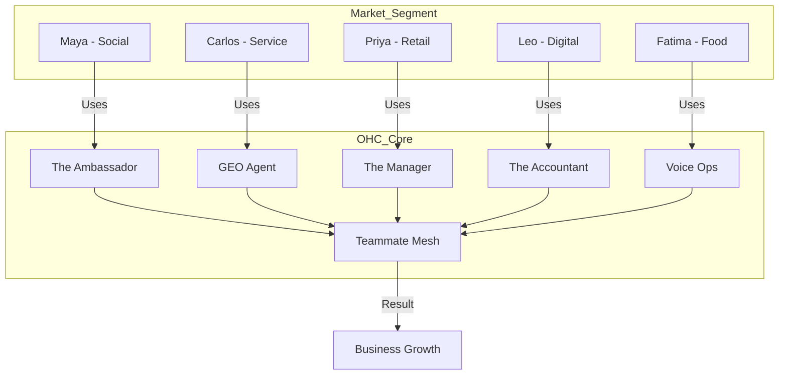

# Strategic Persona Analysis: Empowering the Invisible Founder

## 1. Introduction: Beyond the Tech-Savvy
Traditional eCommerce platforms (Shopify, Wix) are built for "Digital Natives"—users who are comfortable with dashboards, APIs, and configuration. However, the largest untapped market consists of "Invisible Founders": skilled artisans, tradespeople, and service providers who view technology as a barrier, not an enabler.

---

## 2. Detailed Persona Deep-Dives

### 2.1 Maya: The Social Artisan (The "Hustle" Persona)
- **Age**: 28
- **Business**: Custom bakery, selling via Instagram DMs.
- **Digital Skill Level**: High (Consumer) / Low (Business). Comfortable with social media apps but overwhelmed by "back-office" software.
- **Pain Point**: "The DM Trap." Spending 4 hours a day answering the same questions about pricing and availability.
- **The OHC Value Prop**: **The Ambassador**. Maya doesn't need a "Website Builder"; she needs a "Virtual Sales Assistant" that handles the link-sending and inventory checking while she's decorating cakes.
- **Competitive Alternative**: Instagram DMs (Manual), Manychat (Too complex/robotic).

### 2.2 Carlos: The Mobile Tradesman (The "Lead" Persona)
- **Age**: 42
- **Business**: Handyman and home repair.
- **Digital Skill Level**: Low. Prefers voice and SMS. Often works in areas with poor data connectivity.
- **Pain Point**: Missing leads. If he doesn't answer the phone while he's under a sink, the customer calls the next person on Google.
- **The OHC Value Prop**: **The AI Discovery Agent (GEO)** and **Automated Lead Capture**. OHC ensures Carlos appears in "Handyman near me" AI searches and captures leads with an automated, empathetic "I'll call you back in 10 minutes" SMS.
- **Competitive Alternative**: Word of mouth (Limited growth), Yelp (Expensive/Extortive).

### 2.3 Priya: The Hybrid Retailer (The "Sync" Persona)
- **Age**: 35
- **Business**: Physical boutique + nascent online store.
- **Digital Skill Level**: Medium. Uses a basic POS but can't get it to "talk" to her website.
- **Pain Point**: Inventory mismatch. Selling the last "Medium Blue Dress" online while someone is trying it on in the store.
- **The OHC Value Prop**: **The Vigilant Manager**. Proactive "Soft Locks" on inventory and autonomous stock-reconciliation events.
- **Competitive Alternative**: Square (Good POS, but AI marketing is weak), Shopify (Expensive POS integration).

### 2.4 Leo: The Gig Educator (The "Subscription" Persona)
- **Age**: 22
- **Business**: Online music lessons and digital workshops.
- **Digital Skill Level**: High. But suffers from "Admin Burnout."
- **Pain Point**: Churn due to failed payments. Feels "awkward" asking students for money.
- **The OHC Value Prop**: **The Accountant (Empathetic Recovery)**. Automated, founder-toned dunning that recovers revenue without damaging the student-teacher relationship.
- **Competitive Alternative**: Calendly + Stripe (Fragmented), Teachable (High fees).

### 2.5 Fatima: The High-Volume Producer (The "Voice" Persona)
- **Age**: 50
- **Business**: Food cart / Prep kitchen.
- **Digital Skill Level**: Very Low. English as a second language.
- **Pain Point**: Technical exclusion. Most tools require a level of English and technical literacy that makes them unusable during high-stress service hours.
- **The OHC Value Prop**: **Voice-First Operations**. Hands-free order management and thermal printing.
- **Competitive Alternative**: Physical paper and pen (Error-prone).

---

## 3. Comparison of Persona Needs vs. Competitor Offerings

| Persona | Primary Need | Shopify Gap | Wix Gap | **OHC Solution** |
| :--- | :--- | :--- | :--- | :--- |
| **Maya** | DM Conversion | No Agent | No Agent | **The Ambassador** |
| **Carlos** | GEO Discovery | Keywords only | Dashboard only | **AI GEO Agent** |
| **Priya** | Inventory Sync | Paid App | Manual Sync | **Proactive Sync** |
| **Leo** | Churn Recovery | Cold Emails | No Recovery | **Empathetic Dunning** |
| **Fatima** | Accessibility | Screen-Heavy | UI-Heavy | **Voice-First Ops** |

---

## 4. Strategic Recommendation: The "Persona-First" UI
OHC should avoid a "one-size-fits-all" dashboard.
1. **The "Baker" Dashboard**: Highlights DMs and Product Photos.
2. **The "Handyman" Dashboard**: Highlights Map/GEO performance and Incoming Calls.
3. **The "Boutique" Dashboard**: Highlights Stock levels and Hybrid Sales.
4. **The "Food Cart" Dashboard**: Voice-centric, high-contrast, large-button interface.

---

## 5. Visualizing the Persona Impact

