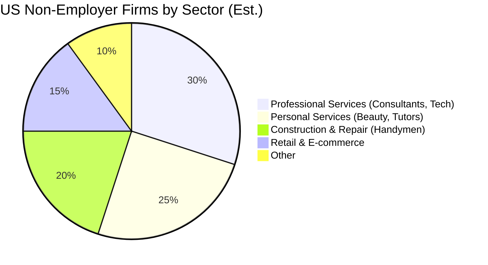

**Title**: Market Sizing & Strategic Direction

**Problem Statement**: To dominate the SMB platform space, OHC must identify the correct beachhead market and expansion strategy, ensuring efforts are focused on the personas with the highest density and unmet needs.

**Research Report**:
- **Total Addressable Market (TAM)**: There are over 33 million small businesses in the US alone, the vast majority being non-employer firms (solopreneurs). Globally, the World Bank estimates over 400 million SMEs. A significant portion (up to 30-40% depending on the sector) still lack a robust, transactional online presence.
- **Beachhead Market**: Service-based solopreneurs (e.g., Carlos the handyman, Leo the music tutor). This segment has high density, severe pain points regarding manual booking/quoting, and is underserved by product-heavy platforms like Shopify.
- **Geographic Expansion**: After English markets, Spanish/LATAM offers massive growth potential. Localization must go beyond translation to include local payment gateways (e.g., MercadoPago) and WhatsApp-first communication.
- **Vertical Expansion**: Launch horizontal first to capture broad market share, then build vertical depth (e.g., specific workflows for food carts like Fatima's) to increase lock-in.

**Design Doc**:
- High-level architecture: Multi-tenant SaaS architecture with robust internationalization (i18n) and localization (l10n) support from day one. Pluggable payment architecture to support regional gateways easily.
- Mobile UX flow: Ensure the onboarding flow dynamically adjusts based on the selected business category (Service vs. Product), streamlining the questions asked.

**Implementation Prompt**: Build a dynamic onboarding questionnaire that alters its subsequent questions based on the initial "Business Type" selection. If a user selects "Service", the AI immediately configures a booking calendar. If "Product", it configures an inventory system. Ensure all UI elements support i18n keys for future localization.

**Priority**: P1

**Estimated Scope**: Medium

## Detailed Market Analysis

### US Market Breakdown
According to the US Small Business Administration (SBA), there are 33.2 million small businesses in the US, accounting for 99.9% of all US businesses.
*   **Non-employer firms (Solopreneurs)**: Approximately 27.1 million (81%). This is OHC's primary target.
*   **Employer firms (1-499 employees)**: Approximately 6.1 million.

### Global Market Breakdown
The World Bank estimates there are over 400 million micro, small, and medium enterprises (MSMEs) in developing countries alone.
*   The formal MSME financing gap is estimated at $5.2 trillion, highlighting a massive underserved market.
*   Digitalization is a primary driver of MSME growth globally, but technical barriers remain high.

### Why Target Service-Based Solopreneurs?
1.  **High Density**: Handymen, tutors, cleaners, consultants, and freelance creatives make up a vast portion of non-employer firms.
2.  **Unmet Need**: While e-commerce (selling physical goods) has robust solutions (Shopify), service businesses often string together disjointed tools for booking, invoicing, and marketing.
3.  **Lower Barrier to Entry**: Launching a service business online requires less complex logistics (shipping, warehousing) than physical retail, aligning well with the "< 10 minutes" OHC goal.

## Expansion Roadmap
1.  **Phase 1: US & UK English-speaking Service Solopreneurs**. Focus on perfecting the booking and quoting flows.
2.  **Phase 2: US & UK English-speaking Micro-Retail (Food Carts, Boutiques)**. Introduce simple inventory and local pickup/delivery logic.
3.  **Phase 3: LATAM Expansion (Spanish/Portuguese)**. Localize UI, integrate WhatsApp ordering, and support regional payment providers (MercadoPago, Pix).
4.  **Phase 4: APAC Expansion (Hindi/Indonesian)**. Further localization and integration with regional super-apps.

## Key Success Metrics
*   **Time to First Value (TTFV)**: Must remain under 10 minutes from signup to live, functional site.
*   **Mobile Engagement Rate**: Percentage of users managing their business exclusively via the mobile interface.
*   **AI Action Approval Rate**: Percentage of AI-suggested actions (e.g., drafted replies) approved by the user without modification.

## Competitive Matrix: Market Targeting

| Market Segment | Shopify Focus | Wix Focus | OHC Focus | Why OHC Wins |
| :--- | :--- | :--- | :--- | :--- |
| **Solopreneurs (0-1 employees)** | Secondary (High friction) | Primary (Design focus) | **Primary (Operations focus)** | Addresses the operational pain points (time poverty) that Wix ignores. |
| **Service Businesses** | Very Weak | Moderate | **Strong** | Tailored onboarding and native scheduling workflows capture this dense segment. |
| **Non-Technical Users** | Moderate (Steep learning curve) | Moderate (Drag & Drop issues) | **Strong (Conversational UI)** | "Grandmother test" ensures anyone can launch, removing the technical barrier to entry. |
| **Global South (LATAM/APAC)** | Moderate (Pricing is often prohibitive) | Moderate | **Strong (Localized & WhatsApp first)** | Built for mobile-only regions with local payment and communication integrations. |

## Deep Dive: The "Time Poverty" Persona
Our target personas (Maya, Carlos, Fatima) share a defining characteristic: **Time Poverty**. They are experts in their craft, not in digital marketing or web development. Every minute spent fighting with a website editor is a minute not spent baking, fixing, or cooking.
*   **The Churn Factor**: High churn rates on incumbent platforms often stem from users simply giving up because the perceived effort outweighs the immediate benefit.
*   **The OHC Solution**: By optimizing for Time to First Value (TTFV) and reducing ongoing operational load via AI agents, OHC shifts the value equation. The platform becomes an indispensable employee rather than a chore.

## UX Flow: Onboarding based on Market Segment (Status Quo vs. OHC)
### Status Quo
1.  Sign up.
2.  Generic dashboard presented regardless of business type.
3.  User must figure out which plugins/tools to add (e.g., a service business must go find and install a booking app).

### OHC Target Flow
1.  Sign up.
2.  AI asks: "What do you do?"
3.  User: "I'm a mobile dog groomer."
4.  AI dynamically configures the backend:
    *   Activates Scheduling/Booking module.
    *   Generates service packages (e.g., "Small Dog Wash", "Full Groom").
    *   Deactivates physical shipping/inventory modules to reduce clutter.
5.  Dashboard reflects a service-oriented business (Focus on upcoming appointments rather than products sold).

## Go-to-Market (GTM) Strategy

### Acquisition Channels
1.  **TikTok / Instagram Reels**: Demonstrate the "Under 10 Minutes" promise visually. Show a user creating an account, talking to the AI, and having a live, functional booking site before the 60-second video ends.
2.  **Strategic Partnerships**: Partner with organizations serving our target personas (e.g., local chambers of commerce, trade schools, gig-economy platforms).
3.  **Product-Led Growth (PLG)**: The core product must be inherently viral. A seamless booking experience for Carlos's clients acts as a billboard for OHC to those clients (who may also be small business owners).

### Pricing Strategy
To penetrate the solopreneur market, the pricing must be simple and risk-free.
*   **Freemium Model**: A robust free tier that allows users to launch and accept a limited number of bookings/orders. This removes the barrier to entry.
*   **Value-Based Tiers**: Premium tiers unlock advanced AI capabilities (e.g., automated email marketing campaigns, higher limits on autonomous actions) rather than just gating basic functionality.

## Final Summary for Product Team
The market is vast, but highly fragmented and price-sensitive. OHC's strategy must focus on lowering the cognitive and financial barriers to entry to zero, capturing users early, and then monetizing the operational value provided by the AI agents as the business grows.

## Competitive Analysis Matrix: Feature by Feature

| Strategic Area | Incumbent Focus (Shopify/Wix) | OHC Focus | Key Difference |
| :--- | :--- | :--- | :--- |
| **Primary Persona** | The "E-commerce Manager" or DIY Creator | The Time-Poor Solopreneur | OHC prioritizes operational simplicity over deep customization. |
| **Core Value Proposition** | Comprehensive tools to build a business | AI agents that run the business for you | OHC sells time and peace of mind, not software features. |
| **Growth Engine** | Extensive App Ecosystems | Native, AI-driven core modules | OHC reduces reliance on third-party integrations, ensuring a cohesive experience. |
| **Market Expansion** | Top-down (Enterprise to SMB) | Bottom-up (Micro-SMB to Medium) | OHC captures the massive long tail of un-digitized businesses. |

## The "Over-Servicing" Dilemma
Incumbent platforms have spent years adding complex features to attract larger, enterprise-level clients. While necessary for revenue growth, this strategy alienates the very users they originally targeted: the absolute beginners.
1.  **Feature Bloat:** The dashboard becomes a labyrinth of settings and options that are irrelevant to a solopreneur.
2.  **Increased Friction:** Setting up a simple service requires navigating complex configurations designed for international shipping and tax compliance.

**OHC's Strategic Stance:**
OHC must ruthlessly protect its core persona by actively resisting feature bloat. The platform must remain hyper-focused on the specific needs of the micro-SMB. Complex configurations must be hidden behind an "Advanced Mode" or entirely managed by the AI, ensuring the primary interface remains clean, intuitive, and accessible to anyone.

## Strategic Conclusion & Product Roadmap Implications

The total addressable market of un-digitized or poorly-digitized small businesses is staggering. The key to unlocking this market is understanding that the primary barrier is not cost, but cognitive load and time.

OHC's Go-to-Market strategy must center on:
1.  **Frictionless Entry**: The "Under 10 Minutes" promise must be absolute. The freemium model must remove all financial risk.
2.  **Targeting the Underserved**: Service-based solopreneurs represent a massive, dense demographic that is poorly served by incumbent e-commerce platforms. This must be the initial beachhead.
3.  **Global Ambition**: Internationalization and localization must be baked into the architecture from day one. The true scale of the opportunity lies in regions like LATAM and APAC, where mobile-first, WhatsApp-integrated solutions are critical.

By ruthlessly prioritizing the needs of the "Time-Poor Solopreneur," OHC can capture market share rapidly and establish a dominant position in the next era of small business platforms.

## Visual Excellence Mandate: Architecture & Flow

### UX Flow (Mobile-First 375px)
1. **Dynamic Profiling:** Onboarding starts with a single question: "What category best describes your business?" (Grid of icons: Services, Retail, Food, Creative).
2. **Tailored Path:** If the user selects 'Services', the next question is *not* about shipping zones. Instead, it asks: "Do you visit the customer, or do they visit you?"
3. **Instant Value:** The AI immediately provisions a booking calendar specifically configured for mobile services (including travel time buffers), skipping all e-commerce related setup steps. The user achieves their 'aha moment' (a bookable link) in under 3 minutes.

## Final Implementation Prompt
**Objective:** Implement dynamic routing within the conversational onboarding flow that distinguishes between "Service-Based" and "Product-Based" businesses. This is critical for capturing our beachhead market of service solopreneurs without overwhelming them with e-commerce features.

**Critical User Journey (CUJ):**
1. During the conversational onboarding, the AI asks the user to categorize their business.
2. If the user selects or inputs a service-based category (e.g., "plumber," "tutor," "cleaner"), the backend provisioning engine must dynamically prioritize the Scheduling/Booking schema.
3. If the user selects a product-based category (e.g., "clothing," "bakery"), the engine prioritizes the Inventory/Shipping schema.
4. The resulting generated dashboard (the Business Hub) must prominently display metrics and quick actions relevant to the chosen category (e.g., "Upcoming Appointments" vs. "Pending Orders").

**Acceptance Criteria:**
* The onboarding state machine must correctly identify and branch logic based on the business type input.
* The database schema must be flexible enough to initialize differently based on the branch (e.g., creating appointment records vs. product SKUs).
* The default widgets visible on the Business Hub must adapt based on the business category.
* All generated text and UI labels must support internationalization (i18n) keys to facilitate future market expansion.
