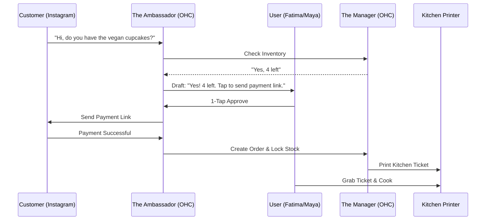

# Vertical Opportunity: OHC for Food Service & Hyper-Local Retail

## 1. The Beachhead: Why Food Service?
Small food businesses (Food Carts, Home Bakers, Pop-ups) represent the highest density of "Maya" and "Fatima" personas. They have high transaction volume, immediate operational needs, and the lowest tolerance for technical complexity.

---

## 2. Industry-Specific Pain Points

### 2.1 The "Order Fog"
- **Problem**: Managing orders from Instagram, WhatsApp, and Walk-ins simultaneously.
- **Result**: Food is made late, or wrong orders are prepared.
- **OHC Solution**: Unified "Order Inbox" that treats a DM like a professional POS entry.

### 2.2 The "Inventory Mismatch"
- **Problem**: Selling a specific flavor of donut online that just sold out in person.
- **Result**: Awkward "Refund & Apologize" calls.
- **OHC Solution**: Real-time "Soft Lock" during checkout.

### 2.3 The "Marketing Gap"
- **Problem**: No time to photograph food and post it during service hours.
- **Result**: Social feeds go "dark" for weeks.
- **OHC Solution**: "The Promoter" drafting posts from past photos or generating "Daily Special" graphics automatically.

---

## 3. Specialized Feature Set (Vertical Depth)

### 3.1 The "Kitchen Printer" Agent
- **Description**: An agent that monitors the order mesh and automatically routes "Ready-to-Cook" tickets to a connected Bluetooth thermal printer.
- **Persona Alignment**: Fatima doesn't need to look at a screen; she just grabs the slip.

### 3.2 The "Dynamic Menu" Agent
- **Description**: Automatically hides items from the website and social "Shop" as soon as the kitchen marks them as "86'd" (Sold out).
- **Persona Alignment**: Maya can focus on baking, knowing the storefront is always accurate.

### 3.3 The "Local GEO" Boost
- **Description**: Targets local searchers specifically during "Hungry Hours" (11 AM - 1 PM, 5 PM - 7 PM).
- **Persona Alignment**: Carlos (or any food founder) gets a surge in visibility exactly when it converts best.

---

## 4. Competitive Landscape (Food Service Focus)

| Feature | OHC Food | Toast / Square | Instagram DMs |
| :--- | :--- | :--- | :--- |
| **Setup Cost** | $0 | $1000+ (Hardware) | $0 |
| **Ease of Use** | High (Voice/1-Tap) | Medium (Complex POS) | Low (Manual) |
| **AI Marketing** | Integrated | Basic | None |
| **Inventory Sync** | Autonomous | Manual/Semi-Auto | None |

---

## 5. Strategic GTM (Go-To-Market) Plan

### Step 1: The "Instagram DM" Wedge
Target home bakers who sell via DMs. Offer them the "Ambassador" for free for 30 days. Show them the time savings of 1-tap checkout links.

### Step 2: The "Pop-up" Kit
Deliver a mobile-first "Pop-up Mode" that handles quick inventory locks and simple mobile payments for temporary food stands.

### Step 3: The "Community Hub"
Link OHC food businesses in the same neighborhood to allow for "Bundle Deals" (e.g., Buy a cake from Maya, get a discount on coffee from a partner OHC shop).

---

## 6. Success Metrics for Food Vertical
- **Time Saved**: Goal of 5 hours/week per founder on manual DM management.
- **Order Accuracy**: Reduce "Refunds due to out-of-stock" by 90%.
- **Revenue Lift**: Increase "Hungry Hour" conversion by 25% via proactive GEO.

---

## 7. Mermaid Flow: The Food Order Lifecycle

