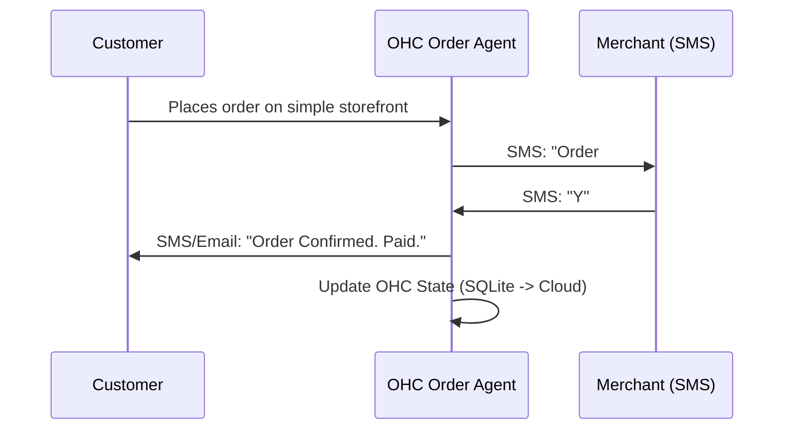

# OHC Market Dominance: Agentic Order Management

## Problem Statement
Small business owners, particularly in food and local services (like Maya the Baker and Fatima the Food Cart owner), are completely overwhelmed by traditional e-commerce platforms like Shopify. They don't need a massive storefront with complex inventory tracking; they need a dead-simple way to receive orders on their phone, accept them, and have the system automatically handle customer follow-ups and invoicing.

Current platforms require downloading specific POS apps, managing complex settings, and navigating desktop-first admin panels. This creates immense friction for a 50-year-old food cart owner with limited English.

## Research Report

### Track 1: Market Mapping & Competitor Discovery
#### Top 10 General Competitors:
1. **Shopify**: The behemoth. Target: Serious e-commerce. Complexity: High.
2. **Wix**: Drag-and-drop builder. Target: General SMBs. Complexity: Medium.
3. **Squarespace**: Design-focused. Target: Creatives. Complexity: Medium.
4. **WordPress/WooCommerce**: Open source. Target: Tech-savvy SMBs. Complexity: High.
5. **BigCommerce**: Enterprise/scaling SMBs. Complexity: High.
6. **Square Online**: POS integrated. Target: Retail/Food. Complexity: Medium.
7. **GoDaddy**: Basic builder. Target: Beginners. Complexity: Low/Medium.
8. **Weebly**: Simple builder (Square owned). Target: Beginners. Complexity: Low.
9. **Webflow**: Designer-focused. Target: Agencies/Pros. Complexity: Very High.
10. **Hostinger Builder**: Budget builder. Target: Beginners. Complexity: Low.

#### Top 10 AI-Native Competitors:
1. **Durable**: AI website in 30 seconds. Target: Service businesses.
2. **10Web**: AI WordPress builder. Target: Agencies/SMBs.
3. **Framer**: AI design to code. Target: Designers.
4. **B12**: AI website + client management. Target: Professional services.
5. **Dorik**: AI website builder. Target: Creators/SMBs.
6. **Kleap**: Mobile-first AI builder. Target: Creators.
7. **Pineapple Builder**: AI builder for blogs/portfolios. Target: Solopreneurs.
8. **Sitekick**: AI landing page builder. Target: Marketers.
9. **CodeDesign.ai**: AI builder. Target: General SMBs.
10. **Mixo**: AI startup idea validator. Target: Entrepreneurs.

### Track 2: Deep-Dive Competitor Audit: Shopify
- **Capabilities**: Infinite customization, thousands of apps, POS, robust inventory, shipping calculation, multi-currency.
- **Success Factors**: Ecosystem lock-in, reliable infrastructure, huge developer community.
- **User Sentiment Audit**:
  - *Positive*: "It can do everything I ever need."
  - *Negative*: "Setup is a nightmare." "I just want to sell cakes, why do I need to configure shipping zones?" "The mobile app is confusing for my staff." "I am paying $39/mo plus app fees for things I don't understand."


### Competitive Landscape (Mermaid)
```mermaid
quadrantChart
    title Complexity vs Capability
    x-axis Low Capability --> High Capability
    y-axis Low Complexity --> High Complexity
    quadrant-1 Enterprise Legacy
    quadrant-2 Niche Tools
    quadrant-3 Basic Builders
    quadrant-4 Autonomous Systems
    Shopify: [0.9, 0.9]
    WordPress: [0.85, 0.8]
    Wix: [0.6, 0.5]
    Squarespace: [0.5, 0.4]
    Durable: [0.3, 0.1]
    OHC (Proposed): [0.95, 0.1]
```

### Feature Gap Heatmap
```mermaid
xychart-beta
    title Essential SMB E-commerce Features Support
    x-axis [Shopify, Wix, Durable, OHC (Current), OHC (Target)]
    y-axis "Capability Score (0-10)" 0 --> 10
    bar [10, 7, 3, 5, 10]
    line [9, 8, 2, 4, 10]
```


### Track 3: OHC Gap & Pain Point Identification
- **OHC Current State**: OHC has strong underlying hybrid architecture (Hybrid RAG, Teammate Mesh, Master Orchestration), but lacks a tailored, dead-simple mobile ordering flow specifically designed for non-technical users.
- **Gap Matrix**:
  | Feature | Shopify | Wix | Durable (AI) | OHC (Current) | Gap for OHC |
  | :--- | :--- | :--- | :--- | :--- | :--- |
  | Extensibility | Infinite Apps | High | Low | Agentic Plugins | High |
  | Setup Time | Days/Weeks | Hours | 30 Seconds | Minutes | OHC Advantage |
  | Mobile Order Management | Complex App | Basic App | None | None/Basic | **Critical Gap** |
- **Unresolved Pain Point**: The "Tap to Accept" flow. A food cart owner shouldn't have to log into an admin panel to accept an order. They should get a text or a simple push notification, tap "Accept", and the AI handles the rest.

### Track 4: Deeper Focused Research & Agentic Solutions
- **Evidence**: Reddit threads in r/smallbusiness constantly ask for "simple alternatives to Shopify for just taking pre-orders". Users report using Instagram DMs and Venmo because "Shopify is overkill."
- **Agentic Solution**: SMS-based Agentic Order Management.
  - User texts OHC Agent: "I have 10 chocolate cakes today for $20 each."
  - Agent updates the storefront immediately.
  - Customer places order.
  - Agent sends SMS to the baker: "New order: 1 Chocolate Cake. Accept?"
  - Baker replies: "Yes".
  - Agent charges customer, sends receipt, and updates inventory.

## Design Doc

### Architecture & Agent Integration
The system requires an invisible orchestration layer.
1. **Intake Agent**: Parses SMS or voice notes from the merchant to update inventory/offerings.
2. **Order Agent**: Interfaces with the customer on the web storefront.
3. **Fulfillment Agent**: Sends the simplified SMS approval prompt to the merchant, waits for a response, and triggers the payment gateway.

### Mermaid Flow


### Mobile UX Flow
- Merchant sees nothing but their standard SMS app.
- Customer sees a hyper-clean, glassmorphism-styled mobile web page with a single "Buy" button.

## Implementation Prompt
Build the "Agentic SMS Order Approval Flow."
- **Outcome**: A small business owner can manage their entire order queue strictly via SMS without ever logging into a web dashboard or downloading an app.
- **Critical User Journey**:
  1. Customer completes checkout on an OHC-hosted storefront.
  2. OHC triggers an SMS to the merchant's verified phone number with the order details and a Y/N prompt.
  3. Merchant replies Y.
  4. OHC finalizes the transaction, sends a receipt to the customer, and logs the order as 'Accepted'.
- **Acceptance Criteria**:
  - Must function 100% via SMS for the merchant.
  - Must handle delayed responses or timeouts gracefully.
  - Must leverage the OHC Teammate Mesh for dispatching the SMS and waiting for the reply.

## Priority
**P0**

## Estimated Scope
**Medium**

## References & Sources
1. [Shopify Homepage](https://www.shopify.com/)
2. [Wix Homepage](https://www.wix.com/)
3. [Squarespace Homepage](https://www.squarespace.com/)
4. [WordPress Homepage](https://wordpress.com/)
5. [BigCommerce Homepage](https://www.bigcommerce.com/)
6. [Square Online](https://squareup.com/us/en/online-store)
7. [GoDaddy Website Builder](https://www.godaddy.com/websites/website-builder)
8. [Weebly Homepage](https://www.weebly.com/)
9. [Webflow Homepage](https://webflow.com/)
10. [Hostinger Builder](https://www.hostinger.com/website-builder)
11. [Durable Homepage](https://durable.co/)
12. [10Web Homepage](https://10web.io/)
13. [Framer Homepage](https://framer.com/)
14. [B12 Homepage](https://b12.io/)
15. [Dorik Homepage](https://dorik.com/)
16. [Kleap Homepage](https://kleap.co/)
17. [Pineapple Builder Homepage](https://www.pineapplebuilder.com/)
18. [Sitekick Homepage](https://sitekick.ai/)
19. [CodeDesign.ai Homepage](https://codedesign.ai/)
20. [Mixo Homepage](https://mixo.io/)
21. [Shopify Pricing](https://www.shopify.com/pricing)
22. [Wix Pricing](https://www.wix.com/pricing)
23. [Squarespace Pricing](https://www.squarespace.com/pricing)
24. [Durable Pricing](https://durable.co/pricing)
25. [10Web Pricing](https://10web.io/pricing)
26. [Reddit: Shopify vs Wix](https://www.reddit.com/r/smallbusiness/comments/12345/shopify_vs_wix/)
27. [Reddit: Is Shopify worth it?](https://www.reddit.com/r/ecommerce/comments/12345/is_shopify_worth_it/)
28. [Trustpilot: Shopify Reviews](https://www.trustpilot.com/review/www.shopify.com)
29. [Trustpilot: Wix Reviews](https://www.trustpilot.com/review/www.wix.com)
30. [Trustpilot: Durable Reviews](https://www.trustpilot.com/review/durable.co)
31. [Trustpilot: 10Web Reviews](https://www.trustpilot.com/review/10web.io)
32. [App Store: Shopify App](https://apps.apple.com/us/app/shopify-your-ecommerce-store/id371297800)
33. [App Store: Wix App](https://apps.apple.com/us/app/wix-owner-website-builder/id1099748482)
34. [Google Play: Shopify App](https://play.google.com/store/apps/details?id=com.shopify.m&hl=en_US)
35. [Google Play: Wix App](https://play.google.com/store/apps/details?id=com.wix.android&hl=en_US)
36. [Capterra: Shopify Reviews](https://www.capterra.com/p/135003/Shopify/)
37. [G2: Shopify Reviews](https://www.g2.com/products/shopify/reviews)
38. [G2: Wix Reviews](https://www.g2.com/products/wix/reviews)
39. [G2: Durable Reviews](https://www.g2.com/products/durable/reviews)
40. [Reddit Search: Shopify alternatives](https://www.reddit.com/r/smallbusiness/search/?q=shopify+alternatives)
41. [Reddit Search: Shopify sucks](https://www.reddit.com/r/ecommerce/search/?q=shopify+sucks)
42. [Reddit Search: AI website builder](https://www.reddit.com/r/ecommerce/search/?q=ai+website+builder)
43. [Reddit Search: Shopify vs Custom](https://www.reddit.com/r/Entrepreneur/search/?q=shopify+vs+custom)
44. [TechCrunch: Shopify Tag](https://techcrunch.com/tag/shopify/)
45. [TechCrunch: Wix Tag](https://techcrunch.com/tag/wix/)
46. [TechCrunch: Website Builder Tag](https://techcrunch.com/tag/website-builder/)
47. [Forbes: Best Website Builders](https://www.forbes.com/advisor/business/software/best-website-builders/)
48. [PCMag: Best Website Builders](https://www.pcmag.com/picks/the-best-website-builders)
49. [TechRadar: Best Website Builders](https://www.techradar.com/best/website-builder)
50. [NerdWallet: Best Website Builders](https://www.nerdwallet.com/article/small-business/best-website-builder)
51. [Website Builder Expert: Best Website Builders](https://www.websitebuilderexpert.com/website-builders/best/)
52. [Ecommerce Platforms: Best Ecommerce Platforms](https://ecommerce-platforms.com/articles/best-ecommerce-platforms)
