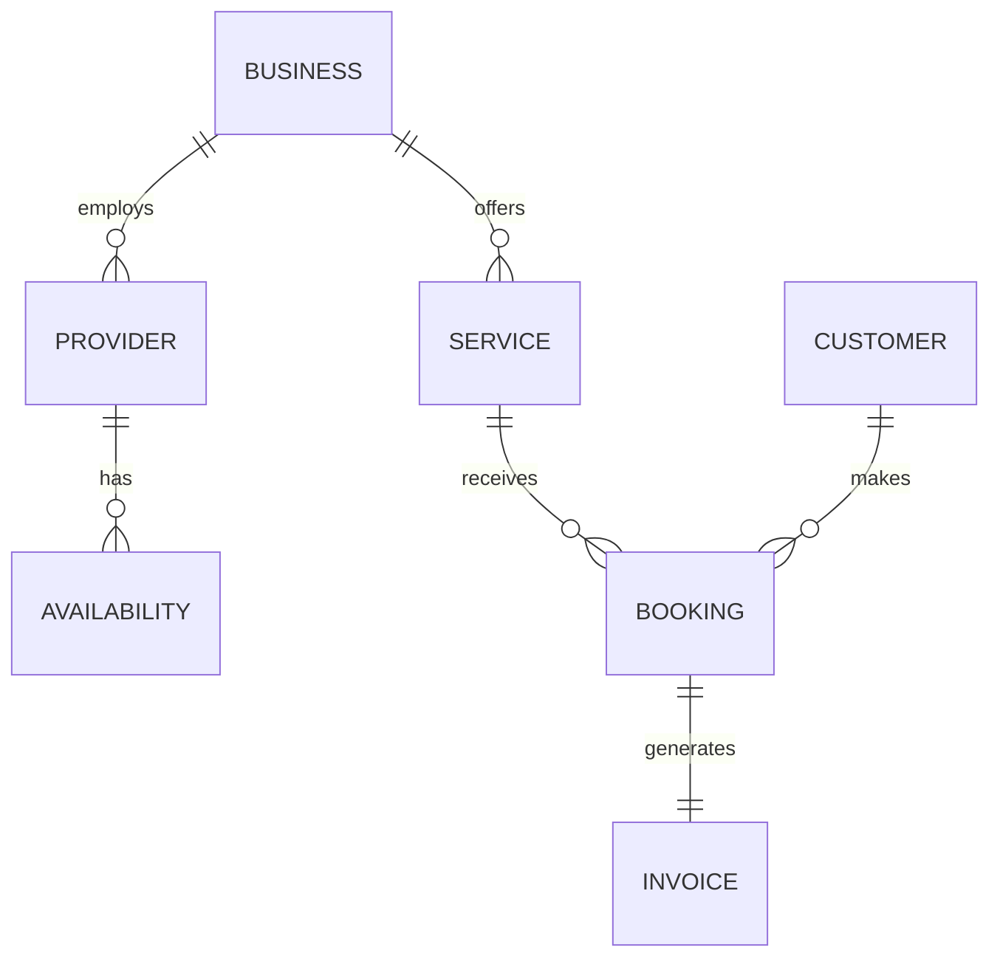

# Strategic Market Entry: Prioritizing Service-Based Micro-Businesses

## Problem Statement
The e-commerce platform market (selling physical goods) is highly saturated with entrenched players like Shopify. Attempting head-to-head competition for standard retail businesses will result in high customer acquisition costs. OHC needs a strategic wedge—a specific market segment that is massive, underserved, and perfectly aligned with OHC's unique value proposition.

## Research Report

### Market Segmentation Analysis

The broader SMB market can be roughly divided into Retail/E-commerce, Service/Booking, and Digital Goods.

#### The Service/Booking Gap
- **Persona Target**: Carlos (Handyman), Leo (Music Tutor).
- **Current Landscape**: These users are forced to cobble together disparate tools. They might use a simple Wix site for presence, Calendly for booking, and Venmo/Zelle for payments. This fragmentation creates friction for both the business owner and their clients.
- **Market Size**: Service-based businesses constitute a larger portion of the SMB economy than pure retail e-commerce. According to SBA data, service sectors dominate the non-employer business statistics.

#### The "Local Commerce" Opportunity
Many of these businesses operate locally. They don't need complex global shipping logic or multi-currency support initially. They need:
1.  **Lead Capture**: Easy ways for potential clients to get in touch.
2.  **Scheduling/Booking**: A unified calendar integrated with their personal availability.
3.  **Quoting & Invoicing**: Simple tools to turn a lead into a paying job.

#### Competitive Advantage
Shopify requires third-party apps for robust booking. Squarespace's Acuity scheduling is powerful but disconnected from the core site building experience. By building native, AI-assisted booking and service management, OHC can create a distinct wedge.

## Design Doc

### Architecture Overview
The core entity model must support Services and Appointments as first-class citizens, alongside physical Products.

1.  **Service Entity**: Defines duration, price, location (virtual/physical), and provider.
2.  **Availability Engine**: Syncs with external calendars (Google, Outlook) and manages open slots.
3.  **Booking Workflow**: A distinct checkout flow optimized for selecting times rather than adding to a cart.

### Mobile UX Flow (375px First)
1.  **Service Setup**: "What service do you offer?" User enters "1-hour guitar lesson."
2.  **Availability Configuration**: A simple mobile calendar interface to block out unavailable times.
3.  **Client View**: A mobile-optimized booking link that clients can open directly from Instagram.
4.  **Owner Dashboard**: A unified view of upcoming appointments, pending invoices, and new leads.

## Implementation Prompt

### User-Facing Outcome
A service professional can set up an online booking presence, complete with calendar sync and automated client reminders, entirely from their phone in under 5 minutes.

### Critical User Journey (CUJ)
1. User selects "Service Business" during onboarding.
2. User defines a service (e.g., "Plumbing Consultation", $50, 1 hour).
3. User connects their Google Calendar for availability sync.
4. System generates a booking page.
5. Client visits the page, selects an available slot, and pays a deposit.
6. The appointment appears on the user's dashboard and personal calendar.

### Acceptance Criteria
- Must support defining services with variable durations and pricing models (fixed, hourly).
- Must implement native calendar synchronization to prevent double-booking.
- The booking flow must be highly optimized for mobile clients.

## Priority
P1

## Estimated Scope
Medium
