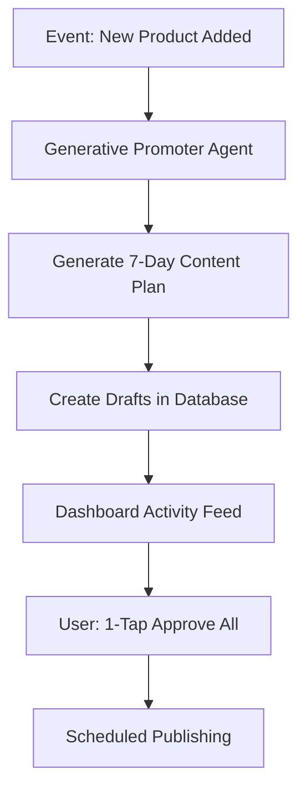

# Issue Brief: AI Social Media Calendar Generator

## Title
[Marketing] AI Social Media Calendar Generator

## Problem Statement
Creating content for social media is the #1 reason small businesses (like Priya the boutique owner) go "dark" after 3 months. It requires marketing dread and massive operational fatigue. Small business owners lack the time, skills, and creativity to consistently plan, draft, and post engaging content across multiple channels.

## Research Report
- **Competitor Landscape**: Platforms like Shopify and Wix offer basic social integrations or require third-party apps with subscription fees, leading to "Cost Creep".
- **Pain Point Validation**: "Marketing Dread" impacts 55% of users. Without an active social media presence, stores fail to attract customers.
- **AI Differentiation**: Competitors offer reactive AI writing assistants (e.g., "help me write a tweet"). OHC's approach is a proactive, autonomous "Generative Promoter" agent that drafts an entire 7-day calendar whenever a new event occurs (e.g., product addition, seasonal change) without requiring a prompt.

## Design Doc
### High-Level Architecture
- **Trigger**: Backend Event Mesh detects a `ProductAdded` or `WeeklyMarketingSchedule` event.
- **Agent Action**: The Generative Promoter agent retrieves business context (vibe, target audience) and generates 7 distinct social media posts (images + captions).
- **Storage**: Drafts are saved to the `agent_tasks` table.
- **UI Flow**: Pushed to the mobile dashboard's Activity Feed.

### Mobile UX Flow (375px First)
1. **Notification/Feed Card**: "Your 7-day social calendar is ready! 🗓️"
2. **Review Screen**: Displays a vertical scroll of 7 cards. Each card shows the generated image/graphic and caption.
3. **Action**: User taps "Approve All" to schedule them automatically, or taps "Edit" on individual cards to tweak the text.

## Implementation Prompt
Implement the "Generative Promoter" AI social media calendar feature. The system should automatically listen for key business events and autonomously generate a complete week's worth of social media drafts (text + image prompts) tailored to the user's business. Present these drafts in a clean, 375px-optimized mobile feed where the user can easily "Approve" or "Edit" them in one tap. Do not prescribe specific database schemas, API contracts, or function signatures.

## Priority
P1

## Estimated Scope
Medium
