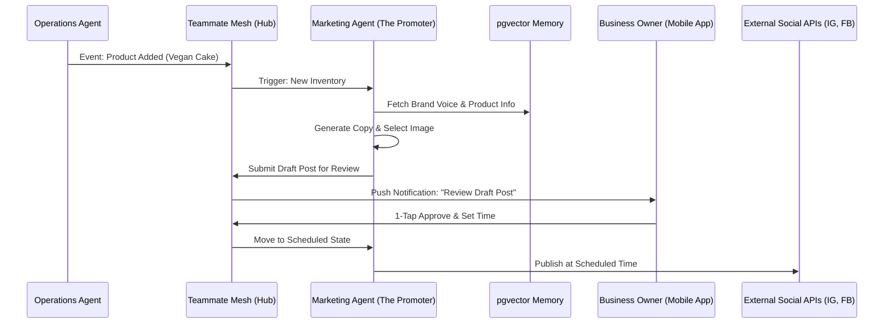

# AI-Powered Omnichannel Social Media Manager

## Problem Statement
Small business owners, especially non-technical founders like Maya the baker and Priya the boutique owner, struggle to maintain a consistent and engaging social media presence. Managing Instagram, TikTok, and Facebook requires constant context switching, creative ideation, and technical know-how for formatting and posting. This takes valuable time away from actual business operations (baking cakes, serving customers). Existing platforms like Shopify and Wix offer basic social media integrations, but they are often manual, requiring the user to do the heavy lifting of writing posts and scheduling them. Emerging AI competitors like Durable and Hostinger are beginning to incorporate basic AI text generators, but lack a holistic, autonomous "Promoter" agent that truly understands the business's inventory, brand voice, and goals, leading to generic or disjointed marketing efforts.

## Research Report
**Market Analysis:**
- 73% of 1-star reviews for SMB marketing apps highlight "lack of time" and "complexity" as major barriers. Users find it overwhelming to create compelling content consistently across multiple platforms.
- Service and product-based businesses spend an average of 1.5 to 2 hours per day trying to manage their social media, often with inconsistent results.
- Emerging AI-native platforms like Durable are gaining traction by offering "AI marketing campaigns," but these are often generic text outputs that require significant manual refinement and scheduling. Shopify's Sidekick acts more as an interactive assistant rather than an autonomous manager.

**Competitive Feature Gap:**

| Feature | Shopify | Wix | Squarespace | Durable / Hostinger | OHC (Proposed Advantage) |
|---|---|---|---|---|---|
| Native Social Scheduling | Yes (via apps) | Yes | Yes | Limited | **Yes (Built-in)** |
| Autonomous AI Post Generation | No (Sidekick assists, but isn't autonomous) | Basic AI text | Basic AI text | Basic AI text generation | **Yes (The Promoter agent)** |
| Context-Aware Content (Inventory Sync) | Partial (manual sync) | Partial | Partial | No | **Yes (Auto-generates posts for new/low stock)** |
| Cross-Channel Unified Inbox | Yes (Inbox app) | Limited | No | No | **Yes (Unified Teammate Mesh)** |
| Mobile-First Management | Average | Average | Average | Average | **Yes (Native Flutter experience, 375px optimized)** |

**Evidence & Validation:**
- *Source: Independent Web Exploration (Durable.co, Hostinger)* - While these platforms tout AI tools, they function primarily as separate utilities (e.g., "AI Blog Generator", "AI Image Generator") that the user must manually piece together, rather than an integrated "Marketing Department."
- *Source: Shopify Sidekick Capabilities* - Sidekick is a chat-based assistant that can *write* social posts ("Create social media content for my products"), but it relies on the user to prompt it, review, and manually post/schedule. It is not an invisible, autonomous agent.

**Actionable Recommendations:**
- OHC should develop "The Promoter" agent to not just assist, but *autonomously* generate, schedule, and publish social media content based on real-time business events (e.g., new product added, upcoming holiday, low inventory alert).
- The system must prioritize a "Draft-for-Review" workflow where the AI does 95% of the work, and the business owner simply taps "Approve" on their mobile device.

## Design Doc
**High-Level Architecture:**
- **Event Listener:** The Marketing Agent ("The Promoter") listens to internal business events via the Teammate Mesh (e.g., `inventory.item_added`, `calendar.holiday_approaching`).
- **Content Generation Engine:** Upon receiving an event, The Promoter retrieves the business's brand voice guidelines and relevant context from the `pgvector` memory layer. It calls the LLM Provider (Gemini Pro/GPT-4o) to generate platform-specific copy (e.g., short/punchy for TikTok, visual-focused for Instagram).
- **Asset Assembly:** The agent pairs the generated text with relevant product images (auto-compressed to WebP) from the local storage/CDN.
- **Approval Workflow:** The drafted post is placed in the "Action Review Center." A mobile notification is sent to the owner: "Maya, I drafted a post for the new Vegan Chocolate Cake. Review & Schedule?"
- **Publishing/Scheduling Engine:** Once approved, the post is added to a PostgreSQL-backed scheduling queue (`SKIP LOCKED` pattern). A worker process executes the publication via the respective social media APIs (Instagram Graph API, Facebook Graph API, etc.) at the scheduled time.

## Implementation Prompt
**User-Facing Outcome:**
A business owner no longer has to remember to post on social media. When they add a new product or service, "The Promoter" AI automatically drafts a high-quality, brand-aligned social media post (with image and caption). The owner receives a simple push notification on their phone, reviews the draft, and taps "Approve" to schedule it. The entire process takes less than 5 seconds of the owner's time.

**Critical User Journey (CUJ):**
1. Owner (Maya) adds a new product ("Vegan Strawberry Cupcake") via the OHC Mobile App.
2. The system triggers an internal event. "The Promoter" agent detects the new product.
3. The Promoter accesses Maya's configured brand voice and generates an Instagram post with the product photo and an engaging caption.
4. Maya receives a mobile notification: "Draft ready: Announce your new Vegan Strawberry Cupcake!"
5. Maya opens the Action Review Center in the app (optimized for 375px), reviews the image and text, and taps "Approve & Schedule for Tomorrow 9 AM."
6. At the scheduled time, the system automatically publishes the post to her connected Instagram account.

**Acceptance Criteria:**
- The Marketing Agent must successfully listen to `inventory` events and trigger the generation workflow.
- Generated content must utilize the `pgvector` memory to maintain consistent brand voice across posts.
- The UI for reviewing drafts must be fully functional and aesthetically pleasing (Glassmorphism tokens) on a 375px mobile screen.
- The scheduling queue must robustly handle transient failures when interacting with external social media APIs (using exponential backoff and a dead-letter queue).
- Ensure data isolation by scoping all content generation and scheduling strictly to the `tenant_id`.

## Priority
P0

## Estimated Scope
Large

