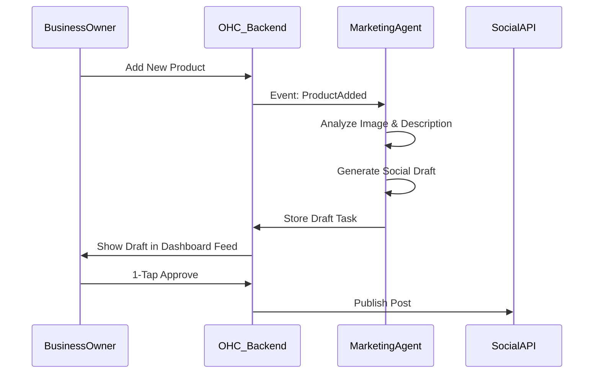

# Issue Brief: Auto-Generating Social Post Agent

## Title
[Marketing] Auto-Generating Social Post Agent

## Problem Statement
Business owners struggle with consistency in social media marketing due to lack of time and inspiration. "I don't know what to post" is a top 5 pain point across small business communities. This inconsistency leads to poor engagement and missed growth opportunities.

## Research Report
Research across Reddit's small business communities, App Store reviews, and Trustpilot highlights a significant gap: most platforms offer website builders but provide zero help with ongoing traffic generation. Competitors either ignore this or offer basic templating. An automated, proactive system that generates draft posts based on business events (like new inventory) will be a major differentiator.

## Design Doc

### Architecture
*   **Marketing Agent Workflow:** A background job triggered by specific events (e.g., `NewProductAdded`) or running on a scheduled weekly cadence.
*   **AI Integration:** Leverages LLMs (e.g., Gemini Pro) to analyze product images, descriptions, and business memory. Generates platform-specific content (Instagram, Facebook).
*   **Approval Pipeline:** Drafts are saved to the database and exposed to the frontend via the Agent Activity Feed for review.

### UX Flow
1.  **Trigger:** Business owner adds a new product (e.g., "Vegan Chocolate Cake") and uploads a photo.
2.  **Generation:** The backend Marketing Agent detects the new product, analyzes the image and description, and drafts an Instagram post with relevant hashtags and emojis.
3.  **Notification & Approval:** The business owner receives a push notification and sees the draft in the mobile dashboard's "Marketing" tab.
4.  **Publishing:** The owner taps "Approve & Post" (or edits lightly). The backend dispatches the post to the connected social media API.

### Mermaid Diagram

## Implementation Prompt
Develop a Marketing Agent module that automatically generates social media post drafts whenever a new product is added or on a weekly cadence for existing products. The user should see these drafts in a dedicated "Marketing" tab and approve them with one tap. Ensure the agent logic is resilient to LLM API errors and uses appropriate fallback mechanisms.

## Priority
P1

## Scope
Medium
