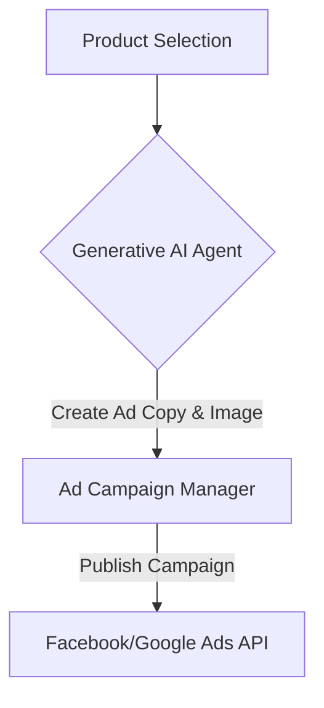

**Title**: Automated Ad Campaign Creation
**Problem Statement**: Running profitable ads requires technical marketing knowledge that most SMB owners lack.
**Research Report**: SMBs waste money on ineffective ads due to poor targeting and unoptimized creative assets.
**Design Doc**:
*   Mobile UX Flow: "Marketing" tab -> "New Campaign" -> Select Product -> Approve AI-Generated Ads.
*   Architecture: Ad API Integration -> Generative AI Agent -> Ad Campaign Manager.

**Implementation Prompt**: Build an end-to-end ad campaign generator that selects a product, generates ad copy and variations using LLMs, and deploys the campaigns directly via ad network APIs after user approval.
**Priority**: P2
**Estimated Scope**: Large

### Breaking Down the Barrier to Advertising
The complexity of Facebook Business Manager and Google Ads is a massive hurdle for non-technical users. They are presented with choices regarding campaign objectives, audience targeting, bidding strategies, and ad placements—decisions they are unequipped to make.

### AI-Driven Targeting
The Generative AI Agent must abstract this complexity. Instead of asking the user to define an audience, the system should:
1.  Analyze the user's existing customer database.
2.  Identify demographic and behavioral patterns of high-LTV customers.
3.  Automatically create "Lookalike Audiences" via the ad network APIs based on these patterns.

### Creative Asset Generation
Generating ad copy is only half the battle. The agent must also handle creative assets.
*   **Image Optimization**: Automatically resize and crop product photos to fit various ad placement formats (e.g., Instagram Stories vs. Facebook Feed).
*   **A/B Testing Automation**: Generate 3-5 variations of ad copy and automatically deploy them. After a short "learning phase," automatically allocate the budget to the best-performing variation and pause the others.
