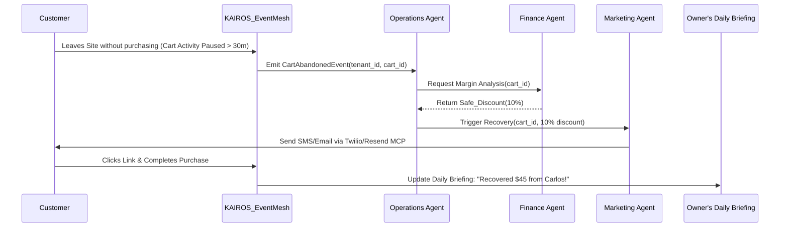

# [Marketing] Autonomous Abandoned Cart Recovery Engine

## Problem Statement
Small business owners (like Maya the baker and Priya the boutique owner) lose an average of 70% of potential online sales to cart abandonment. They are aware they should send "abandoned cart" emails, but setting up these workflows in traditional platforms requires understanding complex triggers, managing separate email marketing apps, and manually creating dynamic discount codes. They suffer from **"Setup Complexity"** and **"Integration Hell"**, leading to lost revenue because they simply don't have the time or technical expertise to configure it.

From the Small Business Owner Lens: "I just want the system to text the customer if they forget to buy my cupcakes, and maybe offer them 10% off. I shouldn't need a marketing degree or 3 different apps to do this."

## Research Report

**Competitor Analysis:**
*   **Shopify:** Offers basic abandoned cart emails, but requires third-party apps (like Klaviyo) for advanced workflows, SMS integration, or dynamic incentives. Setup is complex and involves learning a new UI paradigm.
*   **Wix:** Requires manual configuration of "Automations," which is often too complex for non-technical users. It relies on a visual flowchart builder that alienates users who just want it to "work."
*   **Squarespace:** Similar to Wix, requires manual setup of email campaigns and lacks deep, intelligent multi-channel (SMS + Email) routing based on customer preference.

**OHC Advantage (Invisible Autonomy):**
Instead of giving the user a tool to build a campaign, OHC's **Marketing Agent** and **Finance Agent** collaborate invisibly in the background. When a cart is abandoned, the KAIROS Orchestrator detects the event, the Finance Agent dynamically calculates a safe discount based on margins, and the Marketing Agent drafts the recovery message (Email/SMS). The owner simply sees a card in their daily feed: "Recovered $150 yesterday with autonomous follow-ups."

## Design Doc

### 1. Multi-Tenant Data Model & Invariants
The system relies on strict multi-tenant isolation, ensuring cart and recovery data is absolutely siloed per `tenant_id`.

```mermaid
erDiagram
    TENANT ||--o{ CART_SESSION : "has"
    CART_SESSION {
        uuid id PK
        uuid tenant_id FK "Multi-tenant invariant"
        uuid customer_id FK
        jsonb items
        timestamp last_activity
        string status "ACTIVE, ABANDONED, RECOVERED"
    }

    TENANT ||--o{ RECOVERY_CAMPAIGN : "configures"
    RECOVERY_CAMPAIGN {
        uuid id PK
        uuid tenant_id FK "Multi-tenant invariant"
        boolean is_active
        integer max_discount_percent
    }

    CART_SESSION ||--o{ RECOVERY_EVENT : "triggers"
    RECOVERY_EVENT {
        uuid id PK
        uuid tenant_id FK "Multi-tenant invariant"
        uuid cart_session_id FK
        string channel "EMAIL, SMS, WHATSAPP"
        string message_content
        string status "SENT, OPENED, CLICKED"
        timestamp sent_at
    }
```

### 2. Agent Coordination (Sequence)

### 3. Mobile-First UX Flow (375px)
All configuration must pass the "Grandmother Test." There are no flowcharts.

**Screen 1: The Daily Briefing (Home)**
*   **Layout:** Clean, Ubiquiti UniFi style dashboard card. Translucent Glass materials.
*   **Content:** A card titled "Revenue Recovered".
*   **Text:** "Your AI agents recovered $120 from abandoned carts this week."
*   **Action:** A soft button "View Details or Adjust Settings".

**Screen 2: Simple Settings Modal**
*   **Layout:** Bottom sheet sliding up on mobile.
*   **Content:**
    *   **Toggle:** "Auto-Recover Abandoned Carts" (Default: ON)
    *   **Slider:** "Maximum AI Discount" (0% to 20%). "Allow the AI to offer a discount to close the sale. It will only do this if profit margins allow."
*   **Visuals:** No technical terms (no "webhooks", "triggers", or "liquid tags").

### 4. Zero Trust & Security
*   **Multi-Tenancy:** Every read/write to `CART_SESSION` or `RECOVERY_EVENT` must implicitly filter by the JWT-provided `tenant_id` at the database middleware layer (Postgres RLS).
*   **Identity:** External API calls (Twilio, Resend) made by the Marketing Agent must route through the Hybrid MCP Secrets Vault, ensuring agents never directly access raw API keys.

## Implementation Prompt

**To the Implementer Swarm:**
Your objective is to implement the Autonomous Abandoned Cart Recovery Engine.
1.  **Backend:** Implement the event listener on the NATS/Teammate Mesh that detects a `CartAbandonedEvent`. Create the orchestration logic where the Marketing Agent interacts with the Finance Agent to determine a discount and sends the message. Ensure the `tenant_id` invariant is strictly enforced using Postgres RLS policies on the new tables.
2.  **Frontend (Tauri/Next.js):** Build the "Revenue Recovered" summary card for the Daily Briefing feed and the simple "Auto-Recover" settings modal (slider and toggle). Use the existing design tokens (glassmorphism, clean typography) tailored strictly for a 375px viewport. Do not build a complex workflow editor.
3.  **Acceptance Criteria:** A simulated customer abandoning a cart triggers the system; a message is dispatched via the mocked notification MCP; the recovered revenue appears on the owner's mobile dashboard; Tenant A cannot access Tenant B's cart data under any circumstances.

## Priority & Scope
*   **Priority:** P1 (Critical revenue driver for SMBs)
*   **Estimated Scope:** Medium
