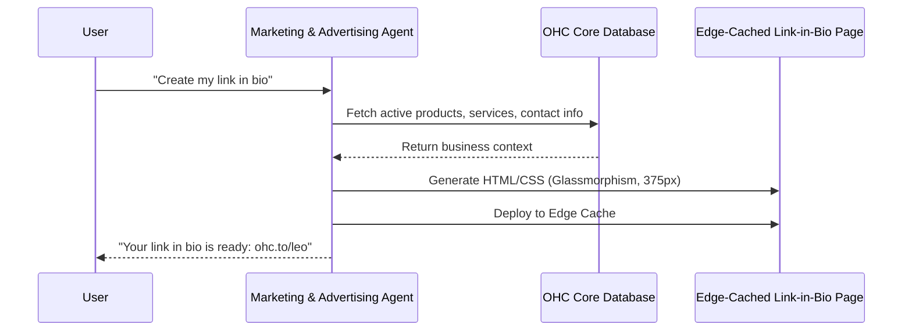

# Issue Brief: Autonomous Link-in-Bio Generator

## Title
[Marketing] Autonomous Link-in-Bio Generator

## Problem Statement
Small business owners like Leo (the music tutor) rely heavily on social media (TikTok, Instagram) to drive traffic. However, platforms like Instagram only allow a single link in the bio. Existing solutions (Linktree) require managing a separate platform, breaking the integrated OHC experience. Leo needs a way to instantly generate a beautiful, mobile-optimized link-in-bio page that seamlessly connects to his OHC bookings, subscriptions, and portfolio.

## Research Report
- **Competitive Analysis:** Linktree, Beacons, and standard Wix/Squarespace pages. These tools are either disconnected from the core business engine (requiring manual sync of services/products) or too complex to set up quickly.
- **OHC Advantage:** Because OHC already holds the business context (services, products, bookings), the Marketing Agent can autonomously generate and update the link-in-bio page without manual effort.
- **Data/References:** A strong link-in-bio can increase conversion rates from social media by up to 30%.

## Design Doc
- **Architecture:** The link-in-bio generator will act as a specialized view generator within the `Marketing & Advertising` department. It will pull active products/services from the OHC core database and render a lightweight, edge-cached mobile page.
- **UX/UI:** A simple toggle in the Dashboard to "Enable Link-in-Bio". The page itself will follow the OHC Visual Mandate: glassmorphism, high-contrast buttons, and mobile-first 375px layout.
- **AI Integration:** The `Marketing` agent will analyze the user's business type and automatically select the most relevant links (e.g., "Book a Lesson" for Leo, "View Menu" for Fatima).

## Implementation Prompt
Implement an autonomous link-in-bio generation feature. The system should allow users to create a mobile-optimized public page displaying their key offerings (services, products, contact info) with a single click. The page must be automatically populated using data from the user's OHC business profile and managed by the Marketing AI agent. Ensure the design adheres to the premium OHC aesthetic (glassmorphism) and is fully responsive (375px baseline). Do not prescribe specific database schemas or API endpoints; focus on the business logic and user experience described above.

## Priority
P1

## Estimated Scope
Medium
