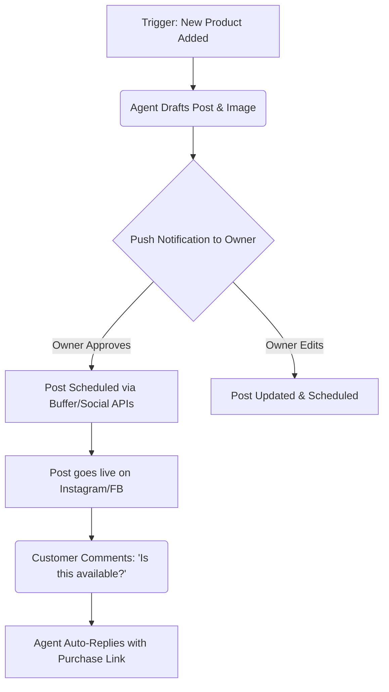

# [marketing] Autonomous Social Agent

## Problem Statement
Small business owners like Maya (the baker) and Priya (the boutique owner) struggle to maintain a consistent social media presence. They are busy creating products, serving customers, and managing inventory. Writing engaging posts, finding the right tags, scheduling them across Facebook, Instagram, and TikTok, and replying to customer comments takes hours every week. When they don't post, sales drop. When they do post, they are overwhelmed by the DMs. They don't need a tool that makes it *easier* to post; they need a digital employee that *posts for them*.

## Research Report
**Market Insight:** 55% of SMBs cite "Creating Marketing Content" as a top 10 pain point. Competitors like Shopify and Wix offer basic social integrations, but they are entirely manual. You connect an account, and maybe you can push a product link. It requires the user to write the copy, choose the image, and hit send.
**Competitor Gap:** Tools like Buffer or Hootsuite are too complex and disconnected from the store's inventory. We have a massive opportunity to provide a native, zero-click social manager.
**User Verbatim:** "I know I need to post on Instagram to get sales, but by the time I'm done baking, the last thing I want to do is think of a clever caption." - Maya, 28.

## Design Doc

### High-Level Architecture (Conceptual)
The Autonomous Social Agent sits between the user's OHC catalog/inventory and external social networks.
- **Trigger Events:** New product added, inventory restocked, seasonal event (e.g., Mother's Day).
- **Core Engine:** An LLM generates draft copy, selects relevant images from the catalog, and proposes a schedule.
- **User Approval Flow:** The user gets a single push notification on their phone: "I drafted 3 posts for your new Cupcake line. Approve?" A single tap schedules them all.
- **Engagement Loop:** When users comment on a post (e.g., "How much?"), the Agent auto-replies with a friendly, plain-language response and a direct link to checkout.

### Mermaid.js Flowchart

### Mobile UX (375px First)
1. **The Briefing Screen:** Owner opens the OHC app. A card at the top says: "Your Social Agent has drafted 2 posts for this week."
2. **Review Screen:** Tapping the card shows the proposed image, caption, and hashtags. Two big buttons: `Approve` or `Edit`.
3. **Edit Screen:** A simple text box to tweak the copy. No confusing settings about timezone or platform specifics unless expanded.
4. **The Inbox:** A unified view showing AI-handled comments and DMs. Messages requiring human intervention are flagged in red.

## Implementation Prompt
**User-Facing Outcome:** The user should feel like they hired a part-time social media manager. When they add a new item to their store, the platform should automatically suggest social posts.

**Critical User Journey:**
1. User adds a new product via the OHC app.
2. The system automatically creates a draft social post.
3. User receives an actionable notification to review the draft.
4. User taps "Approve" and the post is scheduled.
5. The system handles basic replies to comments on that post.

**Acceptance Criteria:**
- The system must be able to generate conversational, brand-aligned text based on product details.
- The UI must be mobile-first, prioritizing a 1-tap approval workflow.
- All technical jargon (e.g., "OAuth", "API Keys", "Webhook") must be hidden behind simple, plain-language setup flows (e.g., "Connect your Instagram").
- The feature must degrade gracefully if the user chooses not to connect social accounts.

## Priority
P0

## Estimated Scope
Medium
