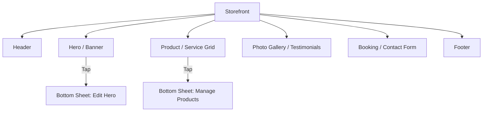

# Issue Brief: Mobile-First WYSIWYG Storefront Editor

## Problem Statement
Most website builders (Wix, Squarespace, Shopify) were born on the desktop. Their mobile editing experience is often a cramped version of the desktop tool, leading to frustration for mobile-only users like Fatima (Food Cart) or Maya (Baker). OHC needs a "375px-native" WYSIWYG editor that feels like using a mobile app (like Instagram or Canva) rather than a simplified desktop site.

## Research Report
### Competitive Audit
- **Shopify Online Store 2.0**: Very powerful on desktop, but mobile editing is essentially a list of form fields that update a preview. No "touch-to-edit" on the preview itself.
- **Wix ADI**: Generates a site well, but customization on mobile is limited to swapping sections. Fine-grained control is difficult.
- **Durable / Hocoos**: Focus on AI generation. Great for Day 1, but Day 2 editing (changing a specific image or button text) feels clunky on a phone.
- **Instagram Profile**: The ultimate "mobile storefront" for millions. It's successful because it's high-constraint and high-consistency. OHC should replicate this simplicity while adding "Site" capabilities.

### Personas Alignment
- **Fatima (Food Cart)**: Needs to quickly toggle an item to "Sold Out" or change a price while standing at her cart.
- **Carlos (Handyman)**: Needs to upload a photo of a finished job to his "Gallery" section between appointments.
- **Priya (Boutique)**: Needs to announce a "Flash Sale" via a banner on her homepage while on the train.

## Design Doc
### High-Level Architecture
- **Block-Based System**: The site is a vertical stack of "Premium Blocks" (Glassmorphism default).
- **Direct Manipulation**: Tapping a block in the preview opens a bottom-sheet with specific controls for that block (e.g., tap the Hero banner to change text/image).
- **Constraint-Based Design**: To ensure the site always looks "Premium" and mobile-ready, we restrict layout freedom (no absolute positioning on mobile). Use a high-quality "Grid System."

#### Site Block Registry

### Mobile UX Flow (375px First)
1. **The Canvas**: A live, interactive preview of the site.
2. **Bottom-Sheet Controllers**: Instead of sidebars (which don't work on mobile), all editing controls live in native bottom sheets.
3. **Ghost Adding**: Floating "+" button between blocks to insert new sections.
4. **AI Assistant "Magician"**: A "Rephrase with AI" button on every text block to help Fatima with English.

## Implementation Prompt
Implement a Flutter-based mobile WYSIWYG editor optimized for a 375px breakpoint. The editor must support a block-based architecture where users can reorder, add, and edit sections (Hero, Product Grid, Gallery, etc.). All editing interactions (changing text, uploading images, toggling visibility) must be handled via bottom sheets. The preview must be live and interactive — tapping a block must highlight it and open its respective bottom-sheet controller. Ensure the editor adheres to the OHC Premium Design Standards (Glassmorphism, Outfit/Inter typography).

## Priority
P0

## Estimated Scope
Large
