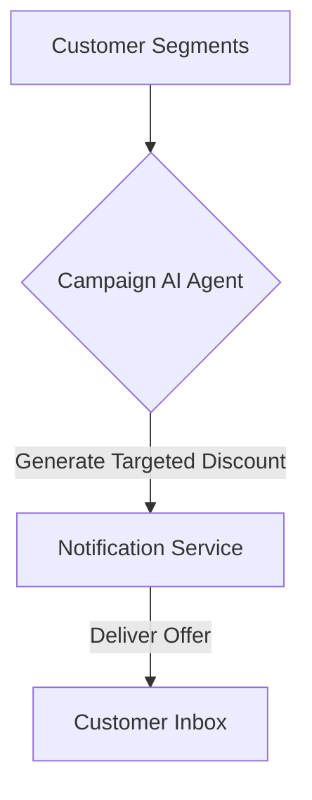

**Title**: Smart Promotional Campaigns
**Problem Statement**: Running blanket discounts hurts margins, while targeted promotions require complex setup.
**Research Report**: Promotions targeted at specific segments (e.g., "dormant VIPs") yield higher ROI than general sales.
**Design Doc**:
*   Architecture: Customer Segments -> Campaign AI Agent -> Discount Generation.

**Implementation Prompt**: Create an AI agent that analyzes customer segments and automatically suggests targeted promotional campaigns, generating unique, single-use discount codes and drafting the associated email or SMS copy for the owner's approval.
**Priority**: P2
**Estimated Scope**: Large
