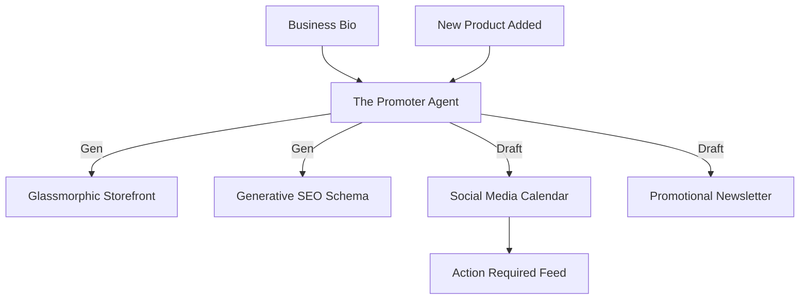

# [Marketing] Architecture Brief: "The Promoter"

## Title
OHC "The Promoter": AI-Driven Website, SEO, and Social Growth

## Problem Statement
Most small business owners aren't designers or marketers. Priya (Boutique) and Leo (Music Tutor) know they need to post on Instagram and show up on Google, but they don't have the time or expertise. Currently, setting up SEO and social media campaigns is a "black box" that costs thousands in agency fees.

## Research Report
- **GEO (Generative Engine Optimization)**: OHC's unique advantage over Shopify. Instead of just meta-tags, we optimize for LLM crawlers (ChatGPT, SearchGPT) to ensure OHC businesses are recommended first.
- **Vibe-Based Generation**: Using AI to generate not just text, but visual themes (Glassmorphism) that match the business's brand personality.
- **Competitive Analysis**: GoDaddy Airo and Durable offer "instant sites," but OHC adds **proactive social scheduling** triggered by business events (e.g., "New Product Added").

## Design Doc

### High-Level Architecture (Mermaid.js)

### UI Flow (375px First)
- **1-Tap Post**: A preview card showing an AI-generated Instagram post (image + caption). The user taps "Post Now" to publish across all connected accounts.
- **Vibe Selector**: Instead of complex CSS, users choose from "Cozy," "Modern," or "Elegant" vibes, and "The Promoter" handles the rest.

### AI Agent Integration
- **Tools**: `websearch`, `generative_visibility` (GEO scoring), `social_publish`.
- **Triggers**: `tenant.product.created`, `tenant.site.launched`.

## Implementation Prompt
**To Implementer Agent:**
Implement "The Promoter" (Marketing) department. This agent's primary task is to manage the business's digital presence. When a new product is added, it must autonomously draft a social media post and an email announcement. It should also perform a "GEO Audit" on the storefront, adding structured JSON-LD data that describes the business vibe and offerings for AI crawlers. Ensure the "Draft-for-Review" workflow is strictly followed for all external posts.

## Priority
P0

## Estimated Scope
Large
