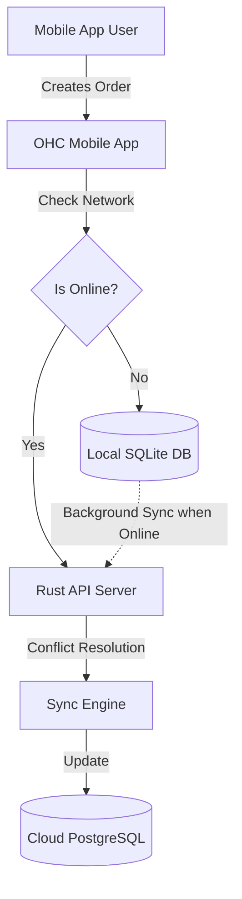

# Actionable Issue Brief: 1-Tap Offline Sync & Resilience

## Title
1-Tap Offline Sync for Mobile Commerce

## Problem Statement
Small business owners operating in areas with poor or intermittent internet connectivity (like Fatima's food cart at a crowded festival, or Carlos in a client's basement) struggle with cloud-only platforms. Shopify POS requires a stable connection; if it drops, sales are lost or delayed. SMBs need a mobile-first solution that functions seamlessly offline and automatically syncs when connectivity is restored.

## Research Report
- **Market Gap:** Shopify and Wix are predominantly cloud-dependent. While Shopify POS has some limited offline cash transactions, full order management and inventory updates fail without an internet connection.
- **User Validation:** Trustpilot and App Store reviews frequently mention frustration over lost data during connection drops at events or in rural areas.
- **Competitor Landscape:**
  - *Square POS:* Has an offline mode, but it's restricted to specific hardware and payment types.
  - *Shopify:* Cloud-dependent for full functionality.

## Design Doc
### High-Level Architecture
- **Agent/Module Role:** Enhancing the core `SyncEngine` and leveraging the existing SQLite local fallback.
- **Entity Relationships:**
  - `Order`, `Inventory`, and `Customer` entities must support a robust local-first strategy.
- **Mobile UX Flow (375px first):**
  1. **Home Screen (Offline):** A subtle banner appears: "Offline Mode Active. You can still accept cash orders and view inventory."
  2. **Order Creation:** User creates an order. It's stored locally and marked as "Pending Sync".
  3. **Connection Restored:** A toast notification: "Back online. Syncing 3 offline orders..."

## Implementation Prompt
**User-Facing Outcome:** The mobile app remains fully functional for critical operations (viewing inventory, logging cash sales) even when disconnected from the internet. When connection is re-established, all local changes are invisibly and safely synced to the cloud.

**Critical User Journey (CUJ):**
1. User loses internet connectivity.
2. User continues to take an order and logs the transaction.
3. The app saves the order locally and updates local inventory counts.
4. User regains connectivity.
5. The system automatically pushes the local order to the server and updates the global inventory state without requiring user intervention.

**Acceptance Criteria:**
- The mobile app must gracefully handle HTTP timeouts and switch to a local-first mode.
- Local data must be stored securely.
- A background sync mechanism must efficiently push updates to the backend when online.
- Conflicts (e.g., inventory updated simultaneously elsewhere) must be resolved gracefully (e.g., using a CRDT-like approach or last-write-wins).
- UI must clearly communicate the sync status without using technical jargon.

## Priority
P1

## Estimated Scope
Medium
