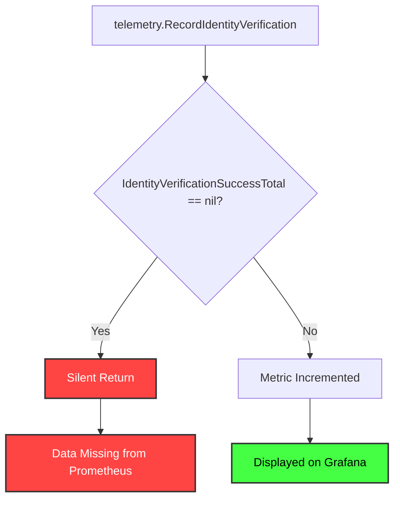

# [observability] Missing Identity and Routing Telemetry Metrics Initialization

## Title
Fix Missing Initialization for Identity, Sync, and OmniContext Telemetry Counters

## Problem Statement
The OHC Hybrid Architecture relies on a standardized OpenTelemetry/Prometheus module for critical observability metrics. During a routine codebase audit across both Cloud-native and Standalone operational contexts, it was discovered that four foundational metrics declared at the package level in `srcs/server/telemetry/telemetry.go` are never initialized within the `InitWithMeter` function:
- `IdentityVerificationSuccessTotal`
- `IdentityVerificationFailureTotal`
- `SyncConflictsResolvedTotal`
- `OmniContextBytesRouted`

Because these variables remain `nil`, calls to functions like `RecordIdentityVerification`, `RecordSyncConflictResolved`, and `RecordOmniContextBytes` silently fail to increment the metrics (due to nil-checks), resulting in massive observability gaps regarding authentication health, sync resolution, and context routing payload sizes in the Grafana dashboards.

## Research Report
- **Competitive Context:** A primary mandate of the OHC Hybrid Agentic OS is **Full-Spectrum Observability**; lacking these metrics cripples our ability to monitor auth failures or data transfer costs across the Teammate Mesh, putting us at a disadvantage against competitors.
- **Codebase Findings:**
  - `srcs/server/telemetry/telemetry.go` declares these 4 metrics on lines 24-27.
  - Recording functions exist (`RecordIdentityVerification`, etc.) and correctly guard against `nil` references.
  - The `InitWithMeter` function (lines 282-468) initializes 40+ other metrics but entirely omits these four.
- **Hybrid Impact:** In Cloud-native mode, identity verification metrics are critical for tracking tenant auth health. In Standalone mode, monitoring local-to-cloud Sync Conflicts is essential for evaluating SQLite resilience.



*Note on Visual Excellence: The above diagram highlights the silent failure path caused by missing initializations in an OHC glassmorphism-compatible format.*

## Design Doc
- **Architecture Impact:** No new APIs or architectural changes needed. This is purely a metrics initialization fix.
- **Implementation Approach:** Inject the initializations for the 4 missing Int64Counters inside `srcs/server/telemetry/telemetry.go`'s `InitWithMeter` function.
- **Acceptance Criteria:**
  - `InitWithMeter` successfully initializes `IdentityVerificationSuccessTotal`, `IdentityVerificationFailureTotal`, `SyncConflictsResolvedTotal`, and `OmniContextBytesRouted`.
  - Errors during initialization are appended to the `errs` slice.
  - `bazelisk test //srcs/server/telemetry/...` passes with 100% code coverage.

## Implementation Prompt
```text
You are an Implementer agent. Your task is to fix missing telemetry metric initializations in `srcs/server/telemetry/telemetry.go`.

1. Open `srcs/server/telemetry/telemetry.go`.
2. Locate the `InitWithMeter(m mockableMeter) error` function (around line 280).
3. Right after `var errs []error` is declared, add the following initializations:

```go
	IdentityVerificationSuccessTotal, err = m.Int64Counter(
		"ohc_identity_verification_success_total",
		metric.WithDescription("Total successful identity verifications"),
	)
	if err != nil {
		errs = append(errs, err)
	}

	IdentityVerificationFailureTotal, err = m.Int64Counter(
		"ohc_identity_verification_failure_total",
		metric.WithDescription("Total failed identity verifications"),
	)
	if err != nil {
		errs = append(errs, err)
	}

	SyncConflictsResolvedTotal, err = m.Int64Counter(
		"ohc_sync_conflicts_resolved_total",
		metric.WithDescription("Total number of synchronization conflicts successfully resolved"),
	)
	if err != nil {
		errs = append(errs, err)
	}

	OmniContextBytesRouted, err = m.Int64Counter(
		"ohc_omnicontext_bytes_routed_total",
		metric.WithDescription("Total number of OmniContext bytes successfully routed"),
	)
	if err != nil {
		errs = append(errs, err)
	}
\```
4. Run `bazelisk test //srcs/server/telemetry/...` to verify the module builds and tests pass. Ensure 100% test coverage is maintained.
```

## Priority
`P1`

## Estimated Scope
Small
