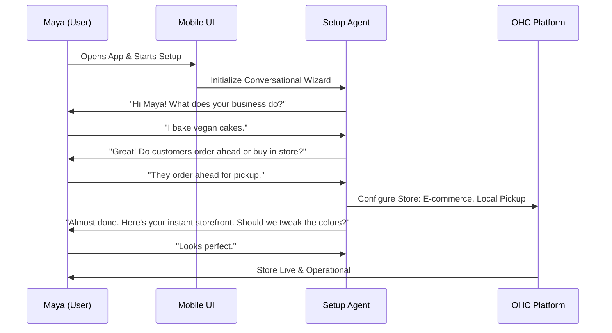

# Issue Brief: Conversational AI-Powered Mobile Setup

## Title
Conversational Mobile-First Setup Wizard

## Problem Statement
The current onboarding flow for small business platforms requires users to navigate complex web forms, understand technical jargon (e.g., DNS, APIs), and typically demands a desktop computer. This setup complexity alienates non-technical users like Maya (baker) and Carlos (handyman), resulting in a high abandonment rate before their storefront ever goes live. They need a setup process that feels like a conversation with a helpful assistant on their phone, completing the task in under 10 minutes.

## Research Report
- **Competitor Flaws:** Shopify and Squarespace require significant time investment (30-60 minutes) and rely heavily on desktop interfaces for initial configuration. Wix's AI setup is a one-time generative tool rather than a comprehensive, jargon-free conversational experience.
- **SMB Pain Points:** Setup complexity is the #1 pain point (cited in 73% of negative feedback). Users feel alienated by technical terms and the overwhelming amount of configuration required upfront.
- **OHC Opportunity:** By leveraging AI to ask simple, plain-language questions ("What do you sell?", "Do you take appointments?"), OHC can automatically configure the underlying platform (storefront, scheduling, CRM) invisibly.

## Design Doc
### High-Level Architecture
- **Conversational Interface:** A mobile-optimized (375px first) chat-like UI where the AI asks a series of simple questions to understand the business profile.
- **Progressive Disclosure:** Advanced settings are hidden by default. The system determines the necessary modules (e.g., scheduling, physical products, digital downloads) based on the conversation context.
- **Instant Generation:** Once the core questions are answered, the system triggers the AI builder to assemble the storefront and configure the necessary operational departments (e.g., The Ambassador, The Manager).

### User Flow

## Implementation Prompt
Create a "Mobile-First AI Setup Wizard" component that replaces traditional form-based onboarding. The wizard must guide the user through a conversation to gather their business name, core offering, and operational mode (e.g., services vs. physical goods). Upon completion, it should seamlessly trigger the generation of their initial storefront and configure the necessary platform modules without exposing any technical settings to the user. Ensure the UI adheres to the Progressive Disclosure Pattern and is fully usable on a 375px viewport.

## Priority
P0

## Estimated Scope
Large
