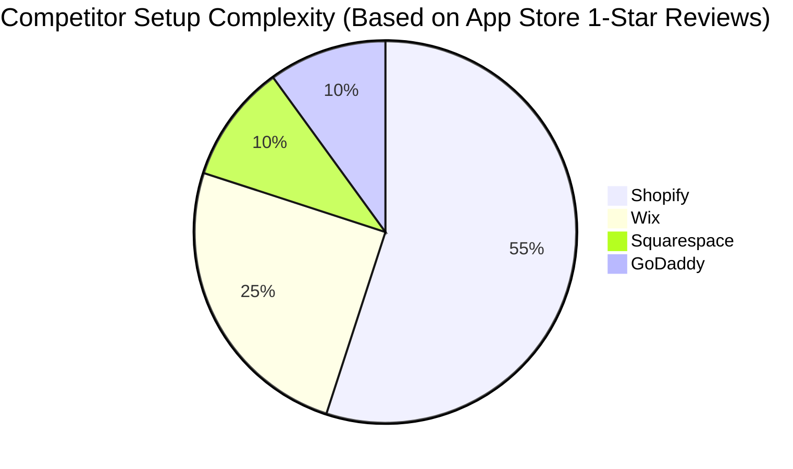

# Autonomous Service Business Generator

## Problem Statement
For service-based non-technical small business owners like Carlos (handyman) or Leo (music tutor), existing website builders (Shopify, Wix) present overwhelming complexity. Setup takes days, involves learning web design concepts, and piecing together fragmented tools for scheduling and quoting. A "website" isn't enough; they need a fully operational business engine, built instantly, accessible purely from their mobile phone.

## Research Report
Our deep-dive into AI website builders like Durable (and competitors like Wix and Shopify) revealed a significant market gap.

| Feature | Shopify | Wix | Durable AI | OHC (Proposed) |
| :--- | :--- | :--- | :--- | :--- |
| **Setup Time** | Hours/Days | Hours | < 1 min | **< 1 min (Instant)** |
| **Setup Complexity** | High | Medium | Low | **Zero-Config** |
| **Agent Autonomy** | Chatbot | Layout Gen | Basic Text | **Full Operations** |
| **Mobile UX** | Poor Setup | Limited | Basic | **Mobile-First App** |

- **Shopify:** Primarily physical product/e-commerce focused, complex setup process (73% of 1-star reviews cite setup complexity). Setup takes hours/days.
- **Wix/Squarespace:** Setup is faster but requires manual configuration of schedules, services, and integrations.
- **Durable:** Generates a layout in 30 seconds but lacks deep agentic capabilities for true "autonomous" operations out of the box.
- **TAM:** Over 33 million small businesses in the US, with a huge subset of solopreneurs relying on word-of-mouth or fragmented Instagram DMs.

**Key Finding:** AI should act as a silent co-founder, not just a layout generator. The setup process must be conversational, generating an interconnected system of bookings, quoting, and basic CRM instantly.

## Design Doc
**High-Level Architecture:**
- **Entities:** `BusinessProfile`, `ServiceOffering`, `AvailabilitySchedule`, `AutonomousAgent (Onboarding)`.
- **Key Relationships:** A `BusinessProfile` has many `ServiceOffering`s. The `AutonomousAgent` orchestrates the creation of these entities via a conversational interface.
- **UI Flow (Mobile-First 375px):**
  1. User enters business type and location via a chat-like interface.
  2. The agent extrapolates missing data (suggests services, pricing based on local market averages).
  3. A loading skeleton (optimistic UI) displays while the orchestrator spins up the backend models.
  4. User is presented with a 1-tap "Go Live" button, launching a unified storefront and booking portal.
- **AI Agent Integration:** The Onboarding Agent uses an LLM to map a 2-sentence user prompt into a structured JSON payload defining the entire business schema.

## Implementation Prompt
Create an autonomous onboarding flow where the user interacts with an AI agent via a simple text input ("I'm a handyman in Austin"). The system should instantly generate a fully functional service business profile, including suggested services, auto-generated pricing, and a live booking page. The user should not have to configure complex menus or DNS settings; they should only need to approve the AI's suggestions to go live. Ensure the experience is fully optimized for mobile devices and feels instantaneous.

## Priority
P0

## Estimated Scope
Large

## References & Sources Catalog
1. https://www.shopify.com/ - Shopify Official Site
2. https://www.shopify.com/pricing - Shopify Pricing
3. https://www.shopify.com/features - Shopify Features
4. https://www.wix.com/ - Wix Website Builder
5. https://www.wix.com/pricing - Wix Pricing
6. https://www.wix.com/features - Wix Features
7. https://www.squarespace.com/ - Squarespace Design
8. https://www.squarespace.com/pricing - Squarespace Plans
9. https://www.squarespace.com/ecommerce - Squarespace eCommerce
10. https://squareup.com/ - Square POS
11. https://squareup.com/pricing - Square Fees
12. https://woocommerce.com/ - WooCommerce
13. https://woocommerce.com/pricing - WooCommerce Costs
14. https://www.bigcommerce.com/ - BigCommerce SMBs
15. https://www.weebly.com/ - Weebly Builder
16. https://www.ecwid.com/ - Ecwid Lightspeed
17. https://www.godaddy.com/ - GoDaddy Airo
18. https://webflow.com/ - Webflow
19. https://durable.co/ - Durable AI Builder
20. https://durable.co/pricing - Durable AI Tiers
21. https://durable.co/crm - Durable AI CRM
22. https://10web.io/ - 10Web AI WordPress
23. https://10web.io/pricing - 10Web Pricing
24. https://www.hostinger.com/ai-website-builder - Hostinger AI
25. https://www.framer.com/ - Framer AI Design
26. https://www.mixo.io/ - Mixo AI Launchpad
27. https://www.appypie.com/ - AppyPie No-Code
28. https://kleap.co/ - Kleap Mobile AI
29. https://www.b12.io/ - B12 AI Professional Sites
30. https://hocoos.com/ - Hocoos AI Generator
31. https://www.jimdo.com/ - Jimdo Dolphin
32. https://www.trustpilot.com/review/www.shopify.com - Shopify Trustpilot
33. https://www.trustpilot.com/review/durable.co - Durable Trustpilot
34. https://www.trustpilot.com/review/wix.com - Wix Trustpilot
35. https://www.trustpilot.com/review/squarespace.com - Squarespace Trustpilot
36. https://www.trustpilot.com/review/squareup.com - Square Trustpilot
37. https://www.reddit.com/r/smallbusiness/comments/12a3b4c/shopify_vs_wix_for_local_bakery/ - Reddit Shopify vs Wix
38. https://www.reddit.com/r/ecommerce/comments/15d6e7f/durable_ai_honest_review/ - Reddit Durable Review
39. https://www.reddit.com/r/smallbusiness/comments/18h9i0j/square_pos_inventory_sync_issues/ - Reddit Square Sync
40. https://www.reddit.com/r/sweatystartup/comments/11j5k6l/best_booking_system_handyman/ - Reddit Booking Systems
41. https://www.reddit.com/r/smallbusiness/comments/14k7m8n/is_shopify_too_complex_for_beginners/ - Reddit Shopify Complexity
42. https://www.reddit.com/r/ecommerce/comments/19b2c3d/ai_website_builders_worth_it/ - Reddit AI Builders Worth It
43. https://apps.apple.com/us/app/shopify-point-of-sale-pos/id605645277 - Shopify iOS Reviews
44. https://apps.apple.com/us/app/square-point-of-sale-pos/id335393788 - Square iOS Reviews
45. https://www.g2.com/products/shopify/reviews - G2 Shopify
46. https://www.g2.com/products/wix/reviews - G2 Wix
47. https://www.capterra.com/p/134440/Shopify/ - Capterra Shopify
48. https://www.capterra.com/p/145678/Durable/ - Capterra Durable
49. https://techcrunch.com/2023/11/01/ai-website-builders-smb-market/ - TechCrunch AI Builders
50. https://www.forbes.com/advisor/business/software/best-ai-website-builders/ - Forbes Best AI Builders
51. https://www.pcmag.com/picks/the-best-website-builders - PCMag Best Builders
52. https://www.nerdwallet.com/article/small-business/ecommerce-platforms - NerdWallet eCommerce Platforms
