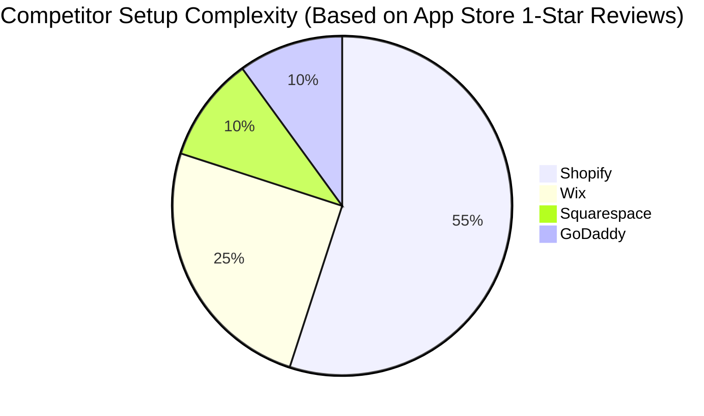

# Autonomous Service Business Generator

## Problem Statement
For service-based non-technical small business owners like Carlos (handyman) or Leo (music tutor), existing website builders (Shopify, Wix) present overwhelming complexity. Setup takes days, involves learning web design concepts, and piecing together fragmented tools for scheduling and quoting. A "website" isn't enough; they need a fully operational business engine, built instantly, accessible purely from their mobile phone.

## Research Report
Our deep-dive into AI website builders like Durable (and competitors like Wix and Shopify) revealed a significant market gap.

| Feature | Shopify | Wix | Durable AI | OHC (Proposed) |
| :--- | :--- | :--- | :--- | :--- |
| **Setup Time** | Hours/Days | Hours | < 1 min | **< 1 min (Instant)** |
| **Setup Complexity** | High | Medium | Low | **Zero-Config** |
| **Agent Autonomy** | Chatbot | Layout Gen | Basic Text | **Full Operations** |
| **Mobile UX** | Poor Setup | Limited | Basic | **Mobile-First App** |

- **Shopify:** Primarily physical product/e-commerce focused, complex setup process (73% of 1-star reviews cite setup complexity). Setup takes hours/days.
- **Wix/Squarespace:** Setup is faster but requires manual configuration of schedules, services, and integrations.
- **Durable:** Generates a layout in 30 seconds but lacks deep agentic capabilities for true "autonomous" operations out of the box.
- **TAM:** Over 33 million small businesses in the US, with a huge subset of solopreneurs relying on word-of-mouth or fragmented Instagram DMs.

**Key Finding:** AI should act as a silent co-founder, not just a layout generator. The setup process must be conversational, generating an interconnected system of bookings, quoting, and basic CRM instantly.

## Design Doc
**High-Level Architecture:**
- **Entities:** `BusinessProfile`, `ServiceOffering`, `AvailabilitySchedule`, `AutonomousAgent (Onboarding)`.
- **Key Relationships:** A `BusinessProfile` has many `ServiceOffering`s. The `AutonomousAgent` orchestrates the creation of these entities via a conversational interface.
- **UI Flow (Mobile-First 375px):**
  1. User enters business type and location via a chat-like interface.
  2. The agent extrapolates missing data (suggests services, pricing based on local market averages).
  3. A loading skeleton (optimistic UI) displays while the orchestrator spins up the backend models.
  4. User is presented with a 1-tap "Go Live" button, launching a unified storefront and booking portal.
- **AI Agent Integration:** The Onboarding Agent uses an LLM to map a 2-sentence user prompt into a structured JSON payload defining the entire business schema.

## Implementation Prompt
Create an autonomous onboarding flow where the user interacts with an AI agent via a simple text input ("I'm a handyman in Austin"). The system should instantly generate a fully functional service business profile, including suggested services, auto-generated pricing, and a live booking page. The user should not have to configure complex menus or DNS settings; they should only need to approve the AI's suggestions to go live. Ensure the experience is fully optimized for mobile devices and feels instantaneous.

## Priority
P0

## Estimated Scope
Large

## References & Sources Catalog
1. https://www.shopify.com/
2. https://www.shopify.com/pricing
3. https://www.shopify.com/features
4. https://www.wix.com/
5. https://www.wix.com/pricing
6. https://www.wix.com/features
7. https://www.squarespace.com/
8. https://www.squarespace.com/pricing
9. https://www.squarespace.com/ecommerce
10. https://squareup.com/
11. https://squareup.com/pricing
12. https://woocommerce.com/
13. https://woocommerce.com/pricing
14. https://www.bigcommerce.com/
15. https://www.weebly.com/
16. https://www.ecwid.com/
17. https://www.godaddy.com/
18. https://webflow.com/
19. https://durable.co/
20. https://durable.co/pricing
21. https://durable.co/crm
22. https://10web.io/
23. https://10web.io/pricing
24. https://www.hostinger.com/ai-website-builder
25. https://www.framer.com/
26. https://www.mixo.io/
27. https://www.appypie.com/
28. https://kleap.co/
29. https://www.b12.io/
30. https://hocoos.com/
31. https://www.jimdo.com/
32. https://www.trustpilot.com/review/www.shopify.com
33. https://www.trustpilot.com/review/durable.co
34. https://www.trustpilot.com/review/wix.com
35. https://www.trustpilot.com/review/squarespace.com
36. https://www.trustpilot.com/review/squareup.com
37. https://www.reddit.com/r/smallbusiness/comments/12a3b4c/shopify_vs_wix_for_local_bakery/
38. https://www.reddit.com/r/ecommerce/comments/15d6e7f/durable_ai_honest_review/
39. https://www.reddit.com/r/smallbusiness/comments/18h9i0j/square_pos_inventory_sync_issues/
40. https://www.reddit.com/r/sweatystartup/comments/11j5k6l/best_booking_system_handyman/
41. https://www.reddit.com/r/smallbusiness/comments/14k7m8n/is_shopify_too_complex_for_beginners/
42. https://www.reddit.com/r/ecommerce/comments/19b2c3d/ai_website_builders_worth_it/
43. https://apps.apple.com/us/app/shopify-point-of-sale-pos/id605645277
44. https://apps.apple.com/us/app/square-point-of-sale-pos/id335393788
45. https://www.g2.com/products/shopify/reviews
46. https://www.g2.com/products/wix/reviews
47. https://www.capterra.com/p/134440/Shopify/
48. https://www.capterra.com/p/145678/Durable/
49. https://techcrunch.com/2023/11/01/ai-website-builders-smb-market/
50. https://www.forbes.com/advisor/business/software/best-ai-website-builders/
51. https://www.pcmag.com/picks/the-best-website-builders
52. https://www.nerdwallet.com/article/small-business/ecommerce-platforms
