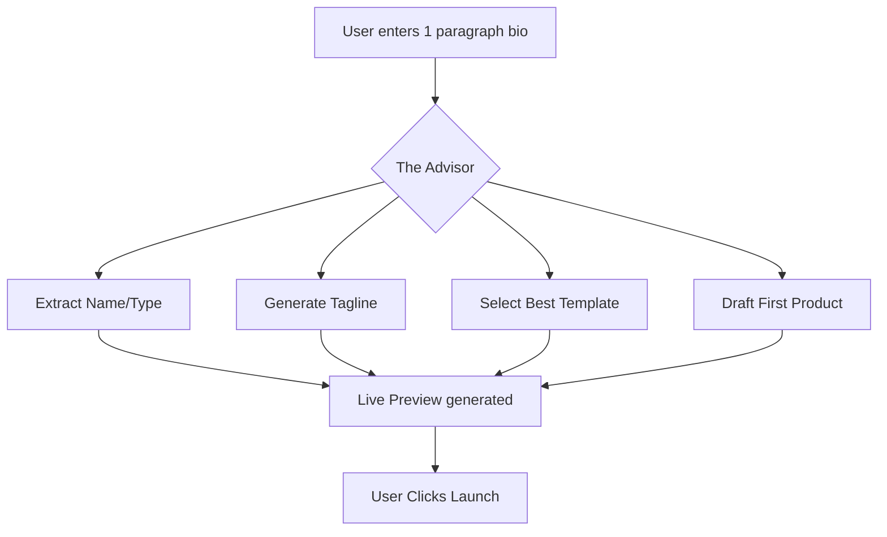

# Issue Brief: Instant "30-Second" Storefront Generation

## Problem Statement
The onboarding friction for most ecommerce platforms is too high. Even a 10-minute setup feels like a chore for a busy founder. Competitors are racing to zero setup time.

## Research Report
- **Durable Benchmark:** Claims "Get online in 30 seconds."
- **Wix Harmony:** Uses "vibe coding" to generate designs instantly from a single prompt.
- **OHC Current State:** The SetupWizard is detailed but requires multiple steps.
- **Target:** Reduce the "Time to Live" for the most basic storefront to under 60 seconds by using AI to guess and fill 80% of the required fields.

## Instant Build Flow

## Design Doc
### High-Level Architecture
- **Conversational One-Pager:** Replace the 11-step wizard with a single "Tell us about your business" prompt for users who want speed.
- **Parallel Generation:** While the user is typing, agents in the background start generating the tagline, logo, and product descriptions.
- **Smart Defaults:** Use location and industry data to set payment and delivery defaults.

### Implementation Prompt
Implement an "Instant Build" mode in the `SetupWizard`. This mode should accept a single paragraph of text from the user and use "The Advisor" to extrapolate all necessary business metadata, passing it to "The Promoter" to generate a live website draft immediately.

## Priority
P1

## Estimated Scope
Medium
