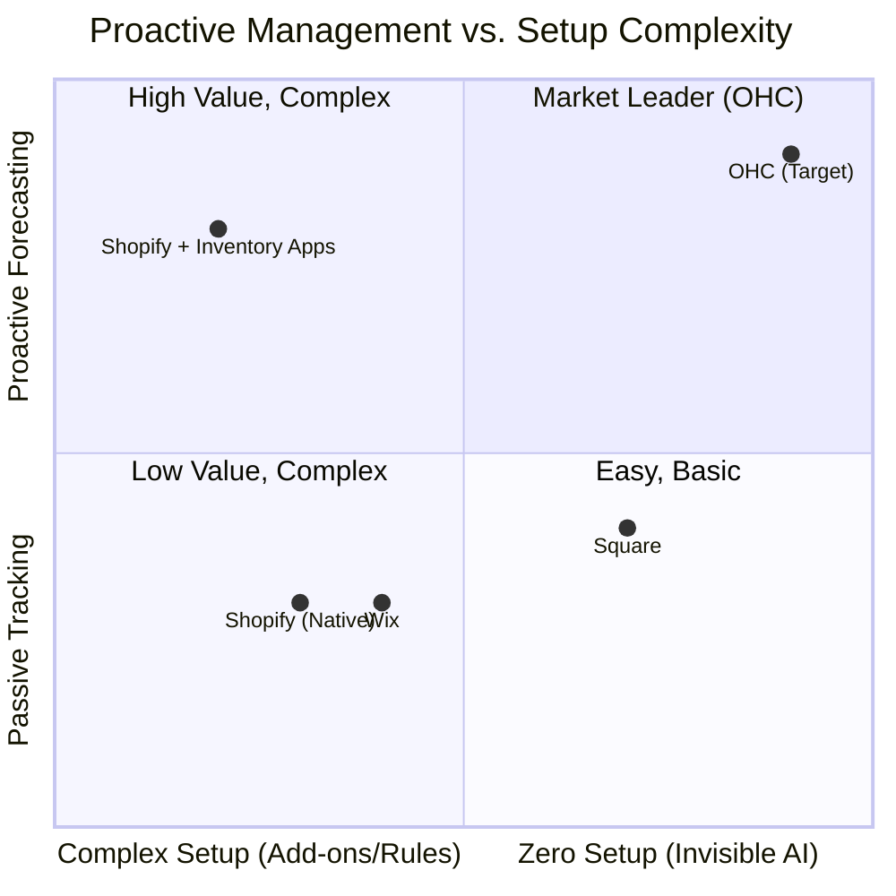
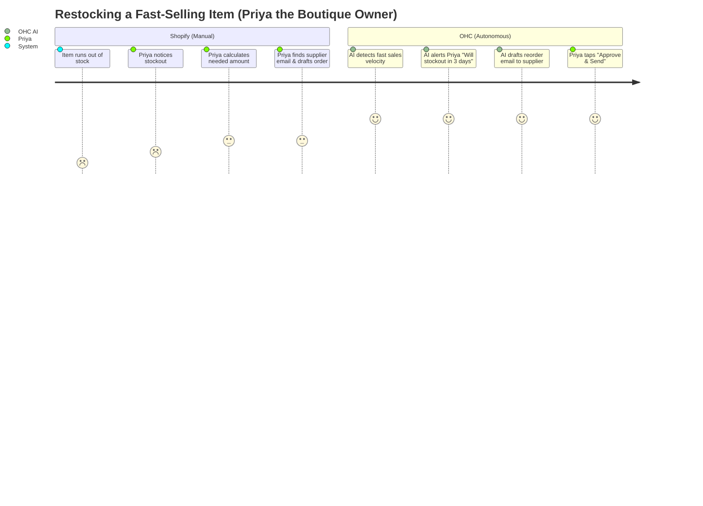

# AI Inventory & Restock Agent: The Proactive Operations Manager

## Problem Statement
For small business owners dealing with physical goods, managing inventory is a persistent source of stress and lost revenue. Priya (the boutique owner) struggles to keep her online storefront synced with in-store sales, leading to double-selling. Fatima (the food cart operator) needs a fast, mobile-friendly way to mark items "sold out" during the lunch rush. Maya (the baker) often realizes too late that she's out of a critical ingredient. Existing solutions like Shopify and Square track inventory numbers but require the owner to constantly monitor dashboards and manually update statuses. They are passive ledgers, not proactive managers.

## Research Report

### Top SMB Pain Points (Validated)
1. **Overselling / Stockouts:** "I sold a dress online that someone bought in-store an hour ago. Now I have to cancel the online order and apologize." - Common complaint on r/ecommerce and Shopify App Store reviews.
2. **Manual Tracking Overhead:** "I spend 2 hours every Sunday counting inventory instead of resting." - Frequent theme on r/smallbusiness.
3. **Missed Restock Windows:** Failing to reorder fast-moving items leads to days or weeks of lost sales while waiting for new shipments.
4. **Friction During Rush Hours:** Managing availability requires too many clicks on mobile. Food business owners need 1-tap "sold out" functionality.

### OHC AI Differentiation Manifesto
OHC must shift inventory management from a passive spreadsheet to a proactive "Invisible Agent" within the **Operations Department ("The Manager")**. The AI Inventory & Restock Agent will autonomously monitor stock levels across channels, predict when items will run out based on sales velocity, alert the owner *before* a stockout occurs, and even draft reorder emails to suppliers.

### Competitive Feature Gap Matrix

| Feature | Shopify | Wix | Square | OHC (Gap/Advantage) |
|---|---|---|---|---|
| Basic Stock Counting | Yes | Yes | Yes | Baseline required |
| Multi-Channel Sync | Yes (with POS) | Yes | Yes | Baseline required |
| Predictive Depletion Alerts | App required | No | No | **Advantage:** Built-in AI forecasting |
| Auto-Draft Supplier Orders | App required | No | No | **Advantage:** AI drafts restock emails |
| 1-Tap "Sold Out" Mobile UX | Buried in menus | Complex | Yes (Good) | **Gap:** Needs instant mobile action |

### Competitive Landscape

### User Journey Comparison

## Design Doc

### High-Level Architecture
The **Operations Department** agent will act as "The Manager" for inventory.
1. **Sales Ingestion:** Every order (online or in-person POS) emits an event that updates the central inventory ledger.
2. **Velocity Calculation:** A background worker analyzes the sales velocity of SKUs to calculate the "Days to Stockout" metric.
3. **Proactive Alerting:** The AI Agent monitors thresholds. When an item is projected to run out soon, it generates an alert for the owner.
4. **Supplier Action:** For items with associated supplier details, the AI generates a draft reorder email or PO.
5. **Mobile UX (375px):**
   - A highly visible "Quick Actions" dashboard for toggling item availability (e.g., Fatima marking "Chicken Over Rice" as sold out with one tap).
   - "Needs Attention" cards highlighting low-stock items.

### Mobile UX Flow (375px First)
1. **Operations Dashboard:** Top section shows "Urgent Restocks Needed" cards.
2. **Quick Toggle View:** A list of today's active menu/catalog items with giant, thumb-friendly toggles to instantly set an item to "Sold Out" (overriding count).
3. **Restock Approval Screen:** When tapping a low-stock alert, the user sees a pre-written email to their supplier requesting X units. One tap to "Send Request".

## Implementation Prompt

**User-Facing Outcome:**
Implement the "AI Inventory & Restock Agent" core flows in the mobile app. Business owners should see proactive alerts when items are running low based on recent sales velocity. Food/service owners must have a 1-tap mobile interface to mark items "Sold Out" instantly. The system should draft reorder requests for low-stock items.

**Critical User Journey (CUJ):**
1. The business owner opens the OHC mobile app (375px view).
2. On the Operations dashboard, an AI alert card says: "Red Summer Dress (M) is selling fast. Expected to stock out in 2 days."
3. The owner taps the alert.
4. The screen shows a drafted restock order/email to the saved supplier for the recommended quantity.
5. The owner taps "Approve". The system records the pending restock.
6. The owner navigates to the "Quick Toggles" tab and easily marks another item as "Sold Out" with a single tap, immediately updating the storefront.

**Acceptance Criteria:**
* The Operations Dashboard UI exists and is fully responsive (mobile-first, 375px).
* Low-stock alerts are displayed based on mock velocity data.
* A "Restock" approval flow exists, showing an AI-drafted supplier message.
* A "Quick Toggles" UI is implemented allowing instant availability overrides without navigating deep into product settings.
* Comprehensive E2E test coverage exists for the Quick Toggle flow and the Restock Approval flow.
* E2E tests must start from the home page, navigate through the UI, and assert final state matching the design doc without mocking network requests.

## Priority
P1

## Estimated Scope
Medium

