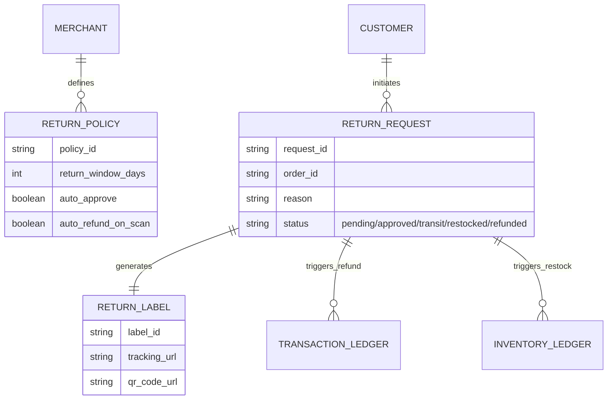
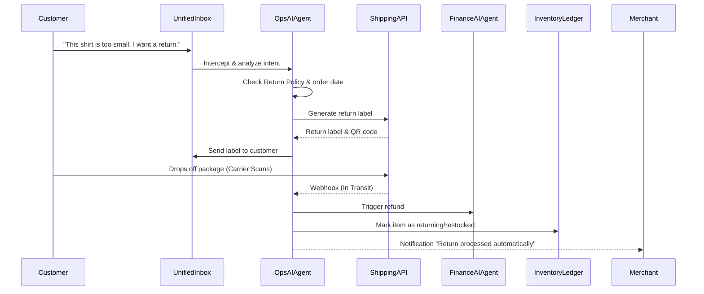

# Title: Autonomous Returns & Exchanges Operations Engine

## Problem Statement
For OneHumanCorp’s core personas selling physical products—like Priya (boutique owner) and Maya (baker)—managing returns and exchanges is a massive operational headache and a major friction point for their customers. When a customer wants to return a dress that doesn't fit or a damaged item, the business owner currently has to manually approve the request, manually log into a shipping carrier (like USPS or ShipStation) to generate a return label, email that label to the customer, wait for the package, inspect it, manually restock the inventory, and finally process the refund via Stripe. This process takes days and hours of manual work. Competitor platforms force the business owner to act as a full-time logistics manager. Small business owners need an autonomous system that instantly handles return requests, generates labels, updates inventory upon scan, and issues refunds without the owner lifting a finger—unless an exception requires approval.

## Research Report
**Market Gap Analysis:**
- **Shopify:** Offers basic native returns, but fully automated return portals, label generation, and automated instant exchanges usually require expensive third-party apps like Loop Returns or Returnly. The default experience still requires significant manual merchant intervention.
- **Wix & Squarespace:** Both require manual review, label creation, and manual refund processing. No built-in autonomous return agents exist.
- **GoDaddy:** Highly manual return process. Essentially just email-based customer service.
- **Current OHC State:** Missing a dedicated returns workflow. Inventory and payment refunds exist as separate primitives but are not orchestrated by an autonomous agent.

**Proposed Solution:**
Introduce an "Autonomous Returns & Exchanges Engine" managed by the OHC Operations AI Agent. When a customer initiates a return via the merchant's OHC storefront or through SMS/WhatsApp (e.g., replying "I need to return this"), the Operations Agent instantly validates the return against the merchant's policy, autonomously generates a printable/QR return shipping label, provides tracking, and coordinates with the Finance Agent to issue the refund once the package is scanned by the carrier. For Maya or Priya, the entire process is invisible, only appearing as a notification: "Return completed & restocked."

## Design Doc

### Architecture Diagram

### Core System Flows

### Mobile UX Flow (375px First)
1. **Merchant Dashboard - Returns Card:**
   - A translucent glass card in the activity feed: "1 Return Auto-Processed Today"
   - Tapping it opens a clean list of recent returns showing item, customer, and status (e.g., "In Transit", "Refunded").
2. **Exception Handling (Manual Approval needed):**
   - If a return falls outside the policy (e.g., 32 days instead of 30), a 1-Tap Approval card appears:
   - "Alex wants to return a shirt (2 days late). Approve or Deny?" with two large, clear buttons.
3. **Customer View (Storefront/Inbox):**
   - Customer accesses "My Orders" and taps "Return Item".
   - Conversational UI asks "Why are you returning this?".
   - Customer taps "Too small", and instantly receives a QR code to show at the post office.

### AI Agent Integration Points
- **Operations AI Department:**
  - Parses incoming return requests from the omnichannel inbox or storefront.
  - Generates the shipping label via integration (e.g., EasyPost/ShipStation).
  - Listens to carrier webhooks to track package status.
  - Updates the `INVENTORY_LEDGER` to reflect returning stock.
- **Finance AI Department:**
  - Instructed by the Ops Agent to process the refund in the `TRANSACTION_LEDGER` when the carrier scans the label, reducing merchant risk.

### Key Design Decisions
- **Instant vs. Scanned Refunds:** We default to "Auto-Refund on Scan" rather than instant (pre-shipment) or manual (post-inspection) to balance customer satisfaction with merchant fraud protection.
- **QR Code First:** No printer required for the customer. The system must support generating carrier QR codes.
- **Zero Trust Multi-Tenancy:** Ensure `RETURN_REQUEST` and `RETURN_LABEL` are strictly tenant-isolated to prevent a customer from refunding a different merchant's order.

## Implementation Prompt
**For the Engineering Swarm:**
Implement the backend orchestration and mobile UI for the "Autonomous Returns & Exchanges Engine".
- **CUJ (Customer User Journey):** Priya’s customer, Alex, buys a sweater but it doesn't fit. Alex opens the OHC store link, taps "Return", and selects "Too small". The OHC Operations Agent instantly checks Priya's 30-day policy, approves it, and displays a USPS QR code. The next day, Alex drops it at the post office. The carrier scan triggers a webhook, prompting the Finance Agent to refund Alex's card. Priya simply sees a mobile notification: "Return for Sweater completed. $45 refunded, inventory updated."
- **Acceptance Criteria:**
  - Create the `RETURN_POLICY` and `RETURN_REQUEST` tenant-isolated data models.
  - Build the Operations Agent workflow that intercepts a return request, validates against policy, and integrates with the existing shipping provider module to generate a return label/QR.
  - Implement a webhook listener that triggers the Finance Agent refund flow upon a "carrier scanned" event.
  - Build the 1-Tap Approval mobile UI for exception handling using macOS-style Translucent Glass materials. Keep technical shipping terms hidden.

## Priority
P1

## Estimated Scope
Large
