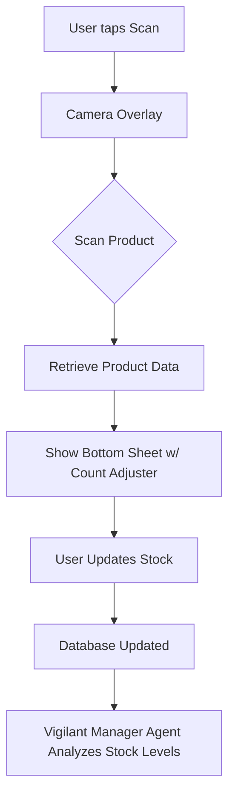

# Issue Brief: Mobile-First Inventory Scanner

## Title
[Operations] Mobile-First Inventory Scanner

## Problem Statement
Many founders (like Fatima the food cart owner) experience "Mobile Gaps" (42% frequency). Managing inventory often requires logging into a clunky desktop dashboard, making on-the-go updates impossible. Keeping stock counts accurate is tedious and prone to human error, leading to overselling or unnecessary stockouts.

## Research Report
- **Pain Point Validation**: Operations fatigue and poor mobile experiences force users to rely on physical notebooks or spreadsheets.
- **Competitor Gaps**: Shopify's mobile app is slow for quick inventory updates. Wix's mobile editor is limited.
- **AI Differentiation**: The "Vigilant Manager" agent watches the inventory data. The scanner itself provides an ultra-fast input mechanism using the mobile device's camera, removing manual data entry entirely.

## Design Doc
### High-Level Architecture
- **Input**: User's mobile device camera.
- **Processing**: On-device barcode/QR scanning or image recognition to identify products.
- **Action**: Immediate update of inventory count in the backend database.
- **AI Hook**: The Vigilant Manager agent detects the update and evaluates restock thresholds automatically.

### Mobile UX Flow (375px First)
1. **Quick Action**: Tap a large "Scan Inventory" floating action button (FAB) on the mobile dashboard.
2. **Camera View**: Clean camera interface with a targeting overlay.
3. **Detection**: Instantly recognizes the product. Shows a bottom sheet with the product name, current stock, and large +/- buttons.
4. **Confirmation**: User adjusts the count and taps "Save" (or it auto-saves after 2 seconds of inactivity).

## Implementation Prompt
Implement a fast, native-feeling mobile inventory scanner. The feature should utilize the device's camera to scan product barcodes or items, instantly displaying the product details in a mobile-optimized (375px) bottom sheet. Allow the user to rapidly adjust the inventory count with large touch targets. Ensure the updated count seamlessly integrates with the backend and triggers the "Vigilant Manager" agent to evaluate potential low-stock risks. Do not prescribe specific database schemas, API contracts, or function signatures.

## Priority
P2

## Estimated Scope
Small
