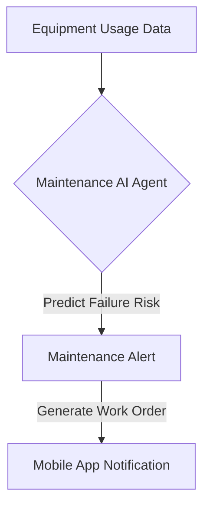

**Title**: Predictive Equipment Maintenance
**Problem Statement**: Unexpected equipment failure (e.g., a commercial oven breaking down) halts operations and causes massive revenue loss.
**Research Report**: Preventative maintenance schedules are often ignored or forgotten.
**Design Doc**:
*   Architecture: Equipment IoT Sensors (or Manual Logs) -> Maintenance AI Agent -> Work Order Generation.

**Implementation Prompt**: Create a system that tracks equipment usage (either via IoT integration or manual daily logging) and predicts when maintenance is required based on manufacturer specifications and historical failure data, automatically generating work order reminders.
**Priority**: P3
**Estimated Scope**: Large
