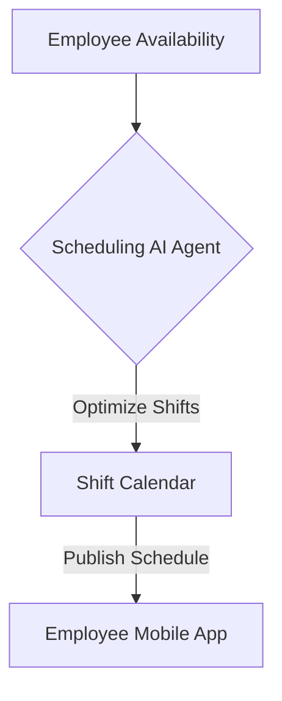

**Title**: Shift Scheduling Optimization
**Problem Statement**: Scheduling employee shifts efficiently while respecting availability and labor laws is complex.
**Research Report**: Manual scheduling often results in over-staffing or under-staffing, impacting profitability and employee satisfaction.
**Design Doc**:
*   Architecture: Employee Data -> Scheduling AI Agent -> Shift Calendar.

**Implementation Prompt**: Develop an AI scheduling agent that automatically generates optimized weekly employee shift schedules based on historical foot traffic data, employee availability, and predefined labor budgets.
**Priority**: P3
**Estimated Scope**: Large
