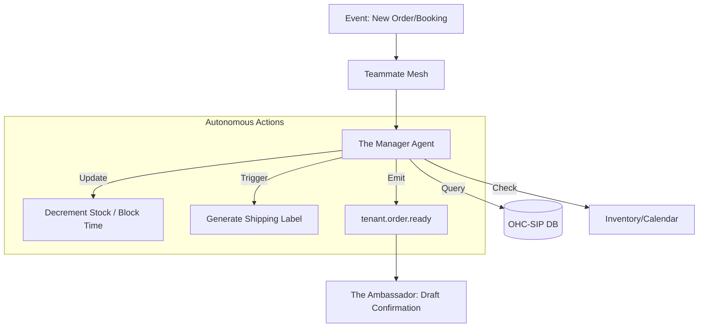

# [Operations] Architecture Brief: "The Manager"

## Title
OHC "The Manager": Autonomous Order & Booking Lifecycle Orchestration

## Problem Statement
Small business owners like Maya (Baker) and Carlos (Handyman) spend hours manually tracking orders, updating inventory, and managing calendars. If Maya forgets to mark a cake as sold out, she has to disappoint a customer. If Carlos double-books a plumbing job, he loses reputation. They need an invisible "Manager" that handles the logistics of fulfillment and scheduling autonomously.

## Research Report
- **Competitive Gap**: Shopify and Wix have "Apps" for inventory and booking, but they require manual configuration of "zones" and "rules." OHC's "The Manager" uses plain language to understand business constraints.
- **Market Benchmark**: Calendly and OpenTable provide vertical-specific automation. OHC unifies these into a single "Operations" department that works for both products and services.
- **Key Metric**: Time from "Order Placed" to "Fulfillment Ready" should require zero user clicks unless a physical action (like baking) is needed.

## Design Doc

### High-Level Architecture (Mermaid.js)

### UI Flow (375px First)
- **Activity Feed**: Shows "The Manager marked 'Large Vegan Cake' as sold out" or "New booking confirmed for Tuesday."
- **1-Tap Fulfillment**: For physical goods, a single button "Mark as Ready" triggers label printing and customer notification via "The Ambassador."

### AI Agent Integration
- **Triggers**: `tenant.order.placed`, `tenant.booking.requested`, `tenant.inventory.low`.
- **Memory**: Recalls peak business hours and seasonal demand to suggest inventory restocking.

## Implementation Prompt
**To Implementer Agent:**
Implement the "The Manager" (Operations) department logic. This agent must autonomously respond to `Order` and `Booking` events. For orders, it should decrement inventory and, if stock hits zero, update the storefront block to show "Sold Out." For bookings, it must verify calendar availability and block the requested time slot. Integrate with the "Teammate Mesh" to emit `fulfillment_ready` events. Ensure all operations are scoped to the `tenant_id` and use `FOR UPDATE SKIP LOCKED` for atomic inventory changes.

## Priority
P0

## Estimated Scope
Large
