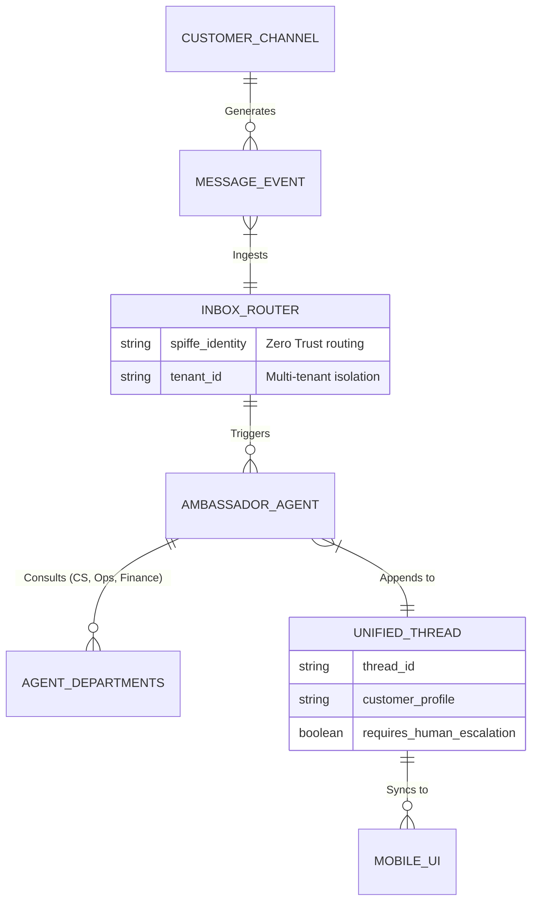

# Issue Brief: Unified Omnichannel Inbox

## Title
[Operations] Unified Omnichannel Inbox

## Problem Statement
Small business owners like Maya (the baker taking custom orders via Instagram) and Carlos (the handyman fielding SMS quote requests) suffer from severe operational fatigue. They spend hours every day toggling between Instagram DMs, WhatsApp, SMS, and email just to answer the exact same questions: "How much for a vegan cake?" or "Are you available next Tuesday?" When they sleep or are on a job, they miss messages, which means lost revenue. The current experience is disjointed, unmanageable on a single mobile screen, and relies entirely on their manual intervention. They need a single, magical inbox that not only aggregates all messages but handles the routine replies automatically, invisibly, and safely while they focus on their craft.

## Research Report
*   **Shopify Inbox:** Highly manual. It aggregates Shopify chat and Instagram/Facebook DMs but requires the merchant to type out replies or click pre-saved "quick replies." The "Sidekick" AI features are geared toward merchant analytics, not proactive customer conversation resolution.
*   **Wix Inbox:** Offers basic auto-responders (e.g., "We received your message") but lacks any semantic understanding or capability to negotiate quotes, check inventory, or book calendar slots.
*   **Squarespace / GoDaddy:** Focused on generic web contact forms. No real-time omnichannel integration or intelligent autonomy.
*   **OneHumanCorp (OHC) Differentiation - "Invisible Autonomy":** Instead of a static "chatbot," OHC deploys the **Ambassador Agent**—an invisible, always-on AI representative that hooks into the merchant's unified inbox. It understands the business context (menu, calendar, pricing), engages customers naturally across any channel, and escalates to the human only when necessary (e.g., a highly custom complex order).

## Design Doc

### Architecture Diagram

### UI Wireframes & 375px Baseline
**Core Layout: macOS-style Translucent Glass + Ubiquiti UniFi Modular Dashboard Cards**
*   **Global Viewport:** 375px width (Mobile First). No horizontal scrolling.
*   **App Bar:** Blurred glass top nav with the business logo and a quick toggle: `[AI: Active / Paused]`.
*   **Feed View (The Queue):**
    *   A vertically scrolling list of cards representing active conversations.
    *   Each card has a frosted glass background (`rgba(255, 255, 255, 0.05)` with `backdrop-filter: blur(10px)`).
    *   **Badging:** A small icon indicates the source (Instagram, SMS, Email).
    *   **Status Indicators:** A green spark icon indicates the AI is handling it. A red pulse indicates "Human Required" (escalation).
*   **Thread View:**
    *   Standard chat bubble layout but the background is a translucent gradient.
    *   AI-generated drafts are shown in a subtle yellow-tinted glass bubble with an "Approve" or "Edit" button.
    *   Sent messages (both human and AI) are shown clearly but distinguished by a small signature (e.g., "✨ Ambassador").

### Mobile UX Flow
1. **Notification:** Maya receives a push notification on her iPhone: "✨ AI booked a $150 cake order from Instagram. No action needed." Or "⚠️ Instagram DM: Custom 5-tier wedding cake. Human input required."
2. **Launch:** She taps the notification and opens the OHC app into the Unified Inbox.
3. **Review:** The thread opens. She sees the customer's request and the AI's suggested response in a frosted card.
4. **Action:** She taps "Approve" (1 second) or edits the text directly before sending.
5. **Advanced Settings (Hidden):** If she swipes left on the app bar, she enters "Advanced Settings" where channel integrations and AI tone preferences are configured.

### AI Agent Integration Points
*   **Customer Service (CS) Department:** Analyzes incoming message sentiment and intent. Decides whether to auto-reply using the knowledge base or escalate.
*   **Operations Department:** Consulted by the CS agent to verify inventory (e.g., "Do we have vegan batter today?") or calendar availability (e.g., "Is Carlos free at 2 PM on Thursday?").
*   **Finance Department:** Generates quote links or deposit payment requests to embed directly into the DM reply.

### Key Design Decisions (Why, not How)
*   **Unified Thread Model:** Small business owners don't care *where* the message came from. They care about *who* is asking and *what* they need. The architecture must normalize all channels into a single "Customer Profile" and "Thread."
*   **Invisible by Default:** The AI should not require manual invocation per message. It acts as a middleware interceptor, drafting responses in the background.
*   **Zero-Trust Isolation:** Because multi-channel API tokens (Meta, Twilio) are highly sensitive, the `INBOX_ROUTER` must strictly enforce multi-tenant isolation using SPIFFE identities. Cross-tenant leakage of DMs is a catastrophic failure mode.

## Implementation Prompt
**To the Implementer Swarm:**
Your goal is to build the underlying architecture and UI for the "Unified Omnichannel Inbox" so a user like Maya can manage Instagram, SMS, and Email conversations from one mobile-optimized view.

**Customer User Journey (CUJ):**
1. Maya connects her Instagram account and SMS number during the setup flow.
2. A customer sends a DM asking for a product price.
3. The Ambassador Agent intercepts the DM, reads Maya's product catalog, and drafts an accurate reply.
4. If Maya has set the agent to "Auto-Reply," it sends it immediately. Otherwise, it surfaces a push notification to Maya with a 1-click "Approve" button.

**Acceptance Criteria:**
*   **Mobile Parity:** The UI must be implemented perfectly for a 375px viewport using the described Translucent Glass aesthetics.
*   **Aggregation:** Incoming messages from at least two distinct mocked sources (e.g., SMS, Web Chat) must normalize into a single thread view.
*   **Agent Integration:** The system must hook into the background AI Orchestration engine to trigger a response draft when a new message event arrives.
*   **Isolation Guarantee:** Implement strict multi-tenant boundary checks so a tenant can only ever read threads associated with their `organization_id`.
*   **Simplicity:** Do not expose developer concepts (webhooks, API keys, sync polling) in the core UI. Hide configuration behind an "Advanced" toggle.

## Priority
P1

## Estimated Scope
Large
