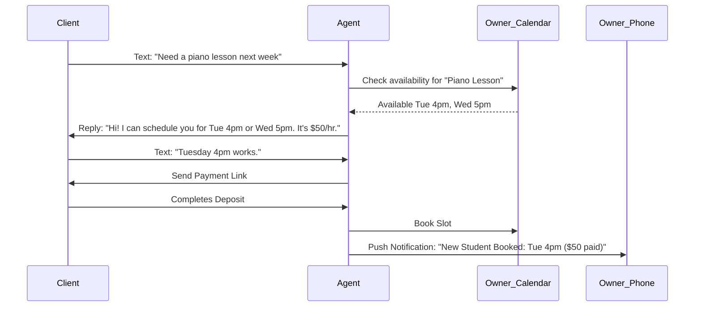

# [operations] Zero-Click Booking Manager

## Problem Statement
Service providers like Carlos (the handyman) and Leo (the music tutor) lose money because they are too busy working to answer the phone or reply to texts immediately. A potential client texts, "Can you fix my sink on Thursday?" and Carlos doesn't see it until Friday. The lead is gone. Existing solutions require the client to go to a website, find a calendar widget, and fill out a long form. Clients don't want to do that; they want to text. Service owners don't want to manage a complex calendar app; they just want to know where to be and who has paid.

## Research Report
**Market Insight:** 60% of service-based SMBs rank "Scheduling and Booking Chaos" as a top pain point. Time-to-response is the #1 predictor of closing a service lead.
**Competitor Gap:** Square Appointments and Calendly are decent, but they force the user into a specific workflow (the web link). They are not conversational. They don't handle the "quoting" phase well via text.
**User Verbatim:** "I lose at least 2 jobs a week because I'm under a sink and can't reply to a text fast enough. By the time I do, they found someone else." - Carlos, 42.

## Design Doc

### High-Level Architecture (Conceptual)
The Zero-Click Booking Agent acts as a smart receptionist that intercepts incoming communications (SMS, WhatsApp, Email).
- **Trigger Events:** Incoming message from a new or existing client requesting a service or quote.
- **Core Engine:** An LLM reads the message intent. It cross-references the owner's OHC Calendar (synced with Google Calendar/Cal.com behind the scenes) and the Pricing Rules set by the owner.
- **Conversation Flow:** The Agent replies instantly. "Hi! Carlos is currently on a job. He has availability Thursday at 2 PM or Friday at 10 AM to fix the sink. The call-out fee is $75. Should I lock in Thursday?"
- **Booking & Deposit:** Once the client agrees, the Agent sends a secure, mobile-friendly payment link for the deposit. Once paid, it officially blocks the calendar and notifies the owner.

### Mermaid.js Flowchart

### Mobile UX (375px First)
1. **The Setup:** Owner simply sets their working hours and service list with base prices. No complex booking rules.
2. **The Daily View:** The owner opens the app to an agenda view. "You have 3 jobs today."
3. **The Intercept View:** A notification pops up: "Agent booked a new sink repair for Thursday. Deposit collected." The owner taps to see the short transcript of the text conversation the Agent had with the client, just for peace of mind.

## Implementation Prompt
**User-Facing Outcome:** The user gets a dedicated phone number (or connects WhatsApp) that acts as their AI receptionist. It books jobs and collects money while they are sleeping or working.

**Critical User Journey:**
1. User configures basic availability and pricing in the OHC app.
2. A customer texts the business number requesting a service.
3. The AI agent negotiates a time slot based on availability.
4. The AI agent collects a deposit.
5. The owner receives a simple confirmation notification that they have a new paid booking.

**Acceptance Criteria:**
- The agent must be able to understand natural language dates ("next Thursday afternoon").
- The system must prevent double-booking.
- The tone of the agent must be friendly and professional, configurable by the owner (e.g., "Casual" vs "Formal").
- The feature must strictly adhere to the "Plain Language Only" rule. No mentions of "Webhooks", "iCal sync", or "OAuth".

## Priority
P0

## Estimated Scope
Large
