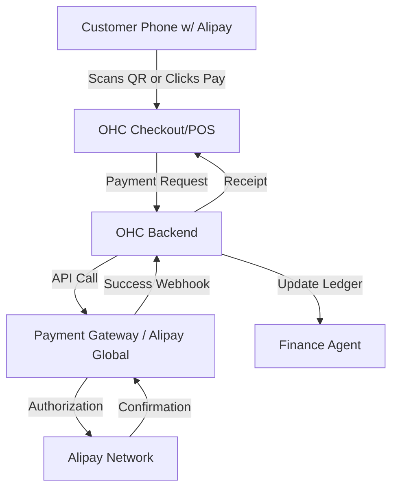

# Scout: Tool Integration Research Q4

## 1. Payment Processing
**Title**: Integrate Alipay for Chinese Market Reach and Local Payment Methods
**Problem Statement**:
Small business owners using OHC are missing out on sales from Chinese customers and tourists who do not possess international credit cards. These customers rely heavily on QR code-based digital wallets like Alipay. Without Alipay integration, OHC users in regions with high Chinese tourism or expats, or those trying to sell internationally to China, face high cart abandonment rates.

**Research Report**:
- **Tool**: Alipay (established by Alibaba Group, now under Ant Group).
- **Target Persona**: Businesses targeting Chinese expats, tourists, and international customers.
- **Advantages**: It is the world's largest mobile payment platform with over 1.3 billion users. A Nielsen report states over 90% of Chinese tourists prefer to use mobile payment overseas if available. Digital payments are the norm in China, often entirely replacing cash. Alipay features "Tourpass" to allow non-Chinese users to pre-load funds, making it versatile. It heavily relies on QR code scanning for physical payments and simple online checkouts.
- **Risks**: Regulatory environment in China can be strict. International settlement depends heavily on the integration method and region (e.g., Stripe's Alipay support vs direct Alipay Global integration).
- **Pricing**: Varies heavily by aggregator (e.g., Stripe charges 2.9% + 30¢ for Alipay), but direct integration typically charges around 1.5% - 2.5% per transaction without monthly fees.
- **Compatibility**: Highly compatible with Cloud multi-tenant mode via aggregated payment gateways (like Stripe or Adyen). For Standalone mode, direct API keys from the merchant's own Alipay/aggregator account would be required.

**Design Doc**:
- **Trigger**: User configures their OHC store or physical point-of-sale settings. In "Payments", they select "Enable Alipay".
- **User Experience (Merchant)**: The merchant connects their existing payment provider (if supported) or enters Alipay credentials.
- **User Experience (Customer - Online)**: At checkout, the customer selects Alipay, is redirected to the Alipay app or website to authenticate the payment, and returns to the OHC confirmation page.
- **User Experience (Customer - In-store)**: The OHC POS system displays an Alipay QR code. The customer scans it with their Alipay app to complete the transaction.
- **AI Integration**: The "Finance & Operations" agent monitors Alipay settlements, alerting the business owner to cross-border transaction volumes and suggesting marketing campaigns targeting Chinese holidays (like Golden Week) based on transaction trends.

**Implementation Prompt**:
Add Alipay as an available payment method in the OHC platform. For online checkouts, render the Alipay payment flow. For physical/POS transactions, implement dynamic QR code generation that the customer can scan with their Alipay app. Ensure successful transactions trigger standard OHC order fulfillment and ledger update events. Do not prescribe specific database changes or endpoint names.

**Priority**: P1
**Estimated Scope**: Medium
