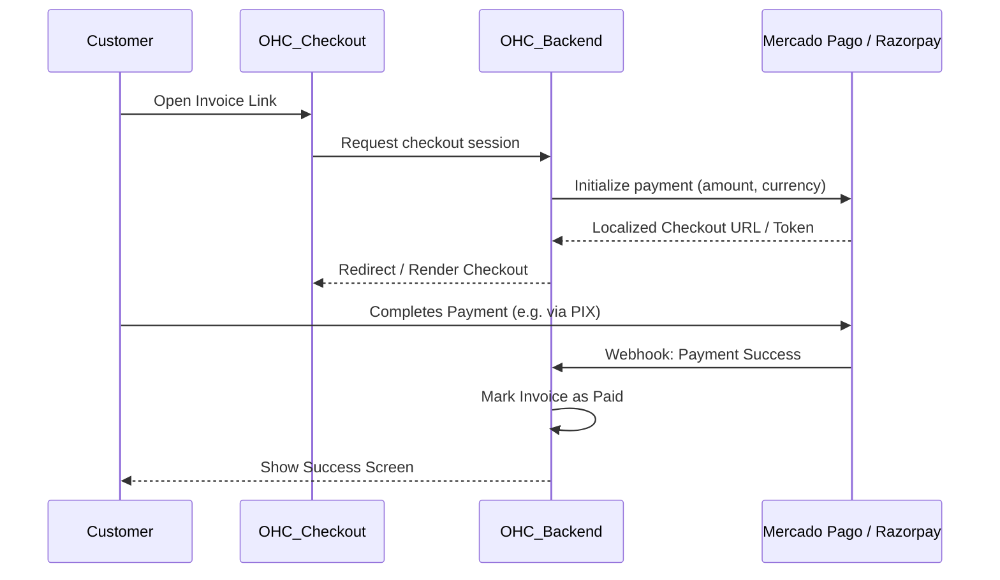

# [Payments] Global Payment Gateways

## Title
Alternative Payment Providers Integration (Mercado Pago, Razorpay, Alipay)

## Problem Statement
As a small business owner outside the US/EU, Stripe is either unavailable, too expensive, or doesn't support the local payment methods my customers actually use (like PIX in Brazil, UPI in India, or WeChat Pay in China). If I can't offer local payment methods, my customers abandon their purchases. I need a way to easily accept payments using the tools that are popular in my specific country, seamlessly tied into my OHC invoicing or store.

## Research Report
**Tools Evaluated:** Mercado Pago (LATAM), Razorpay (India), Alipay/WeChat Pay integrations.

- **Mercado Pago:** Dominant in LATAM.
  - *Ease of Use:* Moderate. Requires business verification locally, but the API integration for checkout is smooth.
  - *Pricing:* Varies by country, generally competitive locally. High settlement speed.
  - *Cloud vs Standalone:* Works in both. In Cloud, payments are processed via webhook callbacks. In Standalone, users will need to ensure their OHC instance is reachable via a public URL for callbacks, or we provide a polling fallback.
- **Razorpay:** Dominant in India.
  - *Ease of Use:* Excellent developer API, supports UPI out of the box which is critical for Indian SMBs.
  - *Pricing:* Low percentage + flat fee per transaction.
  - *Cloud vs Standalone:* Similar to Mercado Pago, works well in Cloud. Standalone requires publicly reachable endpoints or polling for final payment confirmation.
- **Global Alternatives:** Tools like dLocal or Adyen aggregate these, but are built for enterprise. For SMBs, direct integration with the regional leader is best.
- **Recommendation:** Implement a plugin-like payment architecture in OHC. Start by adding Mercado Pago (for LATAM) and Razorpay (for India) alongside the existing Stripe integration, allowing the user to toggle which gateway processes their invoices/checkouts.

## Design Doc
A "Payments" settings page where users select their region and connect the appropriate gateway.
- **Trigger:** Business owner generates an invoice or a checkout link in OHC.
- **Action:** OHC dynamically routes the payment request to the active payment gateway based on the owner's configuration.
- **User View:** The owner sees a unified "Payments Received" dashboard. The customer sees a familiar, localized checkout screen (e.g., a QR code for PIX or UPI) instead of a generic credit card form.

## Implementation Prompt
Design an abstract payment provider interface in the backend so we aren't hardcoded to Stripe. Implement integrations for Mercado Pago and Razorpay to support our LATAM and Indian users. The user interface should allow the business owner to select their preferred payment provider and enter their API keys/credentials. Ensure the checkout experience presented to the end-customer automatically surfaces the local payment methods supported by that provider.

## Priority
P1

## Estimated Scope
Large
