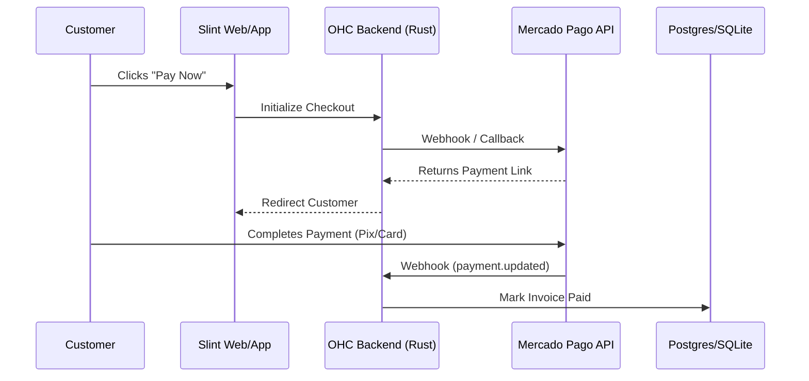

# Mercado Pago Integration

## Problem Statement
Stripe isn't universally accessible or preferred in LATAM. Business owners need a trusted local payment processor that supports local payment methods for sales.

## Research Report
Mercado Pago is the leading payment processor in Latin America, supporting a wide variety of local payment methods (e.g., Pix in Brazil, Oxxo in Mexico).
* **Problem Addressed**: Expands payment acceptance capabilities to the LATAM market where credit card penetration is lower.
* **User Benefit**: "A seamless checkout experience tailored for your LATAM customers, supporting local currencies and payment methods like Pix or cash deposits."
* **Ease of Use (for non-technical users)**: Connecting the account is straightforward. The complexity lies in the backend webhook handling.
* **Risks & Trade-offs**: Geographic limitation (LATAM focus only); API changes and regional compliance variations.
* **Pricing Estimate**: Percentage fee per transaction (varies by country, typically 3-5%).
* **Compatibility**: Cloud & Standalone. Standalone requires a public webhook endpoint to receive payment status updates.

## Design Doc
The integration uses the Mercado Pago Checkout API to generate payment links and webhooks to verify payment completion.

## Implementation Prompt
**Outcome**: Implement the Mercado Pago integration to allow OHC users in LATAM to accept local payments for invoices and products.
**Acceptance Criteria**:
1. Users must be able to securely connect their Mercado Pago credentials.
2. The OHC invoicing/checkout flow must support generating a Mercado Pago payment link.
3. The backend must reliably receive Mercado Pago webhooks to automatically mark invoices as paid.
4. Support for displaying local currencies appropriately in the UI.

## Priority
P1 (High)

## Estimated Scope
Medium
