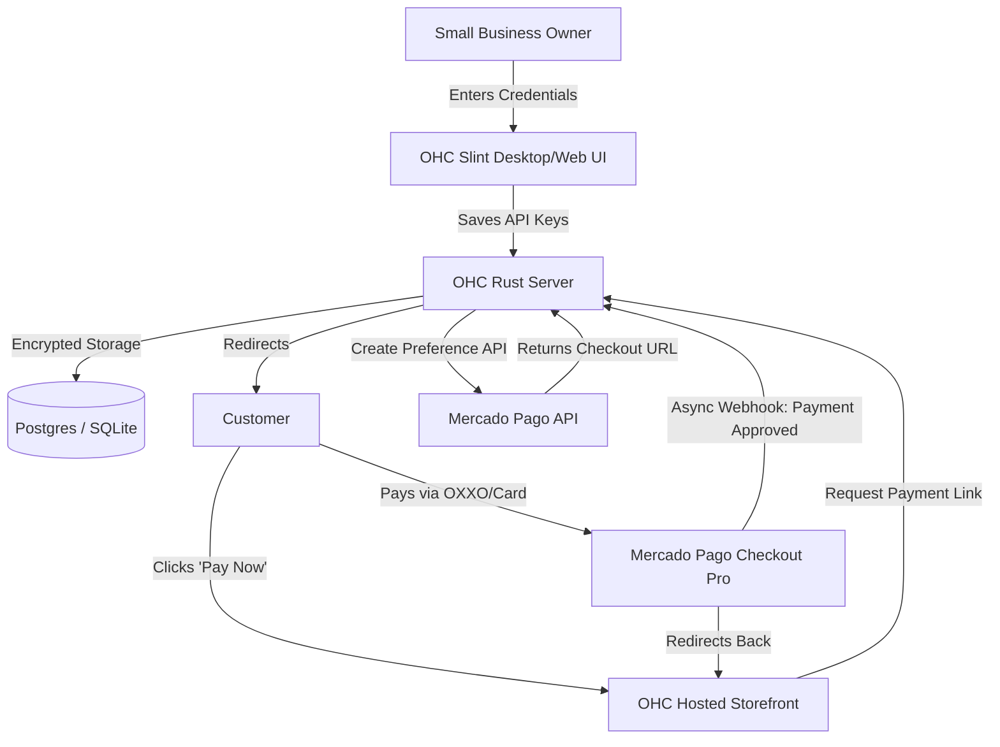

**Title**: Payment Processing Integration: Mercado Pago

## Problem Statement
Small business owners in LATAM (Latin America) struggle to collect payments online. Traditional providers like Stripe might not support local currencies effectively, or their customers might prefer localized payment methods (like SPEI in Mexico, OXXO cash payments, or local bank transfers) that Stripe does not natively excel at in the region. Without a trusted, localized payment gateway, these small businesses lose sales due to friction at checkout and lack of payment options. They need a localized checkout experience that is instantly familiar and trustworthy to their customers.

## Research Report
**Tool Evaluated:** Mercado Pago
**Category:** Payment Processing
**Overview:** Mercado Pago is the leading payment processor in Latin America, owned by MercadoLibre. It supports payments in Argentina, Brazil, Chile, Colombia, Mexico, Peru, and Uruguay.

**Key Features for Small Businesses:**
*   **Checkout Pro:** A ready-to-use, pre-built payment page hosted by Mercado Pago. Customers are redirected, pay securely, and are redirected back.
*   **Localized Payment Methods:** Supports credit/debit cards, bank transfers (e.g., SPEI), cash payments at convenience stores (e.g., OXXO, Paycash), and Mercado Pago account balances.
*   **Installments:** Crucial for LATAM markets, it offers "Installments without Card" and standard credit card installments.
*   **Fraud Protection:** Built-in anti-fraud system, OWASP, and PCI DSS compliance.

**Environment Compatibility:**
*   **Cloud Mode:** Works seamlessly via their API. OHC would generate a "Payment Preference" and give the user a URL to redirect to. Webhooks handle success/failure notifications asynchronously.
*   **Standalone Mode:** Works perfectly. The transaction happens on Mercado Pago's servers. The standalone OHC app can use an API key to generate the checkout link and poll or receive webhooks (if a tunnel like ngrok or a polling fallback is implemented) for payment status.

**Pros:**
*   Absolute dominance and brand trust in the LATAM market.
*   Supports cash-based payments (OXXO) which is vital for unbanked populations.
*   "Checkout Pro" requires minimal integration effort compared to custom API builds.

**Cons:**
*   Checkout Pro redirects the user away from the OHC-hosted site temporarily, which might disrupt the UX slightly compared to a fully native, white-labeled form.

## Design Doc

The integration utilizes Mercado Pago's "Checkout Pro" to offload PCI compliance and simplify the integration for non-technical OHC users.

### High-Level UX Flow:
1.  **Integration Hub:** The business owner goes to Integrations -> Payments -> "Connect Mercado Pago" and pastes their `Access Token` and `Public Key`.
2.  **Payment Collection:** When a customer buys a product or books a service, OHC generates a Mercado Pago checkout link and redirects the customer.
3.  **Customer Experience:** The customer sees a localized payment page in Spanish/Portuguese, pays with their preferred local method, and returns to a "Thank You" page.
4.  **Order Fulfillment:** OHC receives a webhook confirming the payment, marks the order/invoice as "Paid" in the dashboard, and notifies the business owner.

## Implementation Prompt
**Objective:** Integrate Mercado Pago "Checkout Pro" to allow LATAM-based small businesses to collect localized payments securely.
**Acceptance Criteria:**
- Create a configuration UI in Slint to securely accept and store Mercado Pago API credentials.
- Implement a backend service to create a "Payment Preference" via the Mercado Pago API, generating a Checkout Pro URL.
- Implement a webhook endpoint in the Rust backend to listen for Mercado Pago IPN (Instant Payment Notifications) or standard Webhooks to update transaction statuses.
- Ensure the user interface passes the "Grandmother Test" (e.g., using terms like "Accept Payments in LATAM" instead of "Configure MP API Preferences").

## Priority
P1

## Estimated Scope
Medium
