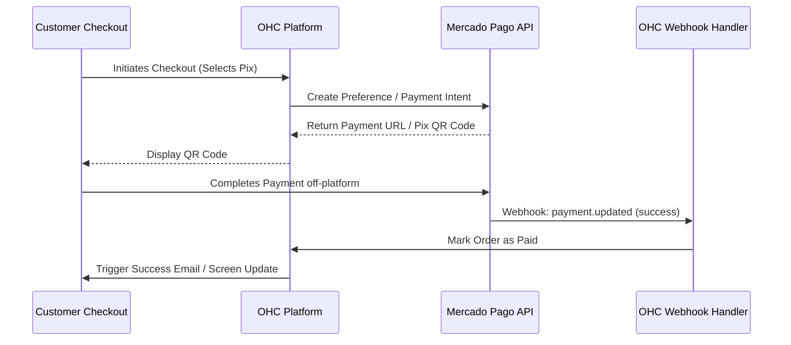
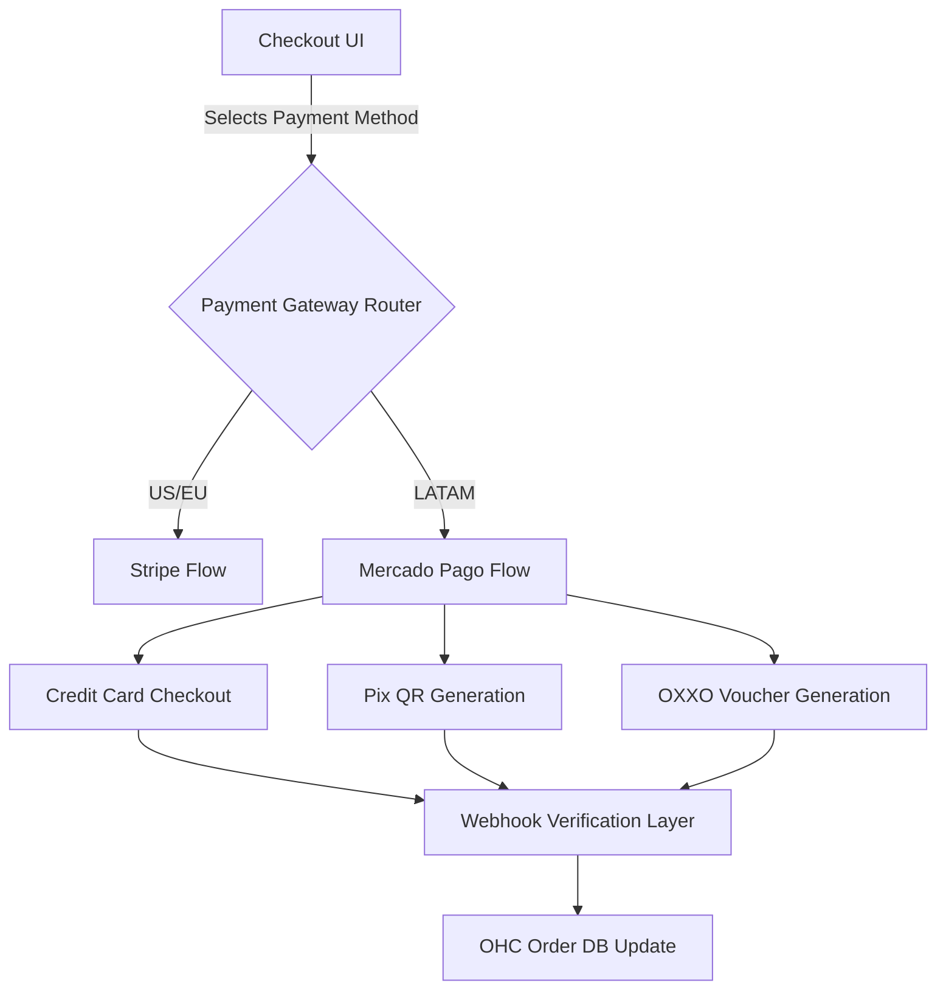

# Scout: Tool Integration Research Q2

## [Payment] Mercado Pago Integration
**Title**: Integrate Mercado Pago for LATAM Payments
**Problem Statement**: Small business owners in Latin America cannot easily use Stripe and need a trusted local payment processor to accept credit cards and local methods like Pix or Pago Fácil.

**Research Report**:
- **Tool**: Mercado Pago
- **Target Persona**: Global users outside the US/EU.
- **Advantages**: Dominant in LATAM. Supports local payment methods (Pix in Brazil, OXXO in Mexico). Good developer docs.
- **Risks**: Settlement times can be longer. API is slightly less standardized than Stripe.
- **Pricing**: Variable by country (e.g., ~4-5% per transaction).
- **Compatibility**: Cloud (OAuth). Standalone (API Key).

### Qualitative Analysis
For OHC to truly serve global SMBs, Stripe alone is insufficient. Mercado Pago provides the crucial link to LATAM markets, where alternative payment methods (APMs) like Pix (Brazil) and OXXO (Mexico) are often more popular than credit cards. Implementing Mercado Pago ensures that a tenant in Brazil can offer checkout experiences that their local customers trust. The integration must carefully handle asynchronous payment completions, as APMs often require the user to complete the payment off-platform (e.g., scanning a barcode at a local store).

### Persona-Specific Pain Point Summary
- **Juliana (Brazilian Food Cart)**: Cannot use Stripe because she needs to accept Pix, the default payment method in her country. Needs Mercado Pago to receive instant transfers.
- **Mateo (Mexican Boutique)**: Customers want to pay via OXXO vouchers. Needs an integration that tracks the pending status until the cash is deposited locally.

### Competitive Matrix
| Feature / Tool | Mercado Pago | Stripe | PayPal |
| :--- | :--- | :--- | :--- |
| **LATAM APMs (Pix, OXXO)** | Native, Comprehensive | Limited/Expensive | Poor |
| **Settlement Speed** | Medium | Fast | Medium |
| **Developer Experience** | Good | World Class | Okay |
| **Market Penetration (LATAM)** | Dominant | Growing | High |

**Design Doc**:
- User selects their country during onboarding. If LATAM, Mercado Pago is offered alongside Stripe.
- User connects their Mercado Pago account.
- Customers see a "Pay with Mercado Pago" button at checkout.
- Webhooks update the order status in OHC when payment succeeds.

**Implementation Prompt**: Add Mercado Pago as a secondary payment provider. Implement the checkout flow to redirect to Mercado Pago and handle the success/failure webhooks to update order status.
**Priority**: P2
**Estimated Scope**: Large

### Deep Dive: Architecture & Security
**Idempotency and Asynchronous State:**
Unlike standard credit card transactions, LATAM Alternative Payment Methods (APMs) like Pix and OXXO are inherently asynchronous. OHC will create a Payment Intent, but the order must remain in a `pending_payment` state until Mercado Pago fires a success webhook. Because webhooks can be delayed or duplicated, the webhook handler must use distributed locks (e.g., Redis) and idempotent database upserts to prevent double-crediting an order.

**Currency Conversion and Display:**
OHC must ensure that product prices are correctly converted and displayed in the tenant's local currency (e.g., BRL for Brazil, MXN for Mexico) before generating the Mercado Pago checkout URL. The backend must enforce that the currency passed to Mercado Pago matches the tenant's configured base currency to avoid API rejection.

**Security & Compliance:**
Mercado Pago handles the raw payment data (PCI compliance is offloaded). However, OHC must securely store the Mercado Pago access tokens. Webhooks must be verified using the `x-signature` header to prevent malicious actors from spoofing successful payment events and stealing inventory.

### Expanded Implementation Timeline
- **Week 1**: Add LATAM region selection and Mercado Pago API credential management.
- **Week 2**: Implement the core checkout redirection flow for Credit Cards and Pix.
- **Week 3**: Build robust, idempotent webhook handlers for asynchronous payment success/failure.
- **Week 4**: Extensive testing in the Mercado Pago sandbox environment; UI updates for pending order states.

### Extended Analysis: Platform Synergies & OHC Differentiators
Integrating Mercado Pago is not just about accepting payments; it is a strategic expansion into the rapidly growing LATAM market where traditional credit cards are not the primary medium of exchange. By supporting alternative payment methods (APMs) like Pix in Brazil and OXXO in Mexico, OHC immediately becomes a viable platform for millions of unbanked or underbanked consumers.

This integration integrates deeply with the OHC Order Management System. When a customer selects "OXXO Cash Payment" at checkout, the OHC system generates a printable voucher. The order is placed in a `pending_payment` state, and the AI Operations Agent automatically sets a reminder to follow up if the voucher is not paid within 48 hours. Once Mercado Pago fires the success webhook, the system instantly transitions the order to `paid` and triggers the fulfillment pipeline.

### Technical Deep Dive: Webhook Ingestion & Scalability
Handling asynchronous payment methods requires absolute precision in webhook processing to prevent double-fulfillment or lost orders. The `src/server/integrations/webhooks.rs` endpoint will receive Mercado Pago notifications. These payloads will be immediately acknowledged and queued in NATS JetStream.

A specialized worker will process these events, utilizing distributed Redis locks based on the `order_id` to ensure that concurrent webhooks do not cause race conditions. The worker will verify the payload signature using the tenant's Mercado Pago secret, query the Mercado Pago API to confirm the payment status definitively, and only then update the local OHC database via an idempotent transaction.

### Conclusion & Roadmap Alignment
The Mercado Pago integration is a critical P2 expansion feature that directly addresses the geographic limitations of Stripe. It empowers international tenants to offer the payment methods their local customers expect, drastically improving checkout conversion rates in key emerging markets.

### Multi-Tenant SaaS Architecture Impact
Adding Mercado Pago as a payment gateway significantly increases the complexity of OHC's multi-tenant financial infrastructure. The system must support dynamic routing of payment intents based on the tenant's geographic location and configured preferences. Each tenant's Mercado Pago credentials must be securely encrypted and isolated. Crucially, the webhook ingestion layer must be universally robust, capable of verifying signatures and idempotently processing asynchronous payment events (like Pix or OXXO confirmations) seamlessly, regardless of which tenant the event belongs to.

### Feature Flag Rollout Strategy
The Mercado Pago integration will be strictly controlled via feature flags (`feature.payment.mercado_pago.enabled`) and geographically restricted during the initial rollout. The launch will target specific LATAM countries (e.g., Brazil and Mexico) to validate the integration against local payment methods and currency conversion logic. Extensive monitoring will be implemented to track the success rate of asynchronous webhook processing and identify any discrepancies between Mercado Pago's reported status and OHC's internal order state.

### Security Considerations & Threat Modeling
- **Threat**: Fraudulent Webhook Confirmations.
  - **Mitigation**: Mercado Pago webhooks must be verified using the `x-signature` header. Crucially, the webhook handler will *not* trust the payload content directly. It will use the webhook merely as a trigger to query the Mercado Pago API directly (Server-to-Server) to fetch the definitive status of the payment intent before updating the OHC database.
- **Threat**: Replay Attacks on Idempotency Keys.
  - **Mitigation**: Idempotency keys generated for Mercado Pago transactions will have a strict TTL (Time To Live) in Redis. Replayed requests outside this window will be rejected. The system will also track processed webhook IDs to prevent processing duplicate success notifications.

### Accessibility & UI Compliance
The checkout flow integrating Mercado Pago must provide a seamless, accessible experience. Error messages related to declined payments or invalid APM inputs (e.g., malformed CPF/CNPJ for Pix in Brazil) must be clear, actionable, and localized. The UI presenting the Pix QR code or OXXO barcode must ensure high contrast and provide a fallback text-based code for users who cannot scan images.

### Future Horizon: Embedded Financial Services
The integration of Mercado Pago represents the first step toward offering embedded financial services for LATAM merchants. As OHC accumulates data on transaction volumes, refund rates, and cash flow patterns, the platform could partner with regional financial institutions to offer tailored credit products, such as inventory financing or cash advances. By utilizing the Mercado Pago API to securely access historical financial data (with the tenant's explicit consent), OHC can transform from a software platform into an essential financial partner for international SMBs.

### System Resilience and Disaster Recovery
**Chaos Engineering Integration:**
Given the financial implications of the Mercado Pago integration, chaos testing is non-negotiable. We will simulate extended latency during the creation of Payment Intents and verify that the circuit breaker trips correctly, preventing resource exhaustion on the OHC backend. We will also test the idempotency logic by intentionally sending duplicate success webhooks and verifying that the order status is updated only once, ensuring the absolute integrity of the tenant's financial data.

### Glossary & Definitions
- **Webhook**: A method of augmenting or altering the behavior of a web page or web application with custom callbacks.
- **Idempotency**: The property of certain operations in mathematics and computer science whereby they can be applied multiple times without changing the result beyond the initial application.
- **Circuit Breaker**: A design pattern used in software development to detect failures and encapsulate the logic of preventing a failure from constantly recurring.
