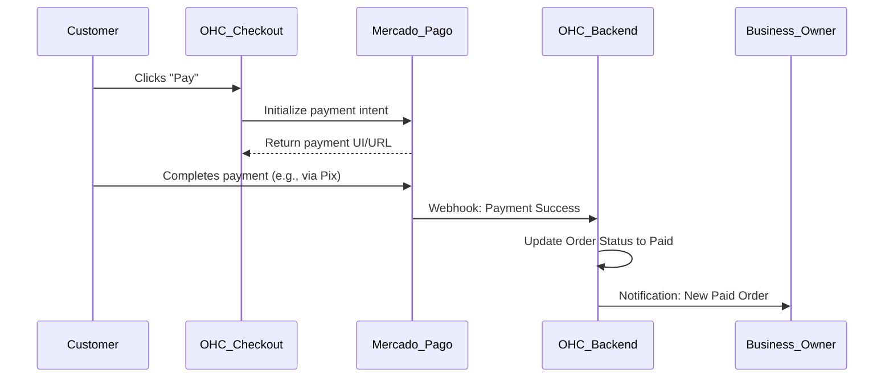

# Native Local Payments via Mercado Pago

## Problem Statement
Small business owners in Latin America (LATAM) often cannot use Stripe. They need a trusted local payment processor natively integrated into their OHC storefront to accept credit cards and local methods (like Pix in Brazil or Pago Fácil in Argentina) without forcing their customers through complex third-party payment routing.

## Research Report
- **Strategy**: Direct API integration with Mercado Pago for seamless LATAM coverage.
- **Target Persona**: Global users outside the US/EU, specifically in LATAM markets.
- **Advantages**: Native integration drastically improves conversion rates for local customers and simplifies onboarding for the business owner.
- **Risks**: API is less standardized than Stripe; settlement times can be longer; regional differences in supported payment methods.
- **Pricing**: Standard transaction fees apply; fully expected by the merchant.
- **Compatibility**:
  - Cloud: Centralized Webhook handling.
  - Standalone: Direct API key integration and Webhooks.

## Design Doc
- **User Experience Flow**:
  1. During onboarding, user selects their country. If LATAM, Mercado Pago is highlighted.
  2. User connects their Mercado Pago account via OAuth or API key in the "Finance" tab.
  3. At checkout, customers see a native "Pay with Mercado Pago" button.
  4. Webhooks update the order status in OHC from 'Pending' to 'Paid'.
- **AI Integration**: The Finance & Payments Agent seamlessly aggregates revenue data from Mercado Pago alongside other sources into a unified native financial dashboard.

### Mobile UX Flow
| Screen | Description |
|---|---|
| Payment Setup | "Connect Payment Provider". Prominent Mercado Pago option based on region. |
| Store Checkout | Standard checkout flow. "Pay with Mercado Pago" button seamlessly integrated. |
| Order Details | Order status updates automatically when payment clears. |

## Implementation Prompt
Integrate Mercado Pago as an alternative native payment provider. The checkout flow must dynamically offer this option based on the merchant's location settings. Implement robust webhook handling to normalize Mercado Pago events into standard OHC order fulfillment statuses.

- **Acceptance Criteria**: LATAM merchants can connect Mercado Pago. Customers can complete checkout using local methods. Orders automatically transition to 'Paid' upon successful webhook receipt.
- **Priority**: P1
- **Estimated Scope**: Large
