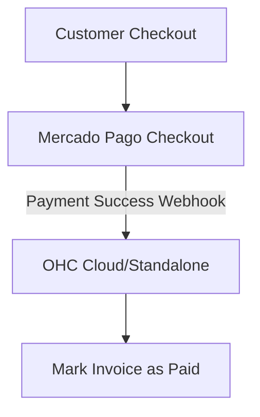

# Payment Processing: Mercado Pago

## Problem Statement
While Stripe is popular globally, small business owners in specific regions (like LATAM) need local payment solutions that support local payment methods (e.g., Pix in Brazil, OXXO in Mexico, local credit card installments) with fast settlement times.

### Persona-Specific Pain Point Summary
- **Online Seller (Maria in Brazil):** "My customers want to pay with Pix, Stripe doesn't support it well locally."
- **Freelancer (Juan in Mexico):** "I need my money faster, and Mercado Pago settles quicker for local banks."

## Research Report
**Tool:** Mercado Pago
**Ease of Use:** Dominant in LATAM. The integration process is well-documented. For merchants, creating an account is standard for the region. (Source: Regional market reports)
**Pricing:** Varies by country, typically a percentage + fixed fee per transaction.
**Reputation:** Highly trusted in Latin America.
**Cloud/Standalone:** Supports standard API/webhook flows compatible with both Cloud and Standalone modes.

### Comparative Table
| Feature | Mercado Pago | Stripe | OHC Fit |
|---|---|---|---|
| LATAM Local Methods | Excellent (Pix, OXXO) | Limited | Essential |
| Settlement | Fast local | Varies | Good |
| API Docs | Good | Excellent | Good |

## Design Doc
### Architecture

### UX Flow
1. User in LATAM sets their payment provider to "Mercado Pago" in Settings.
2. User generates an invoice in OHC.
3. OHC creates a Mercado Pago payment link.
4. Customer pays via the link.
5. OHC receives the webhook and marks the invoice as "Paid".

## Implementation Prompt
Add Mercado Pago as an alternative payment gateway alongside the existing Stripe integration (if any). The user should be able to enter their Access Token in Settings. When generating an invoice, the system should offer a "Pay via Mercado Pago" link. Listen for incoming webhooks to automatically update the invoice status to paid.

## Priority
P1

## Scope
Large
