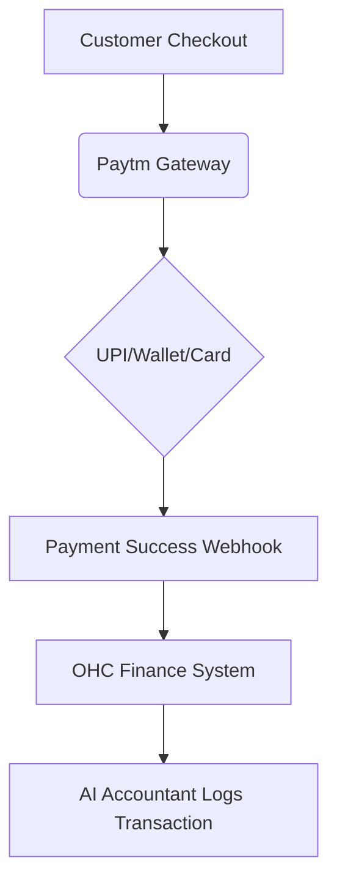

## [Payment] Issue Brief: Paytm Integration for India Market

**Title**: Scout 🔍: Integrate Paytm for Localized Payment Processing (India)
**Problem Statement**:
Small business owners like Rahul (Electronics Shop in India) cannot easily use Stripe due to local market preferences and regulatory requirements. Their customers expect to pay using UPI, Paytm Wallet, or local bank transfers. They need a localized payment gateway to process transactions smoothly without high cross-border fees or failed payments.
**Research Report**:
- **Tool**: Paytm Payment Gateway API
- **Evaluation**: Paytm is a dominant payment processor in India, supporting UPI, wallets, net banking, and cards. It provides fast settlement speeds and high reliability in the Indian market.
- **Ease of Use**: Merchants need to complete local KYC to get a Paytm business account. Once approved, API integration is straightforward.
- **Pricing**: Competitive local rates, often 0% for UPI and standard percentage fees for cards/wallets.
- **Cloud vs. Standalone**: Works in both. Requires merchant API keys and webhook configuration.
**Design Doc**:

- A user operating in India selects Paytm as their preferred payment provider in OHC.
- They enter their Merchant ID and API Keys.
- OHC presents Paytm as a checkout option for invoices and online storefronts.
- Webhooks update OHC when a payment succeeds or fails.
**Implementation Prompt**:
Integrate the Paytm Payment Gateway to support Indian merchants. Implement the checkout flow to generate Paytm payment links or integrate the JS SDK. Set up secure webhook handlers to capture payment success, failure, and refund events, updating the OHC invoice status accordingly. Ensure the AI Accountant agent can read these transactions for automated bookkeeping.
**Priority**: P2
**Estimated Scope**: Medium
