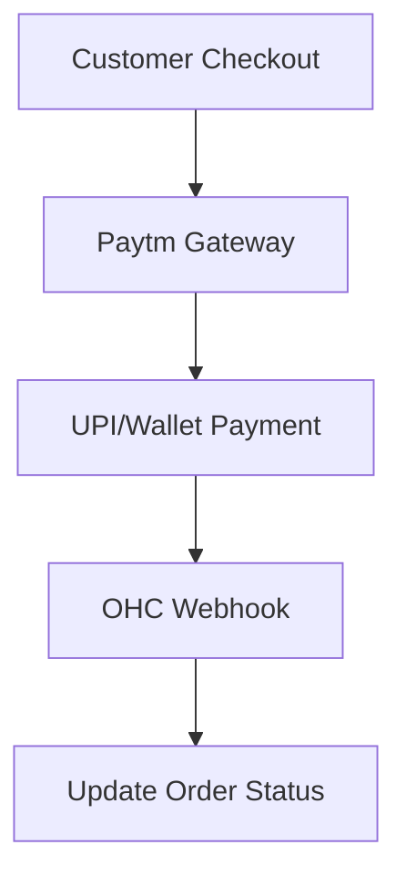

## [Payment] Issue Brief: Paytm Integration for India

**Title**: Scout 🔍: Paytm Payment Gateway for the Indian Market
**Problem Statement**:
Small business owners in India rely heavily on UPI and local wallets. They need a localized payment gateway to accept funds smoothly.
**Research Report**:
- **Tool**: Paytm Payment Gateway API.
- **Evaluation**: Essential for entering the Indian market.
- **Ease of Use**: Users paste their Merchant ID and API Key.
- **Pricing**: Standard transaction fees for the merchant.
- **Cloud vs. Standalone**: Works in both modes.
**Design Doc**:
- "Settings" -> "Payments" -> "Add Gateway".
- User selects Paytm and enters credentials.
- Checkout pages dynamically show Paytm as an option.

**Implementation Prompt**:
Integrate Paytm as a payment option. Update the checkout UI to support Paytm. Ensure webhook listeners update order statuses.
**Priority**: P1
**Estimated Scope**: Medium
