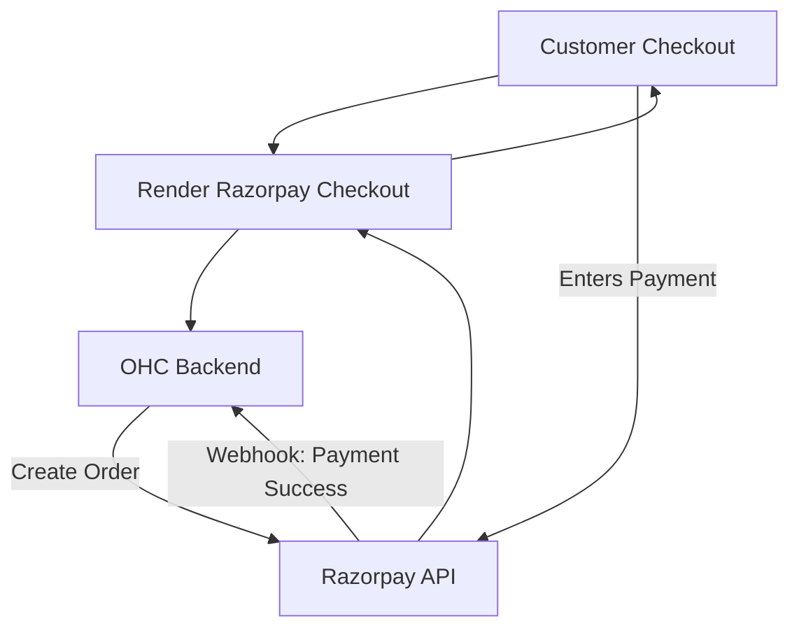

# Research: Payment Processing Integration with Razorpay

## Title
Integrate Razorpay for Streamlined Payment Processing (India Market Focus)

## Problem Statement
Small businesses operating in or selling to the Indian market need a reliable, localized payment processor. Global solutions like Stripe may not fully support preferred local payment methods like UPI or specific regional cards, leading to cart abandonment. Business owners need a seamless way to accept local payments and get settled quickly.

## Research Report
Razorpay is a leading full-stack financial services company in India, offering a comprehensive payment gateway.
- **Ease of Use**: Razorpay offers user-friendly payment links, payment pages, and invoice generation tools that require zero coding from the business owner to use natively. Its dashboard is comprehensive for tracking settlements.
- **Pricing**: Pricing is transparent, typically starting at 2.9% + $0.30 per transaction for international cards, with lower rates (Standard plan) for domestic Indian transactions (e.g., specific percentage for domestic cards, low fixed fees for UPI).
- **Reputation**: Highly trusted in the Indian ecosystem, powering millions of businesses. It is known for high success rates, robust APIs, and extensive support for Indian payment methods (UPI, Netbanking, RuPay).
- **Environment Support**: Razorpay is a cloud-based API service. It integrates well into Cloud architectures. Standalone mode requires an active internet connection to process payments via Razorpay's servers.

## Design Doc
The integration will enable OHC users to accept payments via Razorpay.
1.  **Onboarding**: Users link their Razorpay account or create a new one through the OHC settings via API keys.
2.  **Checkout Flow**: When an OHC transaction occurs (e.g., an invoice is paid, or a storefront item is bought), OHC calls the Razorpay API to generate an order and render the checkout UI (Razorpay Standard Checkout or Payment Links).
3.  **Webhooks**: Razorpay sends a webhook to the OHC backend to confirm payment success or failure.
4.  **Reporting**: OHC records the transaction status and displays successful payments in the user's dashboard.

## Implementation Prompt
Implement a payment integration with Razorpay to support users targeting the Indian market. The integration should allow the generation of payment links or integration of the Razorpay checkout flow directly into OHC-hosted pages. Securely handle API keys and implement robust webhook listeners to verify payment status before marking invoices or orders as paid within the OHC system. Ensure the UI clearly communicates payment status to both the business owner and the customer.

## Priority
P1

## Estimated Scope
Medium
