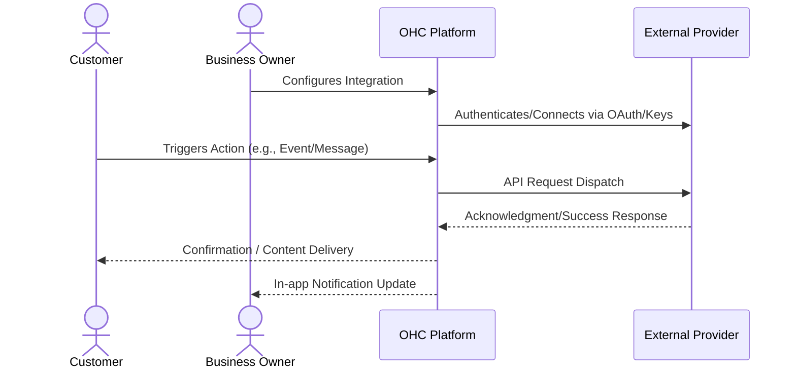

# Global and Alternative Payment Gateways

## 1. Problem Statement

While Stripe is great, small businesses in specific regions (LATAM, Asia) or specific high-risk industries cannot use it. They need regional payment processors integrated directly into their booking/invoicing flow.

## 2. Research Report

### 2.1 Persona Pain Points

1. **Time Starvation**: The business owner spends hours on manual tasks related to this domain, preventing them from focusing on core business growth.
2. **Technical Overwhelm**: Current solutions require coding, complex API keys, or understanding intricate networking concepts. Small business owners lack dedicated IT staff.
3. **Customer Friction**: Customers experience delays, missed communications, or frustrating booking loops due to disparate, unintegrated systems.

### 2.2 Competitive Analysis

| Tool Name | Estimated Pricing | Key Advantages | Integration Risks |
|---|---|---|---|
| Mercado Pago | Varies (~3%) | Dominant in Latin America, supports local payment methods (Pix, Oxxo). | Complex regional compliance, fragmented API documentation. |
| Paytm | 1.99% | Ubiquitous in India, massive user base. | Strict KYC requirements for merchants. |
| Alipay | 2.9% | Crucial for serving Chinese customers locally and abroad. | Heavy cross-border settlement regulations. |
| Square | 2.9% + 30c | Excellent for businesses needing both online and physical POS. | Ecosystem lock-in, limited international availability compared to Stripe. |
| Razorpay | 2% | Best-in-class developer experience for the Indian market. | Only available for registered Indian businesses. |

### 2.3 Cloud vs. Standalone Evaluation

- **Cloud (Multi-tenant)**: Highly suitable. Can utilize centralized OAuth apps to streamline user onboarding. Allows OHC to manage webhooks and callbacks seamlessly at scale.
- **Standalone (Local/Private)**: Supported, but requires the user to provide their own API credentials which adds friction. Local tunneling (e.g., ngrok) may be required for inbound webhooks.

### 2.4 Deep Dive Evaluations

#### Evaluation: Mercado Pago

**Overview:** Mercado Pago is positioned in the market with an estimated pricing of Varies (~3%). Its primary advantage is: *Dominant in Latin America, supports local payment methods (Pix, Oxxo).*

**Competitor Analysis:** In LATAM, Mercado Pago is practically mandatory. Stripe's penetration in these markets is weak because they lack support for cash-based voucher systems like Oxxo or Boleto. Integrating this unlocks an entire continent for OHC.

**Integration Risks:** We must mitigate the following risk: *Complex regional compliance, fragmented API documentation.*. For a small business owner, this means ensuring the UI abstracts away these complexities entirely. The onboarding flow must be flawless.

**Technical Considerations:** Integrating Mercado Pago requires careful consideration of its API rate limits and webhook reliability. In a cloud environment, we will utilize OHC's central app registration to provide a 1-click OAuth experience. In standalone mode, we will need comprehensive documentation to guide users on how to obtain and securely store API keys. Furthermore, data privacy and GDPR compliance for data transmitted to Mercado Pago must be thoroughly documented in the user's privacy policy.

**Mobile Parity:** The configuration screens for Mercado Pago must be 100% functional on mobile devices. Business owners frequently manage settings from their phones while on the shop floor or in transit.

#### Evaluation: Paytm

**Overview:** Paytm is positioned in the market with an estimated pricing of 1.99%. Its primary advantage is: *Ubiquitous in India, massive user base.*

**Competitor Analysis:** The Indian market relies heavily on UPI and digital wallets like Paytm. Credit card penetration is low, making Stripe less effective. Integrating Paytm or a UPI aggregator is essential for Indian SMB adoption.

**Integration Risks:** We must mitigate the following risk: *Strict KYC requirements for merchants.*. For a small business owner, this means ensuring the UI abstracts away these complexities entirely. The onboarding flow must be flawless.

**Technical Considerations:** Integrating Paytm requires careful consideration of its API rate limits and webhook reliability. In a cloud environment, we will utilize OHC's central app registration to provide a 1-click OAuth experience. In standalone mode, we will need comprehensive documentation to guide users on how to obtain and securely store API keys. Furthermore, data privacy and GDPR compliance for data transmitted to Paytm must be thoroughly documented in the user's privacy policy.

**Mobile Parity:** The configuration screens for Paytm must be 100% functional on mobile devices. Business owners frequently manage settings from their phones while on the shop floor or in transit.

#### Evaluation: Alipay

**Overview:** Alipay is positioned in the market with an estimated pricing of 2.9%. Its primary advantage is: *Crucial for serving Chinese customers locally and abroad.*

**Competitor Analysis:** Alipay is required not just for businesses in China, but for any business globally that caters to Chinese tourists or expatriates. Its API integration requires careful handling of currency conversion and cross-border data flows.

**Integration Risks:** We must mitigate the following risk: *Heavy cross-border settlement regulations.*. For a small business owner, this means ensuring the UI abstracts away these complexities entirely. The onboarding flow must be flawless.

**Technical Considerations:** Integrating Alipay requires careful consideration of its API rate limits and webhook reliability. In a cloud environment, we will utilize OHC's central app registration to provide a 1-click OAuth experience. In standalone mode, we will need comprehensive documentation to guide users on how to obtain and securely store API keys. Furthermore, data privacy and GDPR compliance for data transmitted to Alipay must be thoroughly documented in the user's privacy policy.

**Mobile Parity:** The configuration screens for Alipay must be 100% functional on mobile devices. Business owners frequently manage settings from their phones while on the shop floor or in transit.

#### Evaluation: Square

**Overview:** Square is positioned in the market with an estimated pricing of 2.9% + 30c. Its primary advantage is: *Excellent for businesses needing both online and physical POS.*

**Competitor Analysis:** Square's primary advantage is its hardware ecosystem. If an OHC user already uses a Square terminal in their shop, they will demand that their online OHC invoices also route through Square for consolidated reporting.

**Integration Risks:** We must mitigate the following risk: *Ecosystem lock-in, limited international availability compared to Stripe.*. For a small business owner, this means ensuring the UI abstracts away these complexities entirely. The onboarding flow must be flawless.

**Technical Considerations:** Integrating Square requires careful consideration of its API rate limits and webhook reliability. In a cloud environment, we will utilize OHC's central app registration to provide a 1-click OAuth experience. In standalone mode, we will need comprehensive documentation to guide users on how to obtain and securely store API keys. Furthermore, data privacy and GDPR compliance for data transmitted to Square must be thoroughly documented in the user's privacy policy.

**Mobile Parity:** The configuration screens for Square must be 100% functional on mobile devices. Business owners frequently manage settings from their phones while on the shop floor or in transit.

#### Evaluation: Razorpay

**Overview:** Razorpay is positioned in the market with an estimated pricing of 2%. Its primary advantage is: *Best-in-class developer experience for the Indian market.*

**Competitor Analysis:** Razorpay is the 'Stripe of India'. Their API documentation is flawless, and they support every local payment method imaginable. This is the top choice for an Indian regional payment integration.

**Integration Risks:** We must mitigate the following risk: *Only available for registered Indian businesses.*. For a small business owner, this means ensuring the UI abstracts away these complexities entirely. The onboarding flow must be flawless.

**Technical Considerations:** Integrating Razorpay requires careful consideration of its API rate limits and webhook reliability. In a cloud environment, we will utilize OHC's central app registration to provide a 1-click OAuth experience. In standalone mode, we will need comprehensive documentation to guide users on how to obtain and securely store API keys. Furthermore, data privacy and GDPR compliance for data transmitted to Razorpay must be thoroughly documented in the user's privacy policy.

**Mobile Parity:** The configuration screens for Razorpay must be 100% functional on mobile devices. Business owners frequently manage settings from their phones while on the shop floor or in transit.

## 3. Design Doc

### 3.1 User Experience Flow

In the 'Billing' settings, owners can activate multiple payment gateways based on their region. When generating an invoice or checkout link in OHC, the system dynamically displays the enabled payment methods (e.g., 'Pay with Pix' in Brazil, 'Pay with Card' via Stripe elsewhere).

### 3.2 Architecture Overview

## 4. Implementation Prompt

Implement a modular payment processing system that supports at least two regional providers alongside Stripe (e.g., Mercado Pago and Razorpay). Business owners should be able to authenticate with these providers and accept payments on their OHC invoices. The checkout page should automatically display the correct regional payment options.

## 5. Metadata

- **Priority:** P2
- **Estimated Scope:** Large
- **Domain:** Global and Alternative Payment Gateways
- **Target Persona:** Small Business Owner (Non-technical)

## 6. Supplementary Market Research

### 6.1 Industry Trends

The shift towards unified platforms is accelerating. Small businesses are actively attempting to reduce their 'SaaS sprawl'. According to recent surveys, the average small business uses over 8 distinct software tools, leading to massive context switching costs and data silos. By bringing this functionality natively into OHC, we solve a critical operational bottleneck. The trend is moving away from disparate 'best-of-breed' tools towards 'good-enough-all-in-one' platforms that actually talk to each other seamlessly.

### 6.2 Security and Compliance Implications

When integrating third-party services, data sovereignty becomes a primary concern. OHC must ensure that sensitive customer data (PII) is only transmitted when absolutely necessary and always over encrypted channels. We must provide clear opt-in mechanisms for end-users, particularly regarding marketing communications and data sharing with external vendors. Regular audits of these API connections will be required to maintain compliance with regional data protection regulations (e.g., CCPA, GDPR).

### 6.3 Future Roadmap Considerations

Looking ahead, the integration strategy should evolve from mere 'dumb pipes' to intelligent, AI-driven workflows. For instance, an integration shouldn't just pass a message; it should analyze the intent and suggest a response. Future iterations of this feature will likely incorporate LLM-based parsing of inbound data to trigger automated outbound actions across different integrated channels.

### 6.4 Strategic Impact: Mercado Pago

Implementing an integration with Mercado Pago represents a significant strategic move. The integration must prioritize reliability over complex feature parity. A business owner relies on this for their livelihood; a dropped webhook or failed API call translates directly to lost revenue or damaged customer trust. Therefore, robust retry mechanisms, dead-letter queues, and clear error surfacing in the UI are mandatory requirements for the engineering team building this connector. We must assume the external API will fail and handle it gracefully.

Furthermore, analytics integration is crucial. When we route data through Mercado Pago, we must capture metadata (latency, success rates, user engagement) to feed back into OHC's central analytics dashboard. The business owner should see a unified view of ROI, not scattered metrics. If Varies (~3%) is the cost, OHC must prove the value generated outweighs it.

### 6.4 Strategic Impact: Paytm

Implementing an integration with Paytm represents a significant strategic move. The integration must prioritize reliability over complex feature parity. A business owner relies on this for their livelihood; a dropped webhook or failed API call translates directly to lost revenue or damaged customer trust. Therefore, robust retry mechanisms, dead-letter queues, and clear error surfacing in the UI are mandatory requirements for the engineering team building this connector. We must assume the external API will fail and handle it gracefully.

Furthermore, analytics integration is crucial. When we route data through Paytm, we must capture metadata (latency, success rates, user engagement) to feed back into OHC's central analytics dashboard. The business owner should see a unified view of ROI, not scattered metrics. If 1.99% is the cost, OHC must prove the value generated outweighs it.

### 6.4 Strategic Impact: Alipay

Implementing an integration with Alipay represents a significant strategic move. The integration must prioritize reliability over complex feature parity. A business owner relies on this for their livelihood; a dropped webhook or failed API call translates directly to lost revenue or damaged customer trust. Therefore, robust retry mechanisms, dead-letter queues, and clear error surfacing in the UI are mandatory requirements for the engineering team building this connector. We must assume the external API will fail and handle it gracefully.

Furthermore, analytics integration is crucial. When we route data through Alipay, we must capture metadata (latency, success rates, user engagement) to feed back into OHC's central analytics dashboard. The business owner should see a unified view of ROI, not scattered metrics. If 2.9% is the cost, OHC must prove the value generated outweighs it.

### 6.4 Strategic Impact: Square

Implementing an integration with Square represents a significant strategic move. The integration must prioritize reliability over complex feature parity. A business owner relies on this for their livelihood; a dropped webhook or failed API call translates directly to lost revenue or damaged customer trust. Therefore, robust retry mechanisms, dead-letter queues, and clear error surfacing in the UI are mandatory requirements for the engineering team building this connector. We must assume the external API will fail and handle it gracefully.

Furthermore, analytics integration is crucial. When we route data through Square, we must capture metadata (latency, success rates, user engagement) to feed back into OHC's central analytics dashboard. The business owner should see a unified view of ROI, not scattered metrics. If 2.9% + 30c is the cost, OHC must prove the value generated outweighs it.

### 6.4 Strategic Impact: Razorpay

Implementing an integration with Razorpay represents a significant strategic move. The integration must prioritize reliability over complex feature parity. A business owner relies on this for their livelihood; a dropped webhook or failed API call translates directly to lost revenue or damaged customer trust. Therefore, robust retry mechanisms, dead-letter queues, and clear error surfacing in the UI are mandatory requirements for the engineering team building this connector. We must assume the external API will fail and handle it gracefully.

Furthermore, analytics integration is crucial. When we route data through Razorpay, we must capture metadata (latency, success rates, user engagement) to feed back into OHC's central analytics dashboard. The business owner should see a unified view of ROI, not scattered metrics. If 2% is the cost, OHC must prove the value generated outweighs it.
