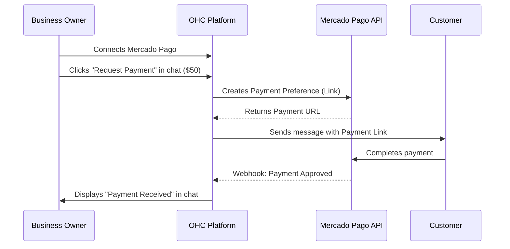

## Payment Processing: Mercado Pago

**Title**: Implement Mercado Pago Integration for LATAM Payments

**Problem Statement**: Small business owners in Latin America often find Stripe unsupported or too expensive/complex. They need a localized, trusted way to send payment links directly in chat (WhatsApp/Instagram) to close sales instantly without forcing customers through a complex checkout flow.

**Research Report**: Mercado Pago is the dominant payment processor in Latin America, deeply trusted by consumers and merchants alike.
* *Ease of Use*: High. Customers are very familiar with the Mercado Pago checkout flow. Merchants can easily generate payment links.
* *Pricing*: Varies by country, typically taking a percentage of the transaction. Settlement speeds are fast, often immediate for a higher fee.
* *Reputation*: The "PayPal of LATAM", essential for doing business in countries like Brazil, Argentina, and Mexico.
* *Mode Compatibility*: Fully supported via API in both Cloud and Standalone modes.

**Design Doc**:

**Implementation Prompt**: Create an integration for Mercado Pago. In the unified chat window, add a "Request Payment" button. When clicked, the owner enters an amount and description. OHC should call the Mercado Pago API to generate a payment link and insert it into the chat draft. The system must listen for payment confirmation webhooks from Mercado Pago and display a clear "Payment Received" success message in the chat timeline so the owner knows it's safe to fulfill the order. Use plain language like "Connect Mercado Pago" for setup.

**Priority**: P1

**Estimated Scope**: Large
