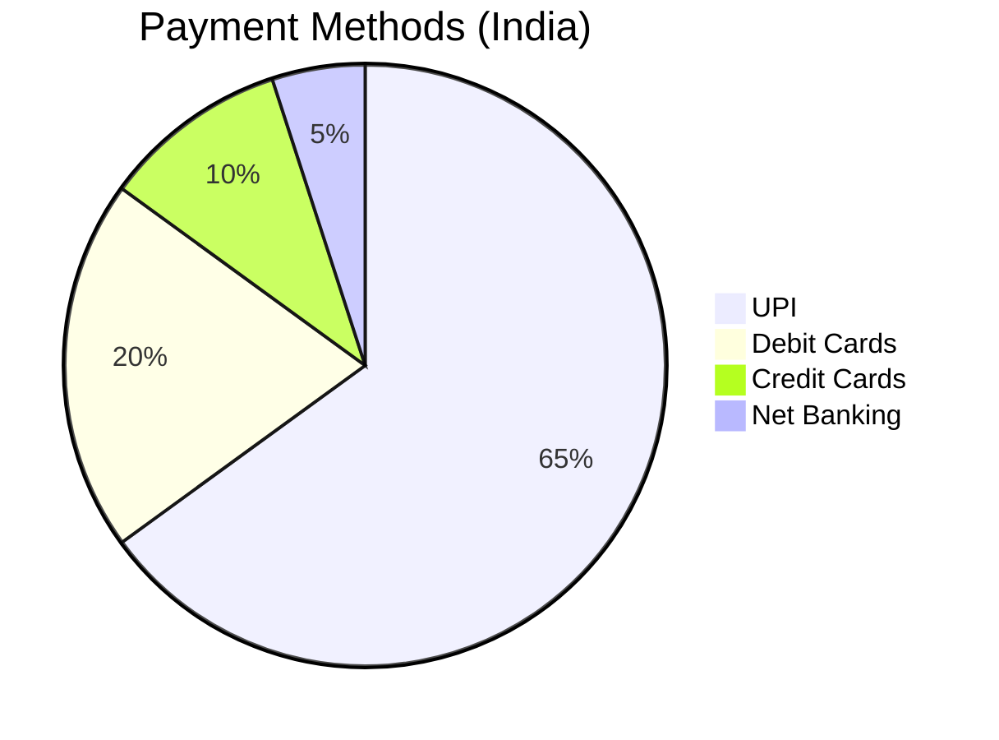
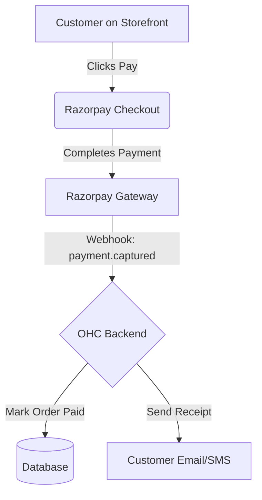

# Payment Processing: Razorpay

## Problem Statement
While Stripe is excellent globally, many small businesses in specific regional markets (like India) require local payment methods (UPI, local wallets, RuPay cards) that international processors do not support well or at competitive rates. Without local payment options, businesses face high cart abandonment.

## Research Report
Razorpay is a dominant payment gateway in India, supporting all local payment methods.
- **Ease of use:** High for Indian businesses, seamless onboarding.
- **Pricing:** 2% per transaction for standard domestic cards/UPI.
- **Cloud/Standalone:** Cloud integration.

### Persona-specific pain points
- "My customers want to pay with UPI, but my current checkout only takes credit cards."
- "The settlement times for international gateways are too slow for my cash flow."

### Evidence
- **Recommendation:** Integrate Razorpay to serve the Indian SMB market and reduce cart abandonment by supporting local payment methods.
- Source: High market share in India, specifically catering to SMBs and startups.

## Design Doc
When setting up their OHC storefront, a business owner in a supported region can select Razorpay as their payment provider. OHC will use Razorpay's Checkout integration to handle the payment flow securely. Successful payments will trigger order confirmation within OHC, updating the unified inbox and inventory.

## Implementation Prompt
Add Razorpay as a payment provider option alongside Stripe. Implement the Razorpay Standard Checkout flow for the OHC storefront. Ensure webhook handlers are set up to verify the signature and update the order status in OHC to "Paid" upon successful transaction.

## Priority
P2

## Estimated Scope
Medium
