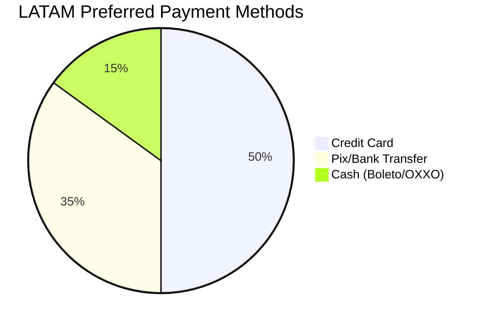

# [Payments] Mercado Pago for LATAM
## Problem Statement
Stripe is not universally accessible or preferred in all regions. Small business owners in Latin America need a localized payment gateway to accept local credit cards and payment methods (like Pix in Brazil).

## Research Report
- **Tool Evaluated**: Mercado Pago API
- **Ease of Use**: Highly recognized brand in LATAM, user-friendly checkout.
- **Pricing**: Varies by country, typically ~4-5% per transaction.
- **Reputation**: The dominant player in LATAM.
- **Cloud & Standalone**: Fully supported via webhooks and redirect checkouts.

### Pain Points Solved
- Reduces cart abandonment for LATAM customers.
- Provides access to local payment methods.

| Payment Gateway | LATAM Focus | Local Methods (Pix) |
| :--- | :--- | :--- |
| Mercado Pago | Very High | Yes |
| Stripe | Low | Limited |
| PayPal | Medium | No |

## Design Doc
- **Integration**: API Key / OAuth integration.
- **Triggers**: Checkout generation redirects to Mercado Pago checkout URL.
- **User Flow**: Business owner enters their Mercado Pago credentials. Customers see Mercado Pago as a checkout option.

## Implementation Prompt
Add Mercado Pago as an alternative payment provider to Stripe. The business owner should be able to configure their account keys. The checkout flow should support generating a Mercado Pago payment link and verifying payment success.

## Priority
P1

## Estimated Scope
Large
